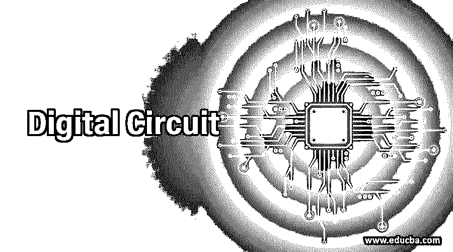

# 数字电路

> 原文：<https://www.educba.com/digital-circuit/>

## 数字电路导论

数字电路嵌入了许多被编程来执行逻辑操作的逻辑电路。这种逻辑电路不是“或”、“与”和“与”,它们组合起来执行任何特定的操作。通过 JIS 符号和 MIL 符号或任何通知，使用电路符号和逻辑表达式来实现逻辑电路。他们有一个真值表，代表任何输入组合，以获得所需的输出。数字逻辑电路是一种以有限的电压和不同的值消耗电压的电路。这些逻辑电路被分为时序逻辑电路和组合逻辑电路。它主要体现在数字电子产品上，如计算器、手机和电脑。

### 数字电路是如何工作的？

中央处理器占据硬件电路，包括微芯片、电子电路、集成电路和编程技术。但是硬件和软件必须相互通信才能执行基本操作。计算机以二进制数字格式执行所有的基本操作，在某些情况下，十进制数值也是隐含的。逻辑运算由使用数字逻辑门的电路执行。数字门是集成电路的物理块，用于通过使用布尔逻辑来执行逻辑任务。逻辑门主要嵌入在电子半导体开关中，如晶体管、二极管等。但是气动分子、逻辑、流体逻辑、电磁继电器和机械部件也用来暗示逻辑门。这些实用的逻辑门是由 CMOS 技术、MOSFET、FET 开发的。各种类型的逻辑门有非门、与门、或门、XNOR 门、或非门和异或、异或是执行逻辑任务最常用的逻辑门。所有常见的逻辑门工作在布尔函数上，根据真值表给出输出，并以单个二进制数字获得输出。因此，这些逻辑门被称为布尔逻辑门或二进制逻辑门。逻辑电路由数字电子系统中的基本构件块构成。

<small>网页开发、编程语言、软件测试&其他</small>

### 逻辑电路的类型

数字电路也称为开关电路，因为电压电平同时从一个值变为另一个值。因此它被称为逻辑电路，因为它们根据真值表遵守一组逻辑规则。逻辑电路大致分为组合逻辑电路和时序逻辑电路。

#### 1.组合数字逻辑电路

*   组合逻辑电路基于逻辑门，如或门、与门、非门、或非门和与非门。或非门和与非门属于通用门。这些门合并在一起形成一个复杂的开关电路。组合逻辑门由积木块组成，其输出可以根据给定的输入立即得到。组合电路不包含任何独立的存储元件。
*   组合电路最好的例子是解码器和编码器。解码器将二进制代码数据和输入改变为不同的数量和不同的输出线。组合开关设备的几个例子是代码转换器、全加器、半加法器、解码器、编码器、解复用器、复用器等。组合电路可以在微控制器和微处理器中实现，以设计计算机的硬件和软件设备。

#### 2.时序数字逻辑电路

时序数字电路不同于组合电路。这里，设备的输出不是基于给定的输入，也不是基于过去给定的输入。换句话说，时序逻辑电路的输出基于给定的输入以及电路的当前状态。在这里，它拥有一个单独的内存组件来保存过去的输入和输出。简而言之，数字电路与存储元件的组合称为时序数字电路。它是使用有限状态机实现的。时序逻辑器件最好的例子是触发器、计数器、存储元件和数字逻辑电路。组合电路使用两个给定的输入来提供不同的输出。从存储器组件得到的输出被提供给组合电路。内部输出和输入是次要组件的一部分。它们具有由存储部件开发的可变状态，并且次级输出设备用于激励分配的存储部件。时序逻辑电路分为时钟驱动、脉冲驱动和事件驱动

#### 3.具有时钟驱动元件的电路

它们是同步的，其中当输入是时钟脉冲输入形式时发生输出转变。它被称为依赖于时钟和脉冲输入的同步时序电路。

#### 4.具有事件驱动元件的电路

*   它们是异步的，当输入不是时钟脉冲的形式时，输出发生转换。它不依赖于时钟信号，但这些异步时序电路依赖于输入脉冲。
*   时序电路具有电平和脉冲输出形式的输出。脉冲输出根据相关输入持续，在少数情况下可以最小化。但是对于时钟时序电路，脉冲输出是在与产生的时钟脉冲相同的持续时间获得的。输出电平标志着输出根据给定的输入脉冲波动，并保持相同的状态，直到它接收到下一个时钟脉冲。
*   计数器以不同形式的逻辑电路实现。它们以脉冲序列运行，根据分频比，仅在达到脉冲数时设置脉冲输出。

### 结论

最后，组合电路对输入的变化作出反应。时序电路记住过去和现在的状态，并与输入中的变化合并以形成新的状态。同步时序器件被实现为基于输入并且也由输入时钟脉冲决定的复杂时序电路。结果交付时几乎没有故障，并且是可以预测的。它是用硬件电路实现的。异步时序电路根据由设备而不是时钟决定的输入速度来决定产生快速响应。这里的过程很难设计，类似于大脑的运作。

### 推荐文章

这是一本数字电路指南。在这里我们讨论一个简介，它是如何工作的，数字电路的类型在详细解释。您也可以浏览我们的其他相关文章，了解更多信息——

1.  [什么是系统设计？](https://www.educba.com/what-is-system-design/)
2.  [什么是微控制器？](https://www.educba.com/what-is-microcontroller/)
3.  [什么是 Salesforce 技术？](https://www.educba.com/what-is-salesforce-technology/)
4.  [微服务工具](https://www.educba.com/microservices-tools/)

