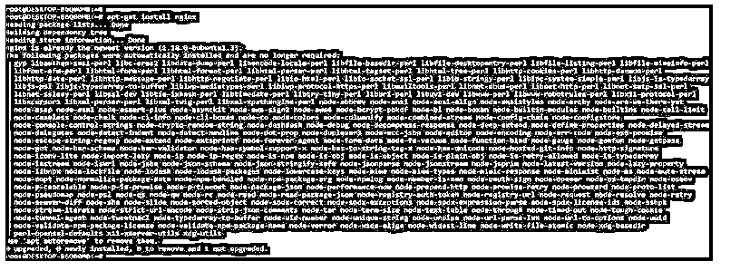

# Nginx 环境变量

> 原文：<https://www.educba.com/nginx-environment-variables/>


## Nginx 环境变量简介

Nginx 环境变量在配置中不受支持，所以这并不意味着没有任何解决方案可以在 nginx 中使用环境变量，我们使用的是 envsubst 实用程序。我们知道 nginx 是一个反向代理和 web 服务器，这成为开发者的默认选择。在使用 nginx 部署应用程序时使用云计算是非常高效和简单的。

### Nginx 环境变量概述

在托管 GCP、AWS 或 azure 的平台上运行应用程序时。要使用 nginx 服务器，我们需要设置我们监听的端口号。我们使用 envsubst 实用程序而不是环境变量，因为 nginx 不支持环境变量。envsubst 实用程序是 gettext 的一部分，所以我们可以说它在 nginx 的 docker 图像中可用，所以我们可以说应用解决方案非常容易。我们需要为 docker 的容器应用 envsubst 配置文件的模板。

<small>网页开发、编程语言、软件测试&其他</small>

### 如何使用 Nginx 环境变量？

Nginx 将删除从父进程继承的所有环境变量，除了 TZ 变量。环境变量中的这个指令允许保留继承变量的名称。TZ 变量可用于 nginx http Perl 模块的模块中。我们可以为 nginx 更新 docker 容器的配置文件。要使用 nginx 环境变量，我们需要在系统中安装 nginx 和 docker。

以下步骤显示了我们如何使用环境变量，如下所示:

1.要使用 nginx 环境变量，首先我们需要在我们的系统中安装 nginx 服务器，如下所示。

**代码:**

```
apt-get install nginx
```

**输出:**




2.在 ubuntu 系统中，安装 nginx 服务器后，nginx 服务器默认不启动。要启动 nginx 服务器，我们需要使用 service 命令。我们可以检查 nginx 服务器的版本和支持的模块如下。

**代码:**

```
service nginx start
service nginx status
nginx –V
```

**输出:**


3.在启动 nginx 服务器后，我们使用 apt-get 命令在 ubuntu 系统中安装 docker，如下所示。

**代码:**

```
apt-get install docker
```

**输出:**


4.在这一步安装 docker 之后，我们将配置 docker-compose 文件，如下所示。在下面文件中，我们可以看到容量、端口和环境变量，然后我们将相同的值存储到 nginx 配置文件中。

**代码:**

```
image: nginx
volumes:
- ./nginx_config:/etc/nginx/nginx_config
ports:
- "80"
environment:
- NGINX_HOST = localhost
- NGINX_PORT = 8080
```

**输出:**


5.根据 docker-compose 的文件，nginx 配置文件生成到 docker 的配置中，如下所示。

**代码:**

```
server {
  listen 8080;
  listen [::]:80;
  server_name www.nginx.com;
  location / {
   root /usr/share/nginx/html;
   index index.html index.htm;
}
error_page 400 404 504 501 /nginx.html;
location = /nginx.html {
  root /usr/share/nginx/html;
 }
}
```

**输出:**


### Nginx 环境变量配置文件

基本上 nginx 是面向性能的 http 服务器，与 apache 服务器相比，它具有更高的稳定性和更少的内存消耗。我们可以用 docker 部署 nginx 服务器，nginx docker 服务器与 nginx 配置的文件名相关，nginx 配置是使用容器启动动态配置的。nginx 配置文件基本上不支持环境变量，我们可以使用 envsubst 工具来使用 nginx 配置文件的特性。

内核和模块是用 nginx 编写的。nginx 的设计非常简洁小巧，完成的工作也非常简单。我们只需要将客户端请求映射到配置文件位置和指令的位置块，配置文件位置和指令是在我们启动不同模块以完成工作的位置配置的。nginx 环境变量中的位置是配置 nginx 以匹配 URL 的指令。基本上，nginx 模块分为两个模块，即第三方模块和基础模块。

nginx 配置文件的模块如下:

**1。核心模块:**该模块包含事件模块、http 模块和邮件模块。这个模块在 nginx 配置文件中非常重要。

**2。基本模块:**该模块包含 http fastcgi 模块、http 访问模块、http 重写模块和 http 代理模块。我们在应用程序中执行的基本操作所使用的模块。

**3。第三方模块:**http 的通知模块和访问密钥模块。

Envsubst 通过在文件名中使用指定标记的值来替换环境变量，如下所示。

下面是如下配置文件:

**代码:**

```
[nginx]
ip = ${ip}
port = ${port}
url = http://${ip}:${port}/index.html
```

**输出:**


在对环境变量执行导出时，会生成一个名为 env.new.conf 的新文件。我们还可以仅使用指定的变量来指定替换。

**代码:**

```
[nginx]
ip = 192.168.92.125
port = 80
url = http://192.168.92.125:80/index.html
```

**输出:**


如果假设我们只想替换 IP，那么我们可以替换成 nginx env.conf 文件。在 Linux 测试中，我们只能使用双引号和单引号，在 nginx env.conf 文件中同样有效。我们可以在 docker-compose.yml 中应用 nginx 概要文件。

下面是 docker 合成文件的例子。

**代码:**

```
version : "3"
services :
nginx :
       image : nginx:1.20.1-alpine
       container_name : nginx_config
ports :
      - 8080:8080
      - 443:443
environment :
             - NGINX_HOST = www.nginx.com
             - NGINX_PORT = 8080
volumes :
         - /root/nginx.temp:/etc/nginx/conf.d/nginx.temp
Command : /bin/sh -c "envsubst < /etc/nginx/conf.d/nginx.temp > /etc/nginx/conf.d/default.conf && exec nginx -g 'daemon on;'"
network_mode : bridge
restart : always
```

**输出:**


### 结论

我们使用 envsubst 实用程序而不是环境变量，因为 nginx 不支持环境变量。我们需要为 docker 的容器应用 envsubst 配置文件的模板。基本上 nginx 是 http 服务器，与 apache 服务器相比，它更注重性能。

### 推荐文章

这是 Nginx 环境变量的指南。这里我们讨论一下入门，如何使用 Nginx 环境变量？和配置文件。您也可以看看以下文章，了解更多信息–

1.  [Nginx 添加 _header](https://www.educba.com/nginx-add_header/)
2.  [Nginx 位置指令](https://www.educba.com/nginx-location-directive/)
3.  [Nginx 晶圆](https://www.educba.com/nginx-waf/)
4.  [Nginx FastCGI](https://www.educba.com/nginx-fastcgi/)


