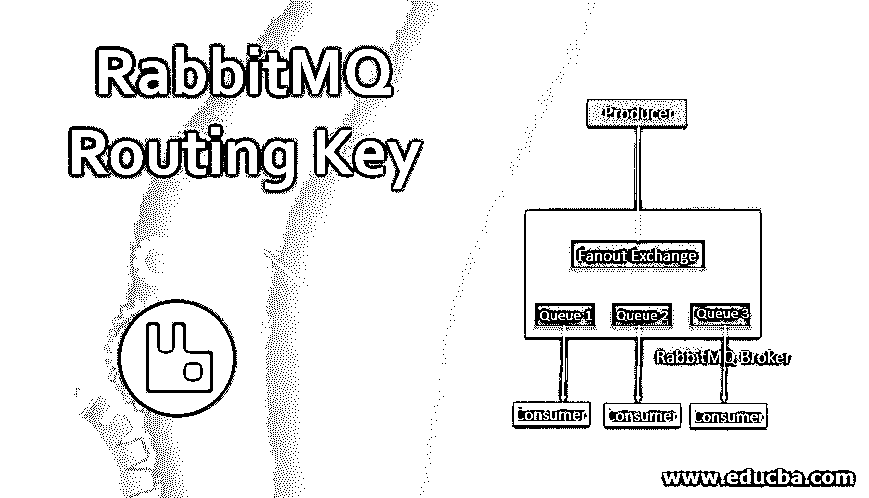
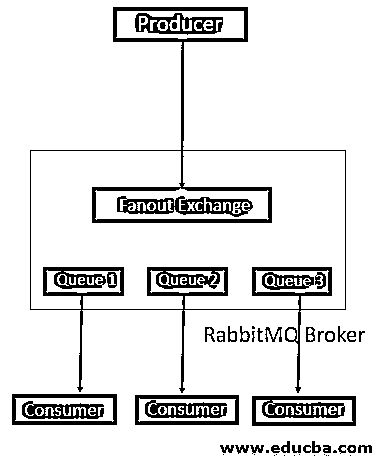
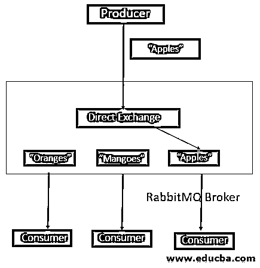
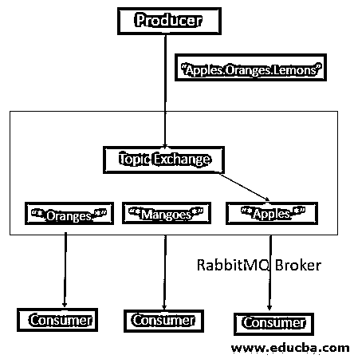
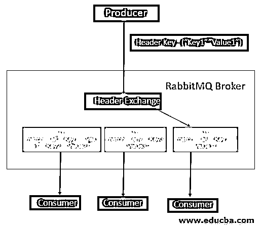

# RabbitMQ 路由密钥

> 原文：<https://www.educba.com/rabbitmq-routing-key/>

## RabbitMQ 路由密钥简介

路由密钥在 RabbitMQ 系统中非常重要。路由密钥由生产者生成，是消息的一部分，与有效载荷(要传输的实际数据)一起。交换机在决定如何路由消息时会查看路由关键字。路由关键字是由点分隔的一个单词或多个单词。

### 什么是路由关键字？

RabbitMQ 因其强大的路由功能而颇受欢迎，路由键在其中扮演着重要的角色。交换负责将消息路由到不同的队列，它使用路由关键字将消息路由到不同的队列。消息由外部应用程序(称为生成器)生成。它必须弄清楚需要发送什么消息，路由关键字应该是什么。在生产者构造消息之后，这些消息被发送到交换机，交换机依次读取路由关键字并将消息路由到适当的交换机或队列。现在的问题是，交换机将路由密钥比作什么:答案是绑定密钥。

<small>网页开发、编程语言、软件测试&其他</small>

### 路由是如何完成的？

为了更好地理解这个过程，让我们也理解一下绑定键。绑定表示队列和交换之间的关系。将队列添加到交换时指定绑定密钥。现在，路由键与绑定键的精确比较取决于交换的类型。让我们讨论各种交换类型以及它们如何路由消息:

#### 1.扇出交换机

它不加区别地将消息路由到所有可用的队列。如果提供了路由关键字，它将被忽略。这种交换对于实现发布-订阅机制很有用。在使用这种交换时，不同的队列可以独立于其他队列以自己的方式处理消息。

如上图所示，消息被路由到所有队列。扇出交换不提供任何路由灵活性，它只能无差别地广播。

#### 2.直接汇兑

它根据消息携带的路由关键字来路由消息。路由关键字是由消息的生产者生成的短字符串。消息被路由到具有与路由关键字完全匹配的绑定关键字的交换机/队列。

如上图所示，路由关键字是“apple ”,消息只传递到一个绑定关键字是“apple”的队列。允许多个队列使用同一个绑定密钥。在上面的例子中，如果我们添加另一个绑定关键字为“Apples”的队列，那么消息也将被传递到这个队列。

#### 3.话题交流

它根据与路由关键字的完全或部分匹配来路由消息。在这种情况下，消息以这样的方式发布，即路由关键字由点分隔的一系列单词组成(如 word1.word2.word3)。模式可以有一个星号(*)，它可以匹配路由关键字特定位置的单词，也可以有一个哈希，它可以匹配零个或多个单词。

在上面的例子中，路由关键字是“苹果”。这些消息被路由到两个队列:一个队列的模式为“*.Oranges.*”，另一个队列的模式为“Apples”。*".

#### 4.标题交换

基于消息头路由消息。将消息头与绑定队列指定的头进行匹配，如果匹配，则将消息发送到该队列。在交换和队列之间的绑定中添加了一个称为“x-match”的特殊参数。现在，该汇整可以有两个值“任意”或“全部”，其中“全部”是默认值。“all”表示所有标题对必须匹配，而“any”表示至少有一个标题对必须匹配。

在上面的例子中，消息被路由到一个队列，该队列的“x-match”被设置为“all ”,并且它的所有键值对(在本例中只有 1 个)都与消息头中的键值对匹配。

#### 5.一致散列法

这种类型的交换对路由关键字或消息头进行哈希处理，以便将消息仅路由到一个队列。这在我们必须保证消息按照发布的顺序使用的情况下很有用。

### 结论

在本文中，我们已经了解了路由键如何为 RabbitMQ 提供强大的路由功能。我们还检查了不同的交换如何根据路由键和绑定键将消息路由到队列或其他交换。

### 推荐文章

这是一个 RabbitMQ 路由键的指南。这里我们讨论路由键如何为 RabbitMQ 提供强大的路由功能。您也可以看看以下文章，了解更多信息–

1.  [rabbitq 体系结构](https://www.educba.com/rabbitmq-architecture/)
2.  [什么是 RabbitMQ？](https://www.educba.com/what-is-rabbitmq/)
3.  [rabbitq 替代品](https://www.educba.com/rabbitmq-alternatives/)
4.  [微服务工具](https://www.educba.com/microservices-tools/)

