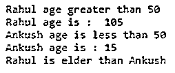

# 伪代码算法

> 原文：<https://www.educba.com/pseudocode-algorithm/>

## 伪代码算法简介

伪代码算法在编程时使用，或者与编写算法相关联。伪代码是一种帮助程序员定义算法实现的方法。我们也可以说伪代码是一个基本算法的虚构的表现。在伪代码算法中，算法用伪代码表示，因为任何人都更容易解释伪代码，即使他们没有任何编程背景或习惯于不同的编程语言。顾名思义，伪代码是一种伪代码，有编程基础知识的外行也能看懂。

### 伪代码算法是如何工作的？

使用伪代码编写算法与用编码语言编写非常相似。编写算法是按顺序在自己的行上完成的。通常，大写字母用于编写指令，小写字母用于编写变量，消息以句子大小写形式编写。在伪代码中，问题是在输入中提出的，而消息是由输出打印出来的。

<small>网页开发、编程语言、软件测试&其他</small>

### 伪代码算法的例子

下面是一些例子:

#### 示例#1

在本例中，我们将检查用户的年龄是否在 50 岁以下或以上。

**第一步**

*   输入输入值
*   输入存储在相应的变量“年龄”中

输入用户输入他们的年龄

将用户的输入存储在 age 变量中

**第二步**

*   插入条件，这里第一个条件是检查年龄变量值是否小于 50。如果该值小于 50，则打印输出注释。否则，将打印 else 注释。

如果年龄< 50 岁，则

输出'我年龄不到 50 '

其他

输出'我的年龄大于 50 '

“输出”我的年龄是:“年龄

**实际代码:**

`Age = 5;
if( Age< 50 )
then
print("My age is less than 50" )
else
print("My age greater than 50" )
end
print("My age is :", Age)`

**输出:**

#### 实施例 2

**第一步**

*   输入输入值
*   输入存储在相应的变量“年龄”中

输入用户输入他们的年龄

将用户的输入存储在 age 变量中

**第二步**

*   插入条件，这里第一个条件是检查年龄变量值是否小于 50。如果该值小于 50，则打印输出注释。否则，将打印 else 注释。在本例中，年龄变量的值为 5，小于 50，因此输出 else 语句。

**代码:**

如果年龄<50 THEN
输出‘我的年龄小于 50’
否则
输出‘我的年龄大于 50’
输出‘我的年龄是:‘年龄

**代码:**

 `Age = 105;
if( Age< 50 )
then
print("My age is less than 50" )
else
print("My age greater than 50" )
end
print("My age is :", Age)`

**输出:**

#### 实施例 3

**第一步**

*   输入 Rahul 的年龄值
*   输入存储在相应的变量“Rahul”中

输入用户输入他们的 Rahul 的年龄

将用户的输入存储在 Rahul 变量中

**第二步**

*   插入条件，这里第一个条件是检查 Rahul 变量值是否小于 50。如果该值小于 50，则打印输出注释。否则，将打印 else 注释。

如果 rahul< 50，那么

输出'拉胡尔年龄小于 50 '

其他

输出'拉胡尔年龄大于 50 '

“输出”拉胡尔的年龄是:“拉胡尔

**第三步**

*   把安库什年龄的输入值
*   输入存储在相应的变量‘Ankush’中

输入用户输入他们的 Ankush 的年龄

将用户的输入存储在 ankushvariable 中

**第四步**

*   插入条件，这里第一个条件是检查 Ankush 变量值是否小于 50。如果该值小于 50，则打印输出注释。否则，将打印 else 注释。

如果 ankush<50，那么

输出'安库什年龄小于 50 '

其他

输出'安库什年龄大于 50 '

“输出”安库什年龄为:“安库什

**第五步**

*   这里使用了另一个条件，变量“Rahul”和“Ankush”下的值。如果条件满足，则打印输出语句，否则打印 else 语句。

如果 rahul>ankush 那么

输出'拉胡尔比安库什年长'

其他

输出'安库什比拉胡尔年长'

**实际代码:**

`Rahul = 105;
if( Rahul< 50 )
then
print("Rahul age is less than 50" )
else
print("Rahul age greater than 50" )
end
print("Rahul age is :", Rahul)
Ankush = 15;
if( Ankush< 50 )
then
print("Ankush age is less than 50" )
else
print("Ankush age greater than 50" )
end
print("Ankush age is :", Ankush)
if (Rahul > Ankush)
then
print("Rahul is elder than Ankush" )
else
print("Ankush is elder than Rahul" )
end`

**输出:**

#### 实施例 4

**第一步**

*   输入年龄值
*   输入存储在相应的变量“年龄”中

输入用户输入他们的年龄

将用户的输入存储在 age 变量中

输出“实际上我是:”年龄

**第二步**

*   插入条件，这里第一个条件是检查年龄变量值是否等于 60。如果该值等于 60，则打印输出注释。

如果年龄== 60 岁，那么

输出'要知道，您已经 60 岁了'

**第三步**

*   插入条件，这里第二个条件是检查年龄变量值是否等于 5。如果该值等于 5，则打印输出注释。

如果年龄==5，那么

输出'要知道，您的年龄是 5 岁'

**第四步**

*   插入条件，这里第一个条件是检查年龄变量值是否等于 0。如果该值等于 0，则打印输出注释。

那么 ELSEIF age==0

“要知道，你不是天生的:P”

其他

输出‘对不起！我猜我们无法确定你的年龄

“输出”告诉你男人！我的年龄是:‘年龄

**实际代码:**

`Age = 150
print("Actually I am: ", Age, "years old" )
if( Age == 60 )
then
print("Got to know that, your age is 60" )
elseif( Age == 5 )
then
print("Got to know that, your age is 5" )
elseif( Age == 0 )
then
print("Got to know that, you are not born :P" )
else
print("Sorry! I guess we are unable to determine your age" )
end
print("Told you man! my age is: ", Age )`

**输出:**

### 优势

以下是伪代码的主要优点:

*   伪代码有助于代码主要关注程序中要使用的逻辑，而不是编程语言的语法。
*   伪代码独立于任何编程语言，这使得它更容易翻译成各种语言。
*   编码者可以自由地用简单的英语表达他们的逻辑，不受任何主要语法的限制。
*   如果编码人员最初使用伪代码编写算法，那么编写实际代码会变得更加容易。因为基本算法不那么简洁，伪代码使得算法足够简洁，使得它更可读并且更容易修改。
*   如果我们把流程图比作伪代码，那么流程图写起来更长，也更难表达。另一方面，伪代码更容易编写，程序也更容易翻译。编码者只需要关注下划线的意思。重点是用逻辑解决问题，而不是拘泥于完美地使用语言。
*   在编写算法时使用伪代码单词和短语简化了将算法翻译成实际编程代码的过程。

### 结论

在上述文章的基础上，我们理解了伪码算法的概念。本文解释了伪码算法及其工作原理。这篇文章介绍了使用伪码算法的主要优点。上面解释了几个例子，它们将帮助编码人员理解伪码算法，以简化他们的程序编写过程。

### 推荐文章

这是一个伪代码算法指南。在这里，我们还讨论了伪代码算法的定义和如何工作，以及不同的例子和它的代码实现。您也可以看看以下文章，了解更多信息–

1.  [Java 中的 swap()](https://www.educba.com/swap-in-java/)
2.  [外壳脚本用法](https://www.educba.com/shell-script-usage/)
3.  [分行覆盖范围](https://www.educba.com/branch-coverage/)
4.  [在 C++中插入排序](https://www.educba.com/insertion-sort-in-c-plus-plus/)

