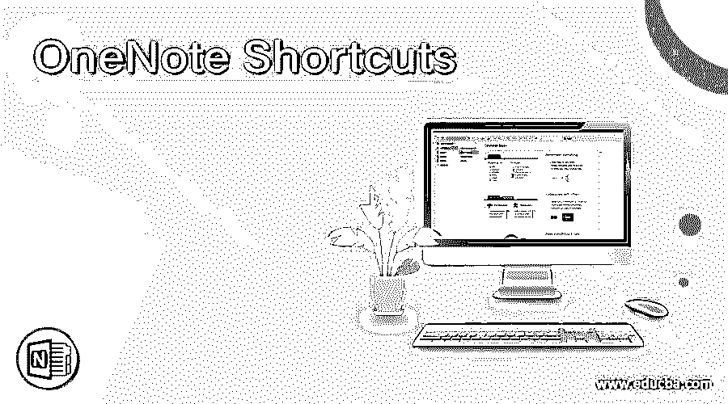

# OneNote 快捷方式

> 原文：<https://www.educba.com/onenote-shortcuts/>

## OneNote 快捷方式简介

OneNote 是由 Microsoft office suite 开发的一个非 taking 程序，用于信息收集和多用户协作。它收集用户的笔记、屏幕剪辑、绘图和音频组件。OneNote 笔记可以通过 internet 或网络与其他 OneNote 用户共享。它支持 Windows 10、android、iOS 和 macOS 等操作系统。作为 OneDrive 和 office for web 的一部分，它有基于网络的版本。为了在 OneNote 中执行各种操作，有一些快捷键可以简化用户的工作。因此，在本文中，我们将讨论 OneNote 的这些快捷键。

下面是 OneNote 的快捷键列表:

<small>网页开发、编程语言、软件测试&其他</small>

*   Ctrl + A:用于选择页面的所有内容。
*   Ctrl + C:用于复制选中的内容。
*   Ctrl + V:用于粘贴复制的文本。
*   Ctrl + X:用来剪切选中的文字。
*   Ctrl + Z:用于撤销之前的动作。
*   Ctrl + Y:用来重做之前的动作。
*   Ctrl + M:用于打开新窗口。
*   Ctrl + Shift + M:用于创建快速笔记。
*   Home:用于移动行首的光标。
*   End:用于移动光标到行尾。
*   Ctrl + K:用于添加超链接。
*   Ctrl + Alt + H:用于高亮显示选中的文本。
*   Ctrl + 0:用于从选中的 notes 中移除所有的 notes 标签。
*   Ctrl + 1:用于应用或清除“待办事项”标签。
*   Ctrl + 2:用于应用或清除“重要”标签。
*   Ctrl + 3:用于应用或清除“问题”标签。
*   Ctrl + 4:用于应用或清除“以后记住”标签。
*   Ctrl + 5:用于应用或清除“定义”标签。
*   Ctrl + 6 或 Ctrl + 7 或 Ctrl + 8 或 Ctrl + 9:用于应用或清除“自定义”标签。
*   Ctrl + Q:用于将当前页面标记为未读。
*   Ctrl + Shift + 1:此快捷方式将创建一个 TodayOutlook 任务。
*   Ctrl + Shift + 2:此快捷方式将创建一个 TomorrowOutlook 任务。
*   Ctrl + Shift + 3:此快捷方式将创建一个 This WeekyOutlook 任务。
*   Ctrl + Shift + 4:此快捷方式将创建下一个 WeekyOutlook 任务。
*   Ctrl + Shift + 5:此快捷方式将创建一个无日期 Outlook 任务。
*   Ctrl + Shift + K:用于打开选中的 outlook 任务。
*   Ctrl + Shift + 0:用于删除选中的 outlook 任务。
*   Ctrl + Shift + 9:用于将 outlook 任务标记为完成。
*   F9:用于同步所有共享笔记本中发生的更改。
*   Shift + F9:用于同步当前笔记本中发生的变化。
*   Ctrl + Shift + E:用于电子邮件中所有选中的页面。
*   Ctrl + o:用来打开笔记本。
*   Ctrl + T:用于创建新的部分。
*   Ctrl + Tab:用于移动到下一节。
*   Ctrl + Shift + Tab:用于移动到前面的部分。
*   Alt + Home:用于移动到节中的第一页。
*   Alt: End:用于移动到该节的最后一页。
*   Ctrl + Alt + 1:用于应用标题 1 样式。
*   Ctrl + Alt + 2:用于应用标题 2 样式。
*   Ctrl + Alt + 3:用于应用标题 3 样式。
*   Ctrl + Alt + 4:用于应用标题 4 样式。
*   Ctrl + Alt + 5:用于应用标题 5 样式。
*   Ctrl + Alt + 6:用于应用标题 6 样式。
*   Ctrl + I:用于对文本应用或移除斜体。
*   Ctrl + B:用于创建或删除粗体。
*   Ctrl + U:用于应用或删除下划线。
*   Ctrl + Shift + N:用于清除应用于文本的所有格式。
*   Ctrl +连字符:用于应用或删除删除线。
*   Ctrl +。:它用于应用或删除项目符号列表。
*   Ctrl + /:用于应用或移除编号列表。
*   Ctrl + =:它用于应用或移除下标。
*   Ctrl + Shift + =:用于应用或移除上标。
*   Ctrl + Alt + P:用来播放选中的录音。
*   Ctrl + Alt + S:用于停止选中的录音。
*   Ctrl + Alt + U:用于向前跳过录音 10 秒。
*   Ctrl + Alt + Y:用于向后跳过录音 10 秒。
*   F7:它是用来检查笔记本上的拼写的。
*   Ctrl + L:用于设置向左对齐。
*   Ctrl + R:用于设置右对齐。
*   Alt + Shift + D:用于添加当前日期。
*   Alt + Shift + T:用于添加当前时间。
*   Alt + Shift + F:用于添加当前日期和时间。

### 结论

这里我们讨论了 OneNote 的各种快捷键，用户可以使用这些快捷键轻松地记下笔记并节省时间。

### 推荐文章

这是 OneNote 快捷方式指南。这里我们讨论 OneNote 快捷键列表的引入。您也可以看看以下文章，了解更多信息–

1.  [Revit 键盘快捷键](https://www.educba.com/revit-keyboard-shortcuts/)
2.  [后效快捷键](https://www.educba.com/after-effects-shortcuts/)
3.  [Maya 快捷键](https://www.educba.com/maya-shortcuts/)
4.  [ArchiCAD 快捷键](https://www.educba.com/archicad-shortcuts/)

