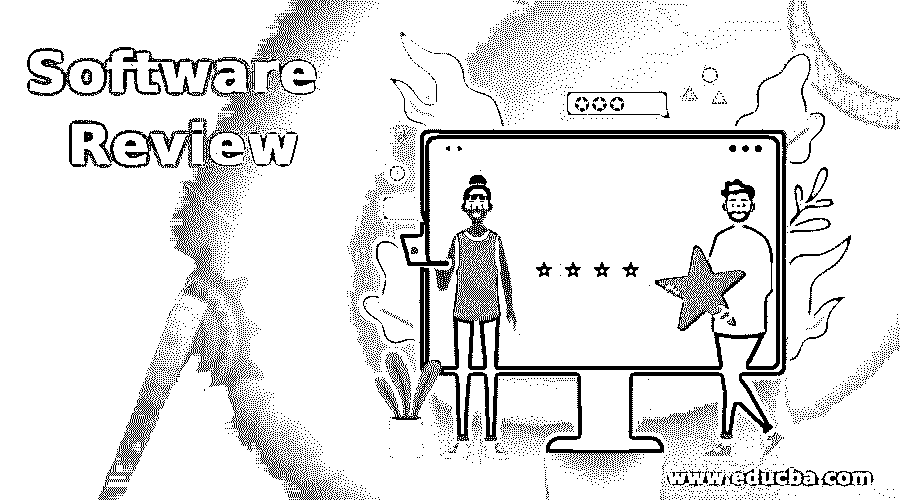

# 软件评论

> 原文：<https://www.educba.com/software-review/>

## 软件评审的定义

软件评审是由一个或多个个人对软件进行的系统检查，他们一起检查软件及其需求，并试图在软件开发生命周期的早期阶段找到并解决可能的错误。审查在 SDLC 中起着重要的作用，它帮助软件工程师验证软件的功能和质量，以及软件的可靠性和其他支持领域。换句话说，我们也可以说软件评审是一个验证软件需求、设计、功能、测试用例以及测试计划的过程。软件评审从非正式的到正式的都有。

*   正式审查:正式审查是以书面程序和要求为特征的审查。它与开发过程的成熟度、法律或法规要求或审计跟踪的需要等因素有关。
*   **非正式评审:**非正式评审是不基于文件化程序的评审，即正式程序。这可以在开发早期的不同时间应用。

### 正式审查的各个阶段

正式评审分为以下 6 个阶段

<small>网页开发、编程语言、软件测试&其他</small>

*   **计划:**在计划阶段，制定具体软件评审的计划，包括评审标准、角色分配、进入和退出标准等各种因素。
*   **启动:**在启动阶段，向评审人员简要介绍评审目标和文档。向参与者解释需要执行的目标和过程。
*   **准备:**在准备阶段，通过审查文件、记录缺陷/故障等为审查会议做准备。
*   **评审会议:**在评审会议阶段，通过记录各种文档、结果、缺陷和解决方案进行讨论。讨论各种活动，如考试、评估、结果。
*   **返工:**在返工阶段，团队试图通过返工并保持缺陷的更新结果来修复缺陷/故障。
*   **跟进:**在跟进阶段，主持人检查各种退出标准和指标，以确保对所有缺陷、流程改进建议和交换请求采取了正确的措施。

### 软件评审的类型

有各种类型的软件审查如下:

#### 1.游戏攻略

演练是文档作者为收集信息并建立对其内容的共同理解而提供的逐步演示。文档的作者主持会议。为了验证内容，使用了各种场景。

走查审查的目标

*   向软件学科内外的涉众展示文档，以便收集关于文档所涵盖主题的信息。
*   建立对文件的共识。
*   检查并讨论解决方案和其他备份替代方案的有效性。
*   解释和评估文件的内容。

#### 2.技术评论

技术评审是指召开会议讨论文档的技术内容并达成共识的过程。与检查评审相比，技术评审不太正式。它的主要焦点是技术概念和它的成就。在技术评审中，进行单独的准备工作来检查产品或软件并发现缺陷。它由技术专家或主持人领导。

技术评审的目标

*   建立技术概念的一致性
*   确保技术概念在开发的早期阶段是正确的
*   获取技术概念值及其替代值

#### 3.检查评审

检查评审是一种正式评审，它依靠对文档的目视检查来发现缺陷。这是最正式的审查技术，因此，总是基于一个记录的程序。在检查评审中，文件由主持人在会议前准备并检查；通过将文件与其来源和其他参考文件进行比较，并使用规则和清单来审查文件。在会议中，发现的缺陷被记录下来，任何讨论都被推迟到讨论阶段。这个过程使得会议成为一个非常高效的会议。

检查评审的目标

*   尽快排除故障或缺陷。
*   通过参与者之间的信息交流达成共识。
*   帮助作者提高文档的质量。
*   提高产品质量。
*   找到缺陷并学习它们，以便我们可以改进流程，从而防止类似类型的缺陷再次发生。

### 软件评审的成功因素

下面是实施评审时可以提高成功几率的关键成功因素列表。

1.  找一个冠军
2.  挑选真正有价值的东西
3.  培训参与者
4.  选择正确的技术
5.  明确计划和跟踪评审活动
6.  管理人员问题
7.  持续改进流程和工具
8.  使用测试仪
9.  遵循规则，但保持简单
10.  报告结果
11.  去做吧！

### 推荐文章

这是软件评审指南。在这里，我们还将讨论正式评审的定义和阶段，以及包括走查、技术评审和检查评审在内的类型。您也可以看看以下文章，了解更多信息–

1.  [软件可靠性](https://www.educba.com/software-reliability/)
2.  [软件维护类型](https://www.educba.com/software-maintenance-types/)
3.  [软件成本估算](https://www.educba.com/software-cost-estimation/)
4.  [软件配置管理工具](https://www.educba.com/software-configuration-management-tools/)

