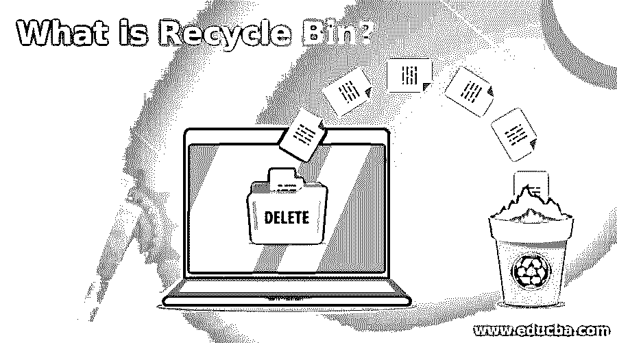

# 什么是回收站？

> 原文：<https://www.educba.com/what-is-recycle-bin/>

## 回收站简介

回收站是一个临时存储 Windows 中已删除对象的地方，直到这些对象被永久删除。它帮助用户在 Windows 操作系统中恢复从 Windows 95 中删除的文件。在用户永久删除文件之前，文件不会从硬盘驱动器中永久删除；所有删除的文件或目录将被保存在回收站。此外，回收站可以让您检索存储在原始存储位置的所有文件。您不能直接访问回收站中的文件；您必须先检索文件才能使用它们。从 Windows 95 开始，它就可以在所有版本的 Windows 中使用。但是，该图标不会出现在更高版本的 Windows 操作系统中。在这种情况下，可以在 Windows 的设置中查看该图标。如果没有堆肥箱，看起来会像真空回收箱。如果它有某些细节，它会与文件一起出现，如下图所示。

### 什么是回收站？

回收站是 windows 的一个文件或文件夹，用于临时存储所有已删除的文件、文件夹和纸张。在带 windows 的桌面上。当回收站为空时，图标会显示一个空的回收站，当回收站中包含项目时，图标会在纸质回收站中发生变化。无论是拖放物品到图标或挑选物品，并按下删除键可以很容易地移动到可回收袋。你也可以选择右键上的东西并选择删除菜单。

<small>网页开发、编程语言、软件测试&其他</small>

如何判断回收站是否包含文件？如果您只是从系统中删除一个文件，它不会被永久删除，而只是被转到回收站。您可以在系统上看到回收站图标，以确定它是否包含文件或为空。当回收站包含文件时，图标看起来像一个装满摩擦纸的篮子。如图所示，一个空的回收站显示为一个空篮子。

### 回收站怎么用？

右键单击回收站图标，您可以更改存储容量，然后从下拉列表的几个选项中选择属性。例如，您可以在“回收站属性”窗口中更改回收站的空间，以存储已删除的数据。您可以通过设置 mb 数或向左或向右拖动滑块来更改存储空间，以便在回收站中存储已删除的文件。此外，它还可以从设备上卸载回收站功能。

### 回收站的优势

有临时存储的已删除文件或文件夹。已删除的对象可以恢复到其原始位置。回收站层只能用于删除最初驻留或存储在操作系统中的东西(文件和文件夹)。如果您从外部存储介质(如网络驱动器、USB 存储器、外部硬盘驱动器等)中卸载这些东西。回收最大限度地减少全球变暖，其严重后果是完全真实的。在废物处理过程中，大量的废物被燃烧，导致高温室气体的释放，如二氧化碳、硫和氮，加剧了全球变暖和气候变化。回收利用允许对现有资源进行敏感和有效的利用。回收消除了大量供应的原材料的歧视性使用的风险。

如何在你的闪存盘上有一个回收站

通常，您在另一台机器上操作，并且您希望将所有已删除的文件夹存储在与该机器一起使用的闪存驱动器上。在这种情况下，您可以使用 iBin 实用程序，将所有已删除的文件发送到连接的闪存盘上的回收站文件夹中。此外，它还提供额外的数据保护。你必须从闪存盘下载 ibin.exe 文件才能使用 iBin 工具。然后，通过按 Windows 键删除，删除文件。首次安装或使用该实用程序时，只需几分钟即可将它安装到闪存驱动器上。完成 iBin 配置设置后，所有临时删除的文件将被转发到闪存驱动器 Bin 文件夹，而不是 Windows 回收站。此外，通过打开 iBin 通知区域图标中的自定义选项，您可以相应地更改此实用程序的设置。

### 推荐文章

这是一个什么是回收站的指南？.这里我们也讨论一下回收站的介绍和使用方法？伴随着优势。您也可以看看以下文章，了解更多信息–

1.  [投资网络安全](https://www.educba.com/invest-in-cybersecurity/)
2.  [Windows 简介](https://www.educba.com/introduction-to-windows/)
3.  [什么是 SOA？](https://www.educba.com/what-is-soa/)
4.  [苹果电视功能](https://www.educba.com/apple-tv-features/)

