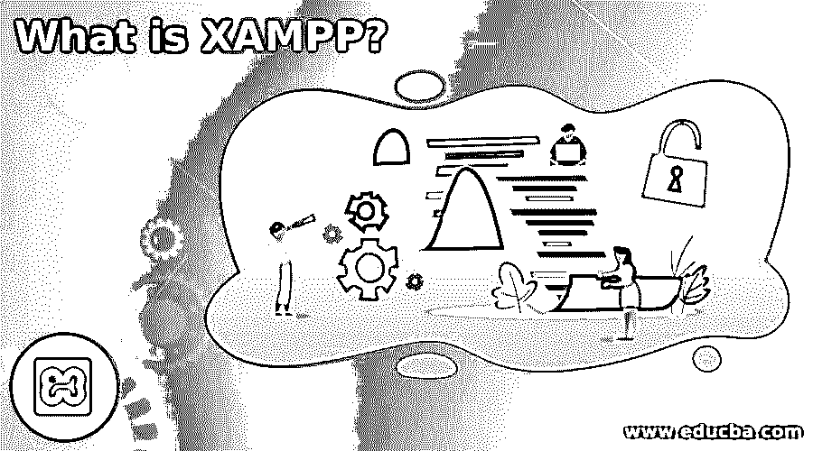

# 什么是 XAMPP？

> 原文：<https://www.educba.com/what-is-xampp/>

## XAMPP 简介

XAMPP 是一个免费的开源跨平台网络服务器。XAMPP 是跨平台、Apache、MySQL、PHP 和 Perl 的简称。XAMPP 是一个流行的跨平台 web 服务器，它允许程序员在本地 web 服务器上编写和测试他们的代码。它是由 Apache Friends 创建的，公众可以修改或修改其原生源代码。它包括 MariaDB、Apache HTTP Server、PHP 和 Perl 解释器以及其他计算机语言。由于 XAMPP 的部署简单，开发者可以快速轻松地在操作系统上安装 WAMP 或 LAMP 堆栈，另外还可以加载像 WordPress 和 Joomla 这样的常用插件应用。

### 需要一个 XAMPP

*   XAMPP 只是一个本地主机或服务器。
*   这个本地服务器运行在您的个人计算机上，无论是台式机还是笔记本电脑。
*   它用于在将客户端或网站发布到远程 web 服务器之前对其进行测试。
*   在本地计算机上，XAMPP 服务器软件为测试 MYSQL、PHP、Apache 和 Perl 项目提供了合适的环境。因为大多数真实世界的 web 服务器部署与 XAMPP 共享相同的组件，所以从本地测试服务器迁移到活动服务器非常简单。

### XAMPP 的优势和劣势

下面给出了提到的优点和缺点:

<small>网页开发、编程语言、软件测试&其他</small>

#### 优势:

*   与 WAMP 等其他网络服务器相比，它的设置非常简单。
*   它是跨平台的，这意味着它可以在 Windows 和 Linux 上工作。
*   只需一个命令，您就可以启动和停止整个 web 服务器和数据库堆栈。
*   XAMPP 的完整版和标准版都有。
*   它有一个控制面板，您可以看到它包含特定机制的启动和停止按钮，例如 Apache，它通过它的控制面板运行。
*   它还包括 OpenSSL、phpMyAdmin、MediaWiki、Joomla、WordPress 和许多附加模块。

#### 缺点:

*   与 WAMP 服务器相比，配置和设置更加困难。

### XAMPP 的组成部分

XAMPP 中包含的组件如下所示:

*   **跨平台:**不同的操作系统以独立的配置安装在不同的本地系统上。包含跨平台组件是为了改进这个 Apache 发行包的功能和范围。它适用于各种平台，包括 Windows、Linus 和 MAC OS 软件包。
*   **Apache:** Apache 是一个跨平台的 HTTP web 服务器。它被用来在世界各地传输网络材料。如果有人使用浏览器请求文件、照片或文档，HTTP 服务器会将这些资产提供给客户端。
*   **MariaDB 数据库:** XAMPP 曾经包括 MySQL DBMS 然而，MariaDB 现在已经取代了它的位置。MySQL 是使用最广泛的关系数据库管理系统之一。它通过互联网提供数据存储、操作、检索、管理和删除服务。
*   **PHP:**PHP 的全称是超文本预处理器。PHP 是 web 开发中最常用的后端编程语言。用户可以使用 PHP 建立动态网站和应用程序。它支持各种数据库管理系统，可以安装在任何平台上。它是用 C 语言编写的。
*   Perl: Perl 通常被称为“通用”编程语言。这种 Perl 语言是动态的，可解释的。这种语言用于 web 开发、GUI 开发、系统管理和其他事情。Perl 支持 HTML、XML 和其他标记语言。
*   phpMyAdmin: 它是 MariaDB 的一个数据库管理工具。
*   **OpenSSL:** OpenSSL 是 SSL 和 TLP 的开源实现。
*   **XAMPP 控制面板:**XAMPP 控制面板是一个协助操作和调节其他 XAMPP 组件的面板。
*   Webalizer: 这是一个 web 分析软件解决方案，可以跟踪用户日志并报告使用情况。
*   Mercury: 它是一个邮件服务器，帮助管理互联网上的电子邮件。
*   Tomcat: 它是一个基于 JAVA 的 servlet，提供 JAVA 功能。
*   **Filezilla:** 它是一个文件传输协议服务器(FTP 服务器)，方便并支持文件传输过程。

### XAMPP 的应用

*   XAMPP 的创建者打算把它作为一种开发工具，让网页设计者和程序员在个人电脑上测试他们的工作，而不需要互联网连接。许多关键的安全元素在默认情况下是禁用的，以使其尽可能简单可行。XAMPP 是用来为互联网上的网页服务的。
*   它还可以用来在 MariaDB 和 SQLite 以及其他数据库中创建和操作数据库。
*   一旦安装了 XAMPP，FTP 客户端就可以连接到本地主机，并将其视为远程主机。在安装 Joomla 或 WordPress 这样的内容管理系统时，使用 FileZilla 这样的工具。您还可以使用 HTML 编辑器通过 FTP 连接到本地主机。

### 结论

XAMPP 是跨平台、Apache、MySQL、PHP 和 Perl 的简称。XAMPP 是一个免费的开源跨平台网络服务器。XAMPP 只是一个本地主机或服务器，用于在将客户端或网站发布到远程 web 服务器之前对其进行测试。本地计算机上的 XAMPP 服务器软件为测试 MYSQL、PHP、Apache 和 Perl 项目提供了合适的环境。这种方法有时可能有助于您避免实时网站上的问题。

### 推荐文章

这是一本什么是 XAMPP 的指南？这里我们分别讨论介绍、需求、优缺点、组件和应用。您也可以看看以下文章，了解更多信息–

1.  [XAMPP 另类](https://www.educba.com/xampp-alternative/)
2.  [jQuery ajax 上传文件](https://www.educba.com/jquery-ajax-upload-file/)
3.  [旅游路线](https://www.educba.com/laravel-route/)
4.  [PHP 压缩文件](https://www.educba.com/php-zip-files/)

