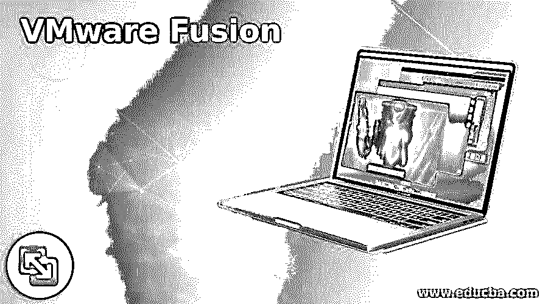

# VMware Fusion

> 原文：<https://www.educba.com/vmware-fusion/>

## VMware Fusion 简介

VMware Fusion 最初是为 MAC 操作系统或 Macintosh 计算机开发的。VMware Fusion 只不过是虚拟机管理程序软件，最初由 VMware 开发。通常，VMware Fusion 可以基于基于 Intel 的 MAC 创建虚拟机。这里，主机操作系统是 MAC 操作系统，我们可以运行不同的客户操作系统，如 NetWare、Solaris、Microsoft Windows、Linux、MAC OS 等。

VMware Fusion 对 Mac 过渡使用了不同的概念。它主要使用两个概念，第一个是半虚拟化，第二个是硬件虚拟化。借助半虚拟化和硬件虚拟化的结合，我们能够成功地将 Mac 过渡到英特尔处理器。这是在 2006 年实现的。

<small>网页开发、编程语言、软件测试&其他</small>

### VMware Fusion 是如何工作的？

VMware fusion 在基于 Intel 的 MAC 操作系统上运行。在半虚拟化和硬件虚拟化的帮助下，我们能够在 MAC 操作系统上创建虚拟机。一旦实际或现有的硬件将被虚拟化。我们可以创建自己喜欢的操作系统，如 Linux、Windows 等。我们可以用虚拟资源、虚拟磁盘、虚拟内存、虚拟 CPU、虚拟网络等来定义虚拟机。

以下是 VMware Fusion 的系统要求列表:

*   我们需要任何基于英特尔处理器的 MAC 操作系统。英特尔处理器的最低要求是 1.5 GHz。我们也可以考虑更快的处理器。
*   我们至少需要 512MB 内存或 1GB 内存。这是推荐值。这是非常少的要求。我们需要更多的内存来运行 MAC 操作系统上的虚拟机。
*   我们需要至少 275MB 的可用磁盘空间用于 VMware Fusion。每个虚拟机至少需要 1GB 的可用磁盘空间。
*   如果我们需要使用 VMware Fusion，我们需要列出 MAC 操作系统的 10.4.9 版本。如果我们能得到比这更高的价格，它也会起作用。

### VMware Fusion 的优势和劣势

以下是 VMware Fusion 的优势和劣势:

#### 优势:

*   它将使用更少的资源，即 OSX 飞行。由于半虚拟化技术，它将在几秒钟内(在当时)让 OSX 慢下来。
*   它将利用虚拟机内部 2%的 CPU 资源。在并行暂停过程或功能中，它将利用 9%到 10%。
*   它可以使虚拟机休眠，而在 parallels 中，每次你想退出程序时，你都需要完全关闭 Windows。(谈论新兵训练营虚拟机)
*   它拥有更快的 CPU 处理速度、更少的内存使用和更好的 I/O 选项。
*   它不会破坏 Windows 操作系统虚拟机。(但是在旧版本中有虚拟机崩溃的问题)
*   在可可应用程序中，它将能够在 Windows 服务器中保持较少的内存使用率。
*   与 parallels 相比，启动和停止过程要快得多。
*   它将提供更好的 USB 2 支持。它还将为不同的设备提供良好的支持，如 WM 手机等。
*   我们得到了 VMware 工程师的大力支持。尽管如此，我们有一个很好的社区平台，可以在任何问题上获得帮助。
*   产品稳定性好。它不会坠毁。如果我们正在考虑并行崩溃，那么它将至少有一天。

#### 缺点:

*   它需要一个更强大的硬件平台。但在小型基础设施中，它像 Core 一样工作得有点慢——2 duo Macbook Pro，2GB RAM，10.4.9 版本，2 个 CPU。
*   如果我们正在与 2D 图形，那么它将利用 40%至 50%的平行。这将取决于行动。
*   如果我们在全屏模式下工作，那么 command + H 选项将不起作用。一旦它隐藏起来，它就不会再出现在纱窗上。除非直到，我们不能点击 MAC 托盘或者除非直到我们可以右击 dock 图标。
*   它有一些网络相关的问题。主要是 ADSL 类型的网络连接出现了一些问题。
*   当我们与工作环境连接或者将要与特定领域连接时，它会产生一些问题。通常，在重试 2 到 3 次后，它将不会在初始阶段打开，然后会连接。
*   当我们处理来宾和主机时，拖放选项不起作用。在某些情况下，它还会打印错误消息。
*   它不会为虚拟机使用单独的硬件配置文件。因此，它将导致“多处理器 ACPI PC”中的设备管理器。

### VMware Fusion 的使用

下面给出了提到的用途:

*   我们可以使用 VMware fusion 在基于 Intel 的 MAC 操作系统上运行 Windows 和 Linux 应用。
*   在保护 Mac 完整性的同时，我们可以运行多个或不同的操作系统
*   VMware Fusion 将安全地运行虚拟机。它将与主机 MAC 操作系统隔离。它将考虑虚拟化的硬件安全性和故障隔离。

### VMware Fusion 的功能

下面是提到的特征:

*   屏幕共享
*   文件传输
*   智能卡身份验证
*   访问睡眠/关机的计算机
*   互联网上的远程会话
*   手机远程控制
*   多平台远程控制
*   会话记录
*   释文
*   监控和警报
*   多平台远程控制

### 结论

我们已经看到了具有不同功能和选项的 VMware fusion 的完整概念。VMware fusion 旨在基于 MAC 操作系统创建来宾虚拟机。但是在这样做的时候，我们要确保它是基于英特尔处理器的。我们可以部署多个或不同的操作系统并并行运行它们。

### 推荐文章

这是 VMware Fusion 的指南。在这里，我们分别讨论介绍，工作，优缺点，用途和特点。您也可以看看以下文章，了解更多信息–

1.  [安装 VMware](https://www.educba.com/install-vmware/)
2.  [硬件虚拟化](https://www.educba.com/hardware-virtualization/)
3.  [什么是 VDI？](https://www.educba.com/what-is-vdi/)
4.  [虚拟软件](https://www.educba.com/virtualization-softwares/)

