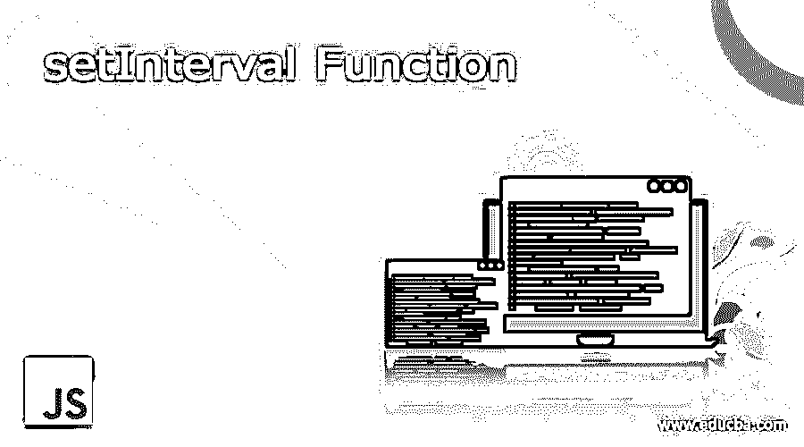
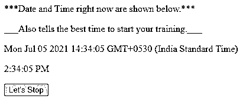

# setInterval 函数

> 原文：<https://www.educba.com/setinterval-function/>

## setInterval 函数介绍

程序员需要在特定的时间间隔后重复运行一组命令的情况有很多。所以，现在运行一组特定的命令对一个程序员来说变得很困难，需要复杂的代码编写才能成功。setInterval 来拯救 javascript 编码人员了。使用 set interval 的简单语法，可以很容易地在特定时间间隔后重复执行一组代码或函数。这使得这种方法对于每个从事 Java script 工作的程序员来说都很重要。在这篇文章中，我们将通过不同的例子详细解释集合区间及其工作原理。

**语法:**

<small>网页开发、编程语言、软件测试&其他</small>

下面是设置 setInterval 函数的基本语法。

`setInterval(function, milliseconds)`

对于更多的参数，语法应该是:

`setInterval(function, milliseconds, parameterA, parameterB, parameterC, ...)`

这里，

*   该函数是必需的，因为没有它，setInterval 将无法设置，并且它是您想要执行的函数。
*   毫秒也是一个至关重要的组成部分，因为没有它，setInterval 将无法设置。它用于设置想要执行代码的次数；基本上就是音程。1000 毫秒= 1 秒。
*   参数，参数 b，参数 c，…是可选组件。这些是传递给函数的附加参数。

### setInterval 的工作

可以使用 setInterval()函数设置间隔。setInterval()可以很容易地定义为一个方法，它使我们能够在一个定义的时间段内重复调用函数。与 setTimeout()函数相比，setInterval()函数的工作方式非常相似。但是，它们略有不同。例如，setTimeout 只工作一次，这意味着它只在定义的时间间隔后调用一个函数或一组代码一次，但是 setInterval()函数在定义的时间间隔后一次又一次地调用一个函数或一组代码。例如，如果我们必须在网站上每 10 分钟向访问者显示一条消息。现在，如果我们应用 setInterval()函数，我们将成功地执行期望的结果，为用户带来良好的用户体验。

### setInterval 函数的示例

下面是 setInterval 函数的例子，给出如下:

#### 示例#1

在下面的示例中，SetInterval 函数的基本示例使用 SetInterval 函数设置警报。单击“乘坐”按钮时，SetInterval 函数被激活，它反过来以弹出窗口的形式显示一个警告，消息如下图所示。这个警报会一直持续下去。

`<!DOCTYPE html>
<html>
<body>
<button onclick="course()">Take a Ride</button>

Visit our Website to Explore new and latest courses and Training Programs. So, click "Take a Ride" button to get a small guided tour.

</body>
</html>`

**输出:**

*   **关于代码执行—**

*   **点击“乘坐”按钮—**

**T2】**

 **#### 实施例 2

在下面的示例中，手表和日期显示是使用 SetInterval 函数创建的。执行代码时，屏幕上会显示以 IST 当地时间表示的日期和单独的时间。

`<!DOCTYPE html>
<html>
<body>
<m>***Date and Time right now are shown below.***</m>

___Also tells the best time to start your training.___

</body>
</html>`

**输出:**

#### 实施例 3

在下面的示例中，手表和日期显示是使用 setInterval 函数创建的，并使用 clearInterval 函数停止。执行代码时，屏幕上会显示以 IST 当地时间表示的日期和单独的时间。点击“让我们停止”按钮，时间和日期都会立即停止。

`<!DOCTYPE html>
<html>
<body>
<m>***Date and Time right now are shown below.***</m>

___Also tells the best time to start your training.___

<button onclick="letsStopTime()">Let's Stop</button>

</body>
</html>`

**输出:**

#### 实施例 4

在下面的例子中，SetInterval 函数被用来以递减的方式给一个条着色。单击“Click to See Outcome”按钮，SetInterval 功能被激活，它反过来以 20 毫秒的间隔显示一个连续递减的条，直到值达到 0。

`<!DOCTYPE html>
<html>

<body>
<h1>If you don't work hard and smart. You will fall like this.</h1>

 
<button onclick="EDUCBA()">Click to See Outcome</button>

</body>
</html>`

**输出:**

*   **关于代码执行—**

**点击“点击查看结果”按钮—**

**T2】**

 **

### 结论

在这篇文章的基础上，我们理解了集合区间的概念。我们通过不同的例子来理解如何设置音程以及如何根据代码的要求来操作它们。这篇文章将帮助初学者理解 set intervals 的用法，并在他们自己的代码中实现它。

### 推荐文章

这是一个 setInterval 函数的指南。这里我们还讨论了 setInterval 函数的介绍和例子。您也可以看看以下文章，了解更多信息–

1.  [JavaScript setInterval](https://www.educba.com/javascript-setinterval/)
2.  [JavaScript 事件处理程序](https://www.educba.com/javascript-event-handler/)
3.  [JavaScript 倒计时](https://www.educba.com/javascript-countdown/)
4.  [反应原生保持清醒](https://www.educba.com/react-native-keep-awake/)

****