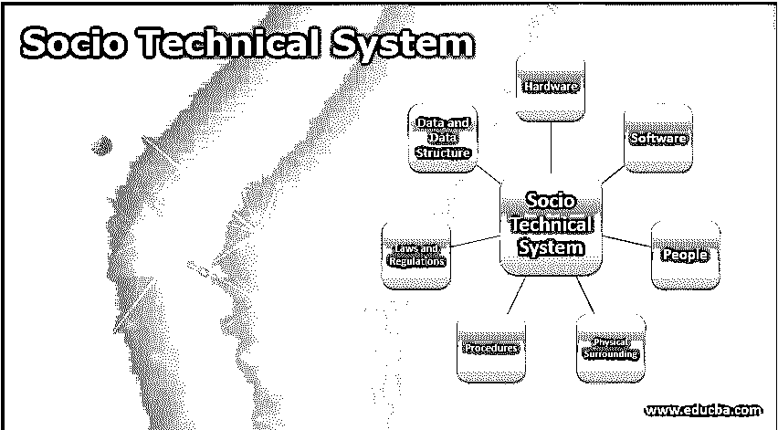

# 社会技术系统

> 原文：<https://www.educba.com/socio-technical-system/>

## 社会技术系统导论

社会技术系统是人和技术以及更多的东西的混合体。它是一种复杂的组织工作设计方法，能够识别工作场所中人与技术之间的交互。该系统将能够执行多个复杂的计算，并将结果返回到其环境中。它说明了系统的基本特征。

### 社会技术系统组件

不同的组件如下所述:

<small>网页开发、编程语言、软件测试&其他</small>

#### 1.五金器具

它包括主机、工作站、外围设备、连接网络。例如，考虑一组通过网络连接的 10 台微型计算机。这些联网的计算机根据环境的不同而不同。这些联网计算机可以是急诊室、大学小型公共实验室、小学计算实验室的一部分，也可以是保险形式的风险分析工具，或者是测试制造零件的军事供应商的一部分。在这个社会技术系统中，硬件就是微型计算机、连接线、集线器、路由器等。

#### 2.软件

软件是任何社会技术系统不可分割的一部分。软件和硬件将社会规则和组织程序作为其设计的一部分:操作系统、实用程序、应用程序、专用代码。操作系统是一种软件，它很可能不会改变，在设计时更多地考虑了社会技术系统。

#### 3.人

个人、团体、机构。一个人在不同的社会技术系统中的这些不同角色带来了不同的责任和伦理问题。

#### 4.物理环境

建筑也影响社会规则，它们的设计可以影响技术的使用方式。将技术从一个物理环境转移到另一个物理环境可能会导致不匹配问题。

#### 5.程序

官方和实际管理模式、报告关系、文档、数据流、规则和规范。它描述了在一个组织中做事的方式。规则及其实际执行对于理解一个社会技术系统是很重要的。例如，那些知道规则的人知道如何投诉，如何通过调查问卷，以及如何找到技术问题的答案。

#### 6.法规

这些程序与上述程序相同，但如果违法者被抓，他们将受到特殊的社会制裁。它们是关于隐私保护或军用芯片测试的法律。这些社会法律法规可能会相互冲突。例如，一些公司期望员工共享商业软件。显然，这些不合法的期望是无法明确表达的，但是可以让他们意识到。

#### 7.数据和数据结构

收集数据、如何记录数据、向谁提供数据以及存储数据的格式都是设计社会技术系统的一部分的决定。急诊室中的数据归档不同于保险公司中的数据归档，并且会受到不同的道德问题的影响。

### 社会技术系统的特征

*   社会技术系统往往是不确定的。这意味着不能保证它们总是为特定的输入生成相同的输出。系统行为取决于人类操作员，而操作员并不总是以同样的方式做出反应。此外，系统的使用可以在组件之间创建新的关系，并因此改变其涌现行为。
*   社会技术系统具有涌现属性，这些属性是系统整体的属性，而不是与系统的单个组件相关联的属性。紧急属性取决于系统组件和它们之间的关系。因此，只有在系统集成后，才能评估紧急属性。
*   系统支持组织目标的程度不仅仅取决于系统本身。还取决于这些目标的稳定性，它们之间的关系和冲突，以及它们如何解释这些目标。

### 紧急系统属性

涌现性是系统组件之间关系的结果。只有将组件集成到系统中，才能对其进行评估和测量。

紧急属性的类型如下:

*   **功能属性:**当一个系统的所有组件一起工作以实现某个目标时，功能属性就出现了。例如，一旦牛车由轮子、座位装置、牛对等部件组装而成，它就具有了作为运输装置的功能特性。
*   **非功能属性:**非功能属性陈述了系统在其功能环境中的行为。比如性能，可靠性，便携性，安全性。系统的可靠性取决于系统组件的可靠性和组件之间的关系，但预期的交互会导致新类型的故障。系统的安全性是其抵御攻击的能力。一些攻击可能是系统设计者没有预料到的，因此可能破坏内置的安全措施。

### 推荐文章

这是一本社会技术系统指南。在这里，我们讨论介绍，社会技术系统的组成部分和紧急系统的性质。您也可以看看以下文章，了解更多信息–

1.  [软件系统架构](https://www.educba.com/software-system-architecture/)
2.  [系统流程图](https://www.educba.com/system-flow-diagram/)
3.  [Python 系统退出](https://www.educba.com/python-systemexit/)
4.  [安全架构](https://www.educba.com/security-architecture/)

