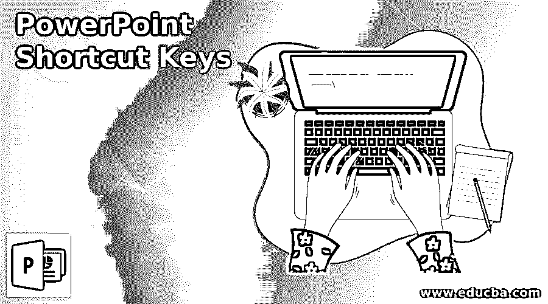

# PowerPoint 快捷键

> 原文：<https://www.educba.com/powerpoint-shortcut-keys/>

## PowerPoint 快捷键介绍

以下文章提供了 PowerPoint 快捷键的概述。PowerPoint 是许多用户用来创建演示文稿的演示软件。它有 102 种语言版本。它是微软办公套件的一部分。它有两个版本，桌面版和网页版。网页版比桌面版要轻一些。为了在 PowerPoint 中执行各种操作，有一些快捷键可以减轻用户的工作。

### OneNote 快捷方式

下面是 OneNote 的快捷键列表:

<small>网页开发、编程语言、软件测试&其他</small>

*   **Ctrl + A:** 用于选择幻灯片的所有内容。
*   **Ctrl + C:** 用于复制选中的内容。
*   **Ctrl + V:** 用于粘贴复制的文字。
*   **Ctrl + X:** 用于剪切选中的文字。
*   **Ctrl + Z:** 用于撤销之前的动作。
*   **Ctrl + Y:** 用于重做之前的动作。
*   **E:** 用于擦除所有钢笔工具和高亮显示的工具标记。
*   **幻灯片编号+回车:**用于从一张幻灯片跳到另一张幻灯片；例如，您想从幻灯片 1 移到幻灯片 8:按 8，然后输入。
*   **ESC:** 用于退出当前幻灯片，并返回活动视图。
*   **Ctrl + B:** 用于创建或删除粗体。
*   **Ctrl + F:** 用于打开查找窗口，使用户能够找到所需的文本。
*   **Ctrl + E:** 用于设置文本向幻灯片中心对齐。
*   **Ctrl + L:** 用于设置向左对齐。
*   **Ctrl + R:** 用于设置右对齐。
*   **Ctrl + H:** 用于隐藏工具。
*   **Ctrl + D:** 用于创建所选幻灯片的副本。
*   **Ctrl + K:** 用于添加超链接。
*   **Ctrl + I:** 在普通视图下，用于创建斜体形式的文本。在幻灯片放映视图中，它用于将普通光标更改为高亮工具。
*   **Ctrl + M:** 用于插入新幻灯片。
*   **Ctrl + N:** 它用于在另一个 powerpoint 程序中创建新的空白幻灯片。
*   **Ctrl + O:** 用于打开文件。
*   **Ctrl + P:** 在普通视图下，用于打印幻灯片。在幻灯片显示视图中，它用于将正常光标更改为钢笔工具。
*   **Ctrl + U:** 用于应用或删除下划线。
*   **Ctrl + S:** 用于保存文件。
*   **Ctrl + T:** 用于打开字体窗口，调整字体样式、大小、颜色等。
*   **Ctrl + W:** 用于关闭当前幻灯片。
*   **Ctrl + =:** 用于应用或删除下标。
*   **Ctrl + Home:** 用于在幻灯片开始时移动光标。
*   **Ctrl + End:** 用于在幻灯片结束时移动光标。
*   **Ctrl + ]:** 用于增加文字的大小。
*   **Ctrl + [:** 用于缩小文本尺寸。
*   **Ctrl +:向上箭头:**用于将光标移动到行首。
*   **Ctrl +:向下箭头:**用于将光标移动到行尾。
*   **Ctrl +:左箭头:**用于将光标向左移动一个单词。
*   **Ctrl +:右箭头:**用于将光标向右移动一个单词。
*   **Ctrl + Backspace:** 用于删除光标左侧的单词。
*   **Ctrl + Del:** 用于删除光标右侧的单词。
*   **Ctrl + F1:** 用于隐藏或显示功能区。
*   **F1:** 用于显示幻灯片中可以使用的快捷键。
*   **F4:** 用于重复上一次执行的动作。
*   **F5:** 用于显示整个幻灯片组的幻灯片。
*   **F12:** 用于打开另存为窗口。
*   F7: 用于打开语法和拼写检查窗口。
*   **Shift + F5:** 用于从选中的幻灯片开始观看。
*   **Shift + Alt + D:** 用于插入当前日期和时间。

### 结论–PowerPoint 快捷键

这里我们看到了 powerpoint 的各种快捷键，用户可以使用它们来创建演示幻灯片并节省时间。

### 推荐文章

这是 PowerPoint 快捷键指南。为了更好地理解，我们在这里讨论简介和 OneNote 快捷方式。您也可以看看以下文章，了解更多信息–

1.  [什么是微软规划器](https://www.educba.com/what-is-microsoft-planner/)
2.  [什么是微服务？](https://www.educba.com/what-is-microservices/)
3.  [计算机输入设备](https://www.educba.com/computer-input-devices/)
4.  [计算机的部件](https://www.educba.com/components-of-computers/)

