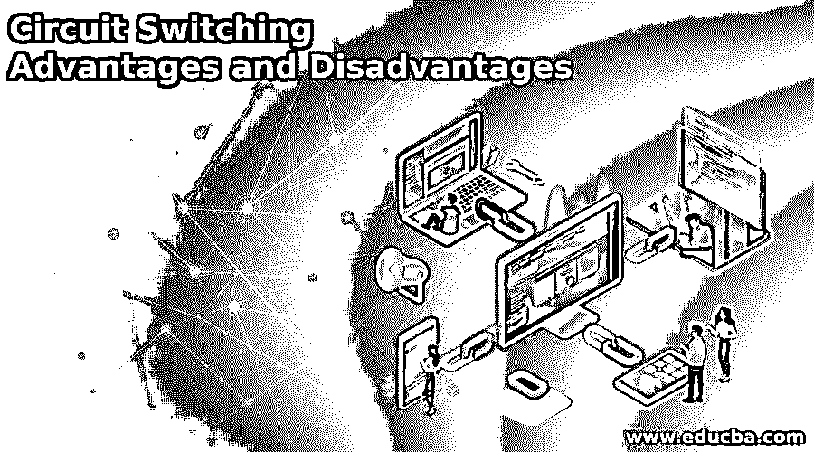

# 电路交换的优点和缺点

> 原文：<https://www.educba.com/circuit-switching-advantages-and-disadvantages/>

## 电路交换优缺点介绍

当两个网络希望通信时，它们在电信网络之间建立连接，这称为电路交换。在电路交换期间，在两个网络之间建立网络路径，并且网络仅通过该路径进行响应，其中该路径不能用于任何其他连接。此路径可用于传输数据，因为它对两个通道都是最安全的，一旦通信完成，就可以移除连接。网络与连接分离，然后该路径可用于其他信道或其他通信。

### 电路交换的优势

*   **专用通信信道:**电路交换为两个网络之间的数据传输提供专用通信信道。该信道有助于将整个带宽专用于通信，并确保信道中没有差异。利用这种信道，数据传输的质量大大提高，并且数据传输只产生固定的速率。这有助于在数据传输期间建立无差异的长距离通信和已知的数据传输速率。由于有专用的物理路径，电路交换通信没有等待时间，这有助于确保通信期间传输的数据的安全性。
*   **良好的带宽:**通常出现在电话系统中，一个特定的带宽被分配给网络，这使得系统有效地工作，在信道之间提供不间断的连接。电路交换在通信网络的物理层建立，并且消息被传送到整个信道，因为该信道专用于此目的。这有助于语音通信，因为它提供了从一个通道到另一个通道的无缝数据传输。
*   **数据包:**数据包以错误的顺序在通信信道中提供，使用户与用户进行正确的通信。一致的数据和数据分组速率使通信连续，并帮助用户在任何信道上进行适当的通信。这导致从一个信道到另一个信道的数据传输中没有任何延迟的连续呼叫。它非常适合于需要大量语音传输的电话系统和语音通信，可以设置用于需要高安全性信道的系统。在同一个通信网络中，通过较少中断的电路交换，可以很容易地建立单个纯信道。通过电路交换和专用信道，网络的性能可以大大提高。
*   **连接:**如果数据是数字或语音，可以使用电路交换来传输数据。电流可以随着语音通信一起传输，从而导致消息的更快传输。这主要用于公共网络，如固定电话和政府批准的语音消息，其中专用信道被分配用于数据传输。它主要基于最初建立路径然后传输数据的连接。要传输的数据量是已知的，因此在信道中相应地设置网络。交叉开关可以用来增加连接的数量。
*   **语音服务:**对于具有较少延迟和固定信道分配速率的语音通信来说，这是非常优选的。安全性和特定的信道分配是通过电路交换分配语音通信的另一个额外优势。可以为数据传输分配特定的时隙，以减少通信网络的空闲时间，从而利用系统中的资源。语音传输不需要报头，因为使用了时隙。

### 电路交换的缺点

*   专用信道的主要问题是，即使该信道可以免费使用并且具有良好的带宽，也无法进行其他数据通信。这使得其他网络创建新的信道，因此可以有许多具有专用网络的信道。由于信道中的网络流量，这造成了网络路径的中断。资源利用不足使得通信网络大部分时间处于闲置状态，资本投资将会损失。用户需要终止电路交换，并且如果信道之间没有通信发生，交换有可能长时间保持空闲，导致资源和金钱损失。
*   初始设置需要时间和金钱。如果带宽不好，建立连接需要时间，长途连接也是如此。在不同的网络之间建立单独的连接，这在进行通信时会在信道中产生偶然的中断，并且需要更多的时间来建立系统中的物理连接。专用信道使得电路交换昂贵，并且用户不能与他人共享信道来降低成本。
*   电路交换不利于数据通信。数据通信以包和流的形式进行，不提供连续的通信流。这使得网络在数据传输未完成时保持空闲，造成资源浪费。
*   如果通信量很大，电路交换就不能正常进行通信，从而导致消息中断。电路交换无法维持流量，导致现在使用这种技术的网络越来越少。如今，移动电话的使用以及通过移动电话的通信非常普遍，人们希望以更快的速度进行通信，而没有任何延迟，并且完全没有流量。因此，分组交换用于 4G 和 5G 设备，而电路交换几乎不用于移动电话。
*   如果电路不能按时连接，可能会掉线。这可能是由于信道不可用或网络中的高流量造成的。建立连接需要时间，这也会导致信道中的掉话。

### 结论

现在电路交换电话少了。通过交换机连接的固定电话呼叫仍然使用电路呼叫。此外，2G 或 3G 电话呼叫在其语音呼叫中使用电路交换。如果语音通话是通过 Skype 或 WhatsApp 之类的数据进行的，那么就不再使用电路交换。

<small>网页开发、编程语言、软件测试&其他</small>

### 推荐文章

这是电路交换优缺点的指南。这里我们详细讨论电路交换的优缺点。你也可以看看下面的文章来了解更多

1.  [什么是电路交换](https://www.educba.com/what-is-circuit-switching/)
2.  [数字电路](https://www.educba.com/digital-circuit/)
3.  什么是分组交换？
4.  [切换技术](https://www.educba.com/switching-techniques/)

