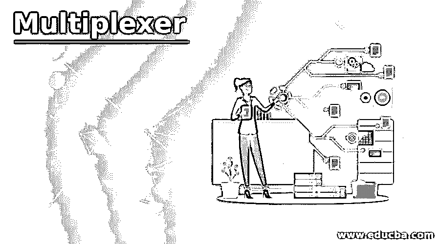
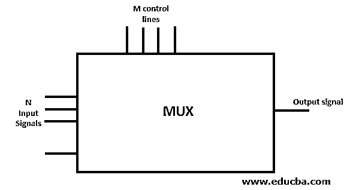
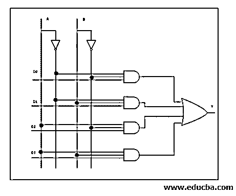

# 多路器

> 原文：<https://www.educba.com/multiplexer/>

## 复用器简介

多路复用器在电子学中还有一个名字叫数据选择器。因此，从名称中可以看出，它从一个源中选择数据。多路复用器从提供给源的不同模拟和数字信号输入中选择数据，并将该信号提供给输出线，因此结果被产生为数字和模拟信号的组合。选择线被提供给多路复用器，并且它仅从那些线中选择信号。这些信号大多是低速的，它们被组合并以比输入信号更高的速度传输。

### 什么是多路复用器？

*   它是一种设备，用于将来自不同输入源的低速数字或模拟信号作为单一输出信号传输到传输速度较高的介质中。该介质可以是单个设备或单个介质。因此，我们可以说复用器是一种多输入单输出设备，用于提高通信系统的效率。根据输出设备的不同，使用的传输导体可以是光缆或铜线。
*   通常，解复用器与复用器一起使用。这有助于验证和挑选出输出设备接收到的信号。它作为一个组合器件工作，通常被称为多路复用器。多路复用器的单个输出由多路分解器的单个输入接收、分析并传输，以便接收器很好地理解系统中的电路。
*   当考虑模拟信号时，需要一个具有时分功能的多路复用器，以便选择、组合单独的模拟信号，并使其成为高幅度模拟信号。由于使用了时分多路复用器，这使得该过程不太复杂。以类似的方式，数字信号作为高振幅的恒定带宽信号被接收、组合和发送。时分多路复用器可用作模拟信号，输入信号被多路复用成可用于输出设备的高速数据流。

### 复用器的类型

根据它们组合和传输的信号类型，很容易将它们分为两种类型。

<small>网页开发、编程语言、软件测试&其他</small>

1.模拟多路复用器是只转换模拟信号的设备。这些信号根据波长和频率进行转换。

因此，波长多路复用器和频率多路复用器是从模拟多路复用器派生出来的两种类型。

**a .波分** **复用器**:各种波长的数据通过单一介质。这有助于确定介质的频率。如果波长增加，频率降低，反之亦然。棱镜可以用作这些类型的复用器的输出，因为棱镜的应用是将不同的波长转换成单个输出。因此，该棱镜成为解复用器的输入。例如，具有不同光波长的光信号通过单条光纤传输，有助于设备通信和数据传输。两个方向都用于光缆中的数据传输。

**b .分频** **复用器**:这是模拟复用中经常出现的复用器。各种频率用于将数据组合成单一输出。带宽被分成不同的频带，所有这些频带向输出信号传送不同的信号。一个非常常见的例子是广播和电视信号。在无线电广播中，多种频率的不同信号同时被传送到空中。FDM 帮助获得这些信号的输出。

2.数字多路复用器是组合和转换数字信号设备。数据是以比特的形式存在的，这些比特是以离散信号的形式存在的。

数字多路复用器分为不同类型。

**时分** **多路复用器**:在信道路径上发送和接收独立的信号，从而将它们分成时隙。每条消息都有一个槽，接收者理解并组合它们。

TDM 分为两种类型。

*   **同步 TDM:** 链路或输入信号被分成时隙，而且是固定的。这些时隙取决于连接的数量，并且是成比例的。进行采样，并且它们对于所有接收的输入都是相似的。同步 TDM 中的所有设备都有相同的时隙。并且即使输入信号是空的，时隙也被分配。
*   **异步 TDM:** 同步和异步 TDM 的区别在于采样速率不同，时钟不能用于所有的信号。如果该时隙没有从输入设备接收到任何信号，它可以用于下一组信号。这在同步 TDM 中是做不到的。

### 框图

下面给出了多路复用器的框图:

多路复用器接收许多输入，并给出一个输出。该多路复用器接收 n 个输入信号，并且仅给出单个输出信号。单一输出信号是器件中使用的控制线的结果。这些控制线进行组合和传输，因此四个输入信号变成一个输出信号。

4 至 1 多路复用器可以类似的方式显示。4 个输入、2 条控制线和 1 个输出是该多路复用器的特点。输出总是取决于设备中使用的控制值。系统的整个控制在控制线中，因为它决定必须选择哪条输入线以及必须将哪些输入数据传输到输出设备。我们可能已经在低年级学生中做了这个实验，以获得想要的结果。

当只有上面的与门被使能而所有其它门被禁用时，D0 信号被传输到输出设备。类似地，当第二个与门被使能，而所有其他与门被禁用时，D1 信号被传输到输出设备。在通信系统中，可以通过不同的方式提高效率，多路复用器的使用是传输高速数据的一种方法。为了更好的通信目的，可以选择时间和带宽。此外，它还可用于实现信号中的布尔函数，以将其用作多变量函数。

### 推荐文章

这是多路复用器指南。这里我们讨论引言；什么是多路复用器？类型和框图。您也可以看看以下文章，了解更多信息–

1.  [复用技术](https://www.educba.com/multiplexing-techniques/)
2.  [传输层协议](https://www.educba.com/transport-layer-protocols/)
3.  [什么是 TCP 协议？](https://www.educba.com/what-is-tcp-protocol/)
4.  [用户数据包协议](https://www.educba.com/user-datagram-protocol/)

