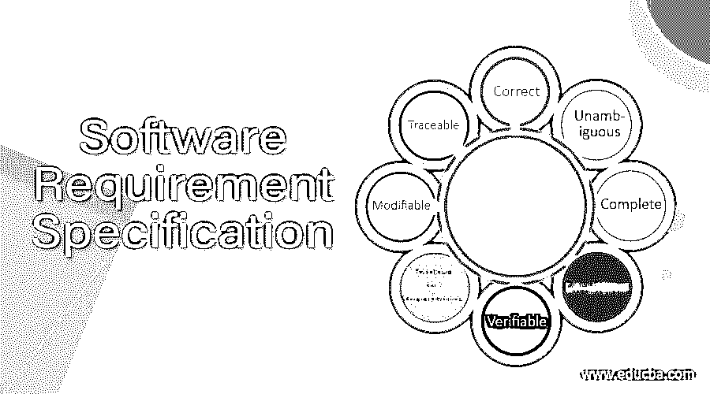

# 软件需求规范

> 原文：<https://www.educba.com/software-requirement-specification/>

## 软件需求规格说明介绍

需求只不过是用户解决问题或实现目标所需的条件。这是系统开发的第一步。软件需求说明书以不一致的方式列出了用户陈述的所有需求。伟大的软件只能从伟大的规范中创造出来。如今的系统和软件是如此复杂，以至于在知道你要构建什么之前就开始设计是愚蠢和冒险的。软件文档也称为软件需求规范。

### 软件需求规范组件

软件需求规格包括以下细节

<small>网页开发、编程语言、软件测试&其他</small>

*   功能:它说明了软件应该做什么
*   **性能:**它涉及速度、响应时间、可用性、恢复时间、软件功能等。
*   **外部接口:**它处理软件如何与人、系统硬件、其他硬件和其他软件交互。
*   **属性:**它解决了可移植性、正确性、安全性、可靠性、可维护性等。
*   **对实现施加的设计约束:**它解决了有效的所需标准、实现语言、数据库完整性策略、资源限制、操作环境等。

### 软件需求规格说明的特征

软件需求规范的特点如下:

*   **正确:**这就像母性和苹果派。当然，您希望规范是正确的。没有人会担心他们知道不正确的规范。正确并不断修正，也就是说，当你发现不正确的地方时，保持规格的更新。
*   明确:一个需求规格说明是明确的，当且仅当其中陈述的每个需求只有一个解释。在发布需求规格之前花时间在这方面可能是浪费时间。但是当你发现不明确的地方，首先要解决它们。
*   **完成:**对此的简单判断是，它应该是软件设计师创建软件所需的全部内容。
*   **一致:**软件需求规格说明书内部应该一致，并与其参考文档一致。如果你在一个地方调用一个输入开始和停止，不要在另一个地方调用它开始或停止。
*   可验证:不要提出这样的要求——它应该为用户提供快速响应，否则系统永远不会崩溃。相反，提供一个量化的要求，比如——每一次击键都应该在 1000 毫秒内提供一个用户响应。
*   **重要性排序:**通常，一个新系统的需求实际上是营销愿望清单。有些可能无法实现。在需求规格中提供这些信息是很有用的。
*   **可修改:**在多个地方有相同的需求可能没有错，但是容易使文档不可维护。
*   **可追溯:**很多时候，这在非政治化的环境中并不重要。然而，在大多数组织中，将需求规范中的需求与更高层次的文档联系起来有时是有用的。

### 利益

*   软件需求规格说明形成了客户和开发组织之间就软件产品预期要做什么达成一致的基础。需求规格中规定了软件预期功能的完整描述。这将有助于最终用户验证软件是否满足指定的需求。如果不是，那么必须如何操作软件来满足需求。
*   软件需求规范减少了开发工作。准备需求规格说明迫使不同的涉众在设计开始之前彻底考虑他们的所有需求，从而减少重新设计、重新编码和重新测试所需的工作。仔细检查指定的需求可以揭示开发早期的遗漏和不一致。因此，纠正这些问题变得更加容易。
*   软件需求规格说明为验证和确认提供了基线。软件开发团队可以从一个准备充分的需求规格文档中更有效地开发它的验证和确认计划或者测试计划。因为它提供了衡量需求确认的基线。
*   它构成了成本估算和项目安排的基础。由于要开发的产品的完整描述是在软件需求规格中指定的，它有助于估计项目成本，并可用于获得客户对已决定的价格估计的批准。
*   它促进了新软件向新环境的转移。软件需求规格说明使得将软件产品转移到新的客户机或新的硬件机器上变得更加容易。以便开发者感觉更容易将软件转移到新的客户，并且客户感觉更容易将软件转移到他们组织的其他系统。
*   它是软件改进的基础。需求规格描述的是产品特性，而不是项目开发的过程；因此，它通过允许开发人员在最终产品需要时进行任何后续修改，作为增强的基础。但是在那种情况下，需求规格说明书需要被修改，也就是说，它形成了连续产品评估的基础。

### 推荐文章

这是一个软件需求规格指南。在这里，我们已经讨论了软件需求规范的基础，以及它的好处和符合性。在这里，我们还讨论了它将如何帮助开发生命周期。您也可以看看以下文章，了解更多信息–

1.  [软件事件管理](https://www.educba.com/software-incident-management/)
2.  [软件可靠性](https://www.educba.com/software-reliability/)
3.  [软件审查](https://www.educba.com/software-review/)
4.  [GIS 软件](https://www.educba.com/gis-software/)

