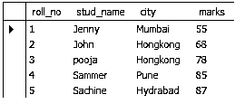
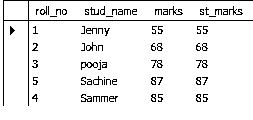
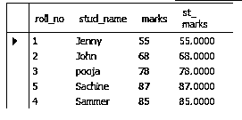
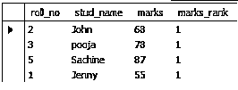

# 红移窗口函数

> 原文：<https://www.educba.com/redshift-window-functions/>

## 红移窗口函数简介

Windows 为用户提供了不同类型的功能，红移是 windows 提供的功能之一。基本上，红移提供了传统聚合函数的范围，并提供了一种合适的方式来快速执行复杂的聚合函数，并根据用户要求简单地编写。Windows 函数还向用户提供不同种类的功能，例如它允许 SQL 开发人员获取所有行并根据用户要求执行不同的计算。换句话说，我们可以说红移函数执行聚合操作，但它是基于行组的。

### 红移窗口函数

现在我们来看看 windows 的不同红移函数如下。

<small>网页开发、编程语言、软件测试&其他</small>

通过利用窗口容量，您可以让您的客户更有效率地进行有见地的业务查询。窗口容量作用于结果集的片段或“窗口”,并为该窗口中的每一列返回激励。相反，对于结果集中的每一行，没有窗口容量完成它们的计算。不同于总结果推送的集束作品，表格连接中的所有列都被持有。

通过利用该窗口中线条排列的值来确定返回的质量。对于表中的每一列，该窗口表征了用于计算额外学分的一串线。利用窗口确定(过度供应)来表征窗口，并且依赖于三个主要概念:

窗口划分，它构造行的集合(分区语句)

窗口请求，描述每个地块内的请求或线组的特征(按但书排序)

窗口轮廓，其特征与每列相当，以额外限制行的排列(行细节)

窗口容量是在查询中执行的最后一个任务安排，最后一个订单除外。在处理窗口容量之前，所有连接和所有 WHERE、GROUP BY 和 HAVING 但书都已完成。因此，窗口容量可能只显示在 select rundown 或 ORDER BY 语句中。您可以在具有各种边缘条件的单独问题中利用各种窗口容量。你同样可以在其他标量发音中利用窗口容量，比如 CASE。红移支持两种窗口容量:聚集和定位。

现在首先让我们看看不同类型的聚合函数，示例如下。

首先，我们需要使用如下语法创建表。

`create table sstudent(roll_no int(30), stud_name varchar(30), city varchar(30), marks int(30));`

**说明:**

通过使用上面的语句，我们创建了一个新的表名 sstudent，它具有不同的属性，如 roll_no、stud_name、city 和 marks，具有不同的数据类型，如图所示。我们使用下面的屏幕截图展示了上述语句的最终输出。

现在，使用下面的语句将一些记录插入到新创建的表中，如下所示。

`insert into sstudent(roll_no, stud_name, city, marks) values(1, "Jenny", "Mumbai", 55);
insert into sstudent(roll_no, stud_name, city, marks) values(2, "John", "Hongkong", 68);
insert into sstudent(roll_no, stud_name, city, marks) values(3, "pooja", "Hongkong ", 78);
insert into sstudent(roll_no, stud_name, city, marks) values(4, "Sammer", "Pune", 85);
insert into sstudent(roll_no, stud_name, city, marks) values(5, "Sachine", "Hydrabad", 87);
select * from sstudent;`

**说明:**

通过使用上面的语句，我们向学生中插入了一些记录。我们使用下面的屏幕截图展示了上述语句的最终输出。

现在我们来看看红移函数如下。

现在让我们看看如何在一个窗口中执行聚合函数，如下所示。

`SUM function()`

这是一个聚合函数，它用于计算指定表格中所有分数的总和。

**举例:**

`SELECT
roll_no, stud_name, marks
, sum(marks) OVER (PARTITION BY stud_name ORDER BY city) as "st_marks"
FROM sstudent;`

**说明:**

在上面的示例中，我们尝试实现红移的聚合函数，即上面示例中所示的和。在上面的示例中，我们使用 partition by 子句来创建 windows 分区，然后我们使用 order by 子句来定义顺序和行，如图所示。我们使用下面的屏幕截图展示了上述语句的最终输出。

现在让 AVG()函数如下。

基本上，avg()函数用于根据用户需求生成 avg。它属于红移的聚合函数。

**举例:**

`SELECT
roll_no, stud_name, marks
, avg(marks) OVER (PARTITION BY stud_name ORDER BY city) as "st_ marks"
FROM sstudent;`

在上面的示例中，我们尝试实现 Redshift 的聚合函数，即上面示例中所示的 avg。在上面的示例中，我们使用 partition by 子句来创建 windows 分区，然后我们使用 order by 子句来定义顺序和行，如图所示。我们使用下面的屏幕截图展示了上述语句的最终输出。

同样，我们可以根据需要实现其他聚合函数，如 count、cume_dist、first_value、lag、last_value、lead、max、median、min、nth_value 等。

现在我们来看看红移排名函数如下。

`Rank() function`

**举例:**

`SELECT
roll_no, stud_name, marks
, rank() OVER (PARTITION BY city ORDER BY city DESC, city DESC) as "marks_rank"
FROM sstudent
LIMIT 4;`

**解释**

在上面的例子中，我们试图实现红移的排序函数，如图所示。在上面的例子中。在上面的示例中，我们使用 partition by 子句来创建 windows 分区，然后我们使用 order by 子句来定义顺序和行，如图所示。我们使用下面的屏幕截图展示了上述语句的最终输出。

通过这种方式，我们可以根据用户需求实现其他排名红移函数，如 dense_rank、ntile、percent_rank 和 row_number。

### 结论

我们希望从这篇文章中你能学到更多关于红移窗函数的知识。从上面的文章中，我们学习了红移函数的基本概念，也看到了红移的不同作用。从本文中，我们了解了如何以及何时使用红移函数。

### 推荐文章

这是红移窗口函数的指南。这里我们讨论红移函数的基本概念，我们也看到红移的不同函数。您也可以看看以下文章，了解更多信息–

1.  [setInterval 函数](https://www.educba.com/setinterval-function/)
2.  [DB2 函数](https://www.educba.com/db2-functions/)
3.  [JavaScript 中的函数](https://www.educba.com/functions-in-javascript/)
4.  [PowerShell 功能参数](https://www.educba.com/powershell-function-parameters/)

