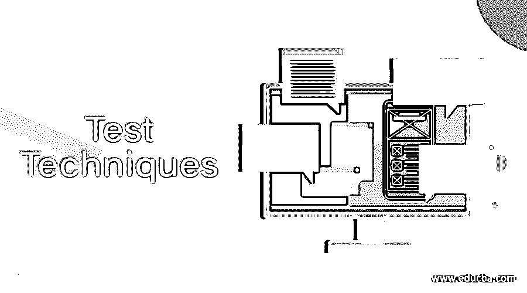

# 测试技术

> 原文：<https://www.educba.com/test-techniques/>

## 测试技术介绍

测试技术是在测试过程中使用的技术或策略，以确保系统或产品的功能。测试的成功取决于我们使用的技术。选择正确的技术将导致测试成功，选择错误的技术将导致测试失败。技术的选择取决于许多因素，如系统类型、管理标准、风险水平、风险类型、客户、需求、测试目标、文档的可用性、测试人员的知识、开发生命周期、时间、预算、用例模型和以前发现的缺陷类型的经验。有些技术更适用于某些情况和测试水平；其他适用于所有级别。

### 测试技术列表

有各种技术可用；每一种都有自己的优点和缺点。每种技术都善于发现特定类型的缺陷，而不善于发现其他类型的缺陷。在本节中，我们将讨论各种技术。

<small>网页开发、编程语言、软件测试&其他</small>

#### 1.静态测试技术

静态测试不执行被检查的代码，通常在执行任何测试之前使用。它们也可以被称为非执行技术。大多数静态测试技术用于测试文档，包括设计、源代码、模型、功能需求、系统需求。为了执行静态测试，静态分析工具被用来集中测试形式语言。

#### 2.基于规格的测试技术

所有基于规格说明的技术都有一个共同的特征，即它们都基于规格说明的某个方面的模型，从而能够系统地导出案例。有 4 种基于子规范的技术，如下所示

*   等价划分(Equivalence partitioning):这是一种基于规范的技术，在这种技术中，测试用例被设计成执行来自等价划分的代表。原则上，案例被设计为覆盖每个分区至少一次。
*   **边界值分析**:基于边界值设计案例的技术。边界值是一个输入值或输出值，它位于等价分区的边缘，或者位于边缘两侧的最小增量距离处。例如，最小值和最大值。
*   **决策表测试**:这是一种设计案例来执行决策表中显示的输入和原因组合的技术。
*   **状态转换测试**:这是一种技术，在这种技术中，用例被设计成执行有效和无效的状态转换。

#### 3.基于结构的测试

基于结构的用于测试软件的内部结构。这被称为白盒测试。所有基于结构的软件都有一个共同的特点，那就是它们都是基于被测软件是如何构造或设计的。这个结构信息被用来访问软件的哪一部分已经被一组测试使用过。额外的案例可以以系统的方式衍生出来，以覆盖之前没有被任何测试触及的结构部分。基于结构的技术涉及各种子测试，如下所示。

*   **测试覆盖率:**它是一种程度，表示为一个测试套件对一个指定的覆盖率项目进行测试的百分比。
*   **语句覆盖率:**是测试套件已经执行的可执行语句的百分比。
*   **决策覆盖:**它是一个测试套件已经执行的决策结果的百分比。100%的决策覆盖率意味着 100%的分支覆盖率和 100%的语句覆盖率。
*   **分支覆盖率:**它是测试套件已经执行的分支的百分比。100%的分支覆盖率意味着 100%的决策覆盖率和 100%的语句覆盖率。

#### 4.基于经验的测试

基于经验的技术是基于测试人员的经验和知识来推导和选择案例的过程。所有基于经验的方法都有一个共同的特点，即它们都是基于人类的经验和知识，既包括系统本身也包括可能存在的缺陷。案例推导不太系统，但可能更有效。技术人员和业务人员的经验是基于经验的技术的关键因素。

### 结论

这里要理解的最重要的事情是，最好的技术不是单一的测试，因为每种技术都擅长于发现一个特定类别的缺陷。此外，只使用一种技术将有助于确保发现该特定类的任何缺陷。这也有助于确保其他类的任何缺陷被遗漏。因此，使用各种技术将有助于您确保发现各种缺陷，并将导致更有效的测试。因此，它最常用于对源代码进行统计测试。

### 推荐文章

这是测试技术指南。在这里，我们讨论了各种测试技术及其优缺点。您也可以看看以下文章，了解更多信息–

1.  [立方体测试](https://www.educba.com/cubictest/)
2.  [测试覆盖工具](https://www.educba.com/test-coverage-tools/)
3.  [硒负荷测试](https://www.educba.com/selenium-load-testing/)
4.  什么是自动化测试？

