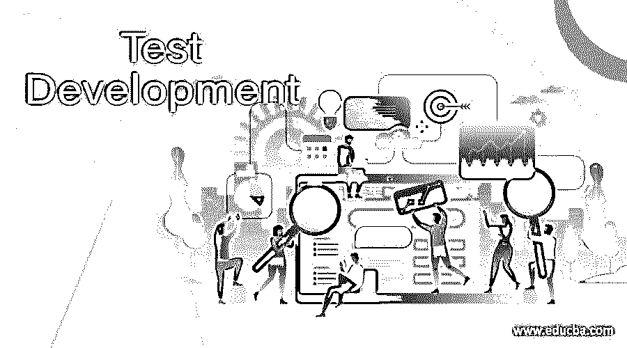

# 测试开发

> 原文：<https://www.educba.com/test-development/>

## 测试开发简介

测试开发是设计各种测试用例来执行软件或产品测试的过程。测试开发由不同的步骤组成，在这些步骤中，为产品或软件收集需求，基于需求，设计和文档被制作，然后实现过程开始。在实施过程中，会进行各种测试以确保产品的功能性。例如，单元测试、组件测试、集成测试等。最后，驱动最终测试，对系统进行整体测试。在这篇文章中，我们将详细讨论这个测试开发和过程管理。

### 测试开发过程

在这一部分，我们将讨论测试开发的过程。

<small>网页开发、编程语言、软件测试&其他</small>

#### 1.测试文件的形式

测试可能以不同的正式程度进行。正式测试将有大量受控的文档，并期望记录的测试细节包括准确和具体的输入以及测试的预期结果。非正式测试根本没有文档；个别测试人员做了一些笔记。测试人员被期望在他们的头脑中有一些想法，并记录下他们想要测试什么，以及他们期望的结果是什么。合适的正式程度取决于上下文。例如，商业安全应用程序与只有少数人短期使用的独立应用程序有着非常不同的需求。

正式程度还受到组织、其文化、在那里工作的人、开发过程的成熟度、测试过程的成熟度、测试人员等的影响。测试文档的彻底性也依赖于时间限制、截止日期、过度的压力、良好的文档等等。

#### 2.测试分析:识别测试条件

测试分析只不过是一个寻找可以用来获得测试信息的东西的过程。它可以是任何东西，比如系统需求、代码、技术信息、业务需求、设计模型。有时测试也是基于用户的知识和经验。测试条件是可以测试的东西。例如，如果我们需要需求规格，那么目录就是我们最初的条件列表。如果我们需要代码决策的覆盖，那么代码就是我们的初始条件列表。

测试过程中使用的测试条件取决于测试策略或测试方法。例如，它们可能基于项目中的风险、为系统设计的模型、专家的建议、遵从性。选择正确的测试条件将导致项目的成功。选择错误的测试条件会导致项目失败。测试条件应该能够在测试的基础上链接回它们的来源，这被称为可追溯性。换句话说，我们可以说，识别文档和软件中相关项目的能力，例如相关测试的需求，被称为可追溯性。可追溯性可以是水平的，也可以是垂直的。

#### 3.测试设计:指定测试用例

测试用例可以按照 IEEE 829 测试文档标准中的描述进行文档化。该测试最重要的方面是它可以评估系统是否做了它应该做的事情。要了解系统需求，我们需要有关于系统行为的信息来源。一旦选择了给定的输入值，测试人员需要确定与输入值相对应的预期结果。一旦两者都被决定，测试人员需要记录它，同时它将作为测试用例的一部分。预期结果包括关于输入值的信息，该信息响应于用户输入的输入而显示在屏幕上。它还包括数据或状态的变化或测试的任何其他结果。

测试人员必须在测试执行之前预测预期的结果。随后根据结果，进行评估以测试软件的工作情况。除了预期的结果之外，测试用例还指定了测试环境以及在测试执行之前和测试执行完成之后需要做的其他事情。

#### 4.测试实现:指定测试过程或脚本

下一步是按顺序收集所有测试用例来执行它们，并指定运行测试所需的顺序步骤。一些测试用例需要以特定的顺序运行。例如，测试用例可以创建新记录，修改新记录，然后删除它。这些测试需要以正确的顺序运行。测试程序是描述运行一组测试所需步骤的文档。它被称为测试脚本。对于需要手动运行的测试，测试脚本可以是手动的，对于需要自动化的测试，测试脚本可以是自动化的测试工具。之后，测试程序形成一个测试执行计划。测试执行计划是执行测试程序的方案。它指定了哪个测试需要首先运行，或者我们可以说它决定了以一种顺序的方式运行测试的顺序。

### 推荐文章

这是一个测试开发指南。在这里，我们详细讨论了测试开发和一步一步的过程管理。您也可以看看以下文章，了解更多信息–

1.  [基于模型的测试](https://www.educba.com/model-based-testing/)
2.  [响应式测试工具](https://www.educba.com/responsive-testing-tool/)
3.  [测试覆盖工具](https://www.educba.com/test-coverage-tools/)
4.  [移动测试工具](https://www.educba.com/mobile-testing-tools/)

