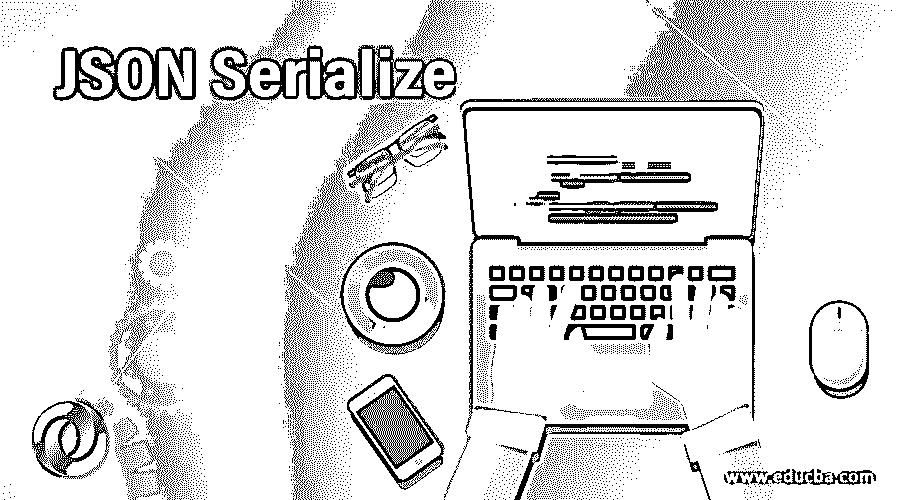
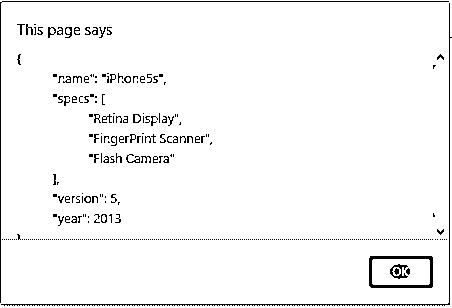

# JSON 序列化

> 原文：<https://www.educba.com/json-serialize/>

## JSON 序列化简介

JSON 序列化程序将对象转换为字符串。反过来也是可能的，这就是所谓的反序列化。JSON 是一种将对象编码成字符串的格式。在传输数据或存储文件时，数据需要以字节串的形式出现，但像复杂对象都是以 JSON 格式出现。序列化将这些对象转换成字节字符串，这就是 JSON 序列化。在这些字节串被传输之后，接收者从称为反序列化的串中恢复原始对象。

**语法:**

<small>网页开发、编程语言、软件测试&其他</small>

ECMAScript 5 提供了本机函数 JSON.stringify()和 JSON.parse()，用于序列化对象和恢复 Javascript 对象。

`Object = {var1:1, var2:{var3:[id, name]}};
Serialized_object = JSON.stringify(Object);
JSON.stringify() to serialize Javascript objects.`

对象、数组、字符串、布尔值、有限数和 NULL 都可以序列化。Infinity、null 和 NaN 可以序列化为 NULL。因为序列化将数据结构或对象转换成可以序列化和传输的格式

### JSON 序列化的例子

以下是 json serialize 的例子:

#### 示例#1

**代码:**

`<!DOCTYPE html>
<html>
<head>
<body>

</body>
</html>`

**输出:**

#### 实施例 2

以下示例使用 JSON.stringify()将 JavaScript 对象序列化为 JSON 字符串。这个 json 字符串被传递给 JSON.parse()来创建 JS 值。

**代码:**

`<!DOCTYPE html>
<html>
<head>
<title>JSON Object Serialization</title>

</head>
<body>

Serializes an object and then
parses the same string into an appropriate JavaScript Object.

</body>
</html>`

**输出:**

#### 实施例 3

使用数值的 Javascript JSON 对象序列化。该参数用于控制空白和缩进。最大缩进值为 10，大于该值时，将该值设置为 10。

**代码:**

`<!DOCTYPE html>
<html>
<head>
<title>JSON Object Serialization Example Using Numerical Value </title>

</head>
<body>

</body>
</html>`

**输出:**

在 C#、JSON 序列化中，它支持两种数据结构。

1.  名称/值对的集合
2.  值的有序列表。

**Object** :一个对象以' { '开头，以' } '和逗号'，'结尾，分隔每个名称-值对。

`var sample = {“employeeName” : “ Amar”, “age” : “23”, “employer” : “Incento”}`

**数组**:值有序集，以'['开头，以']'结尾

`var sample = [{ “sample1” : {“employeeName” : “ Amar”, “age” : “23”, “employer” : “Incento”}}, { “sample2” : {“employeeName” : “ Amar”, “age” : “23”, “employer” : “Incento”}}]`

**字符串**:用引号括起来的汇编 Unicode 字符。

`var sample = “{\”employeeName\” : Amar, \”age\” : 24, \”, \“employer” : “Incento”’}`

JSON 序列化可以在下面的 was、

*   使用 JavaScriptSerializer 类。
*   使用 DataContractJsonSerializer 类
*   使用 JSON.Net 图书馆

JSON 序列化程序也可以转换。NET 对象转换成等效的 JSON，

**公共类 JsonSerializer** = >初始化 JSON 序列化程序类的新实例。

JsonSerializer 可以直接使用，并且能够通过 JsonTextReader 和 JsonTextWriter 在流中读取和写入 JSON 文本。JsonSerializer 还有许多其他属性，用于定制 JSON 的序列化。对于 JSON 序列化，如果 JSON.stringify 不可用，则定义一个新函数来接受单个对象参数。该参数可以是单个值、数组或复杂对象。

如果传递了一个数组或一个对象，逻辑将通过提到的属性进行迭代。

**JSON . stringify():**JSON . stringify()将值序列化为 JSON 表示法如下，

*   如果值为布尔值，数字、字符串对象将通过字符串化转换为相应的值
*   如果该值有 toJSON()方法，那么它负责序列化哪些数据
*   如果值是未定义的、函数或符号，则它们不是有效的 JSON 值。这些值要么被省略，要么被更改为 NULL
*   数字无穷大、NaN 以及 null 值都被认为是 NULL。
*   对于所有对象实例，如 Map、Set、WeakSet 和 WeakMap，只有可枚举的属性才会被序列化

我们在这里已经看到了 javascript 和 C#中的序列化，让我们看看 Java 中的序列化，

*   对于 Java 序列化，用户不需要依赖第三方工具或库和配置
*   相比之下，Java 序列化在开始时很容易理解。
*   每个开发人员都非常了解 Java 对象的序列化。
*   暂态字段不会被初始化，因为 Java 不会调用内存分配的构造函数
*   结果是 Java 将被压缩，因此 Java 序列化效率不高。
*   当结果的大小在部署期间很重要时，可以使用这种序列化
*   在 Java 中，序列化结果的长期存储不是问题

### 结论

考虑到以上我们讨论的所有要点，让我们总结一下这篇文章。我们已经了解了 JSON serialize 的含义和工作原理，以及 javascript 中的 JSON.stringify()方法如何序列化 JSON 对象。举例说明了 JSON serialize 的几个例子，也看到了 JSON serialize 如何在 C#编程语言和 Java 语言中工作的一些要点。根据用户需求，可以使用 JSON Serialize 对对象、数组、字符串、布尔值和 NUL 值进行序列化。

### 推荐文章

这是一个 JSON 序列化的指南。在这里，我们还将讨论 json serialize 的介绍和语法，以及不同的示例和代码实现。您也可以看看以下文章，了解更多信息–

1.  [JavaScript 解析字符串](https://www.educba.com/javascript-parse-string/)
2.  [Python 字符串替换](https://www.educba.com/python-string-replace/)
3.  [SQL Server 子串](https://www.educba.com/sql-server-substring/)
4.  [Python 拆分字符串](https://www.educba.com/python-split-string/)

