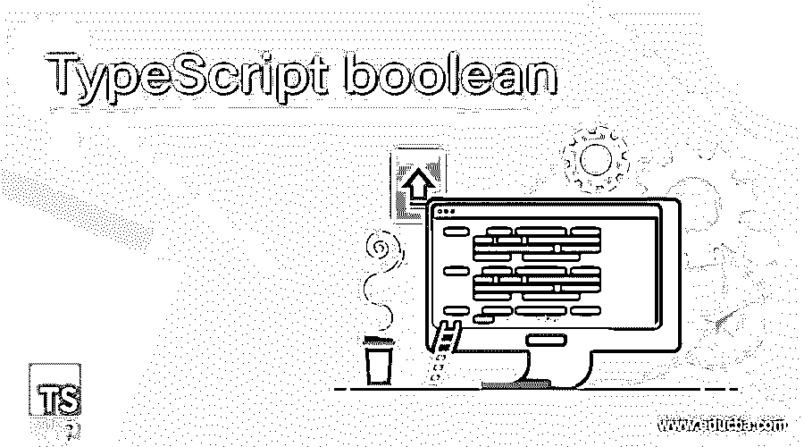
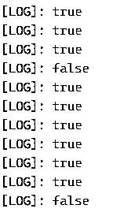
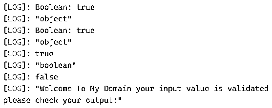
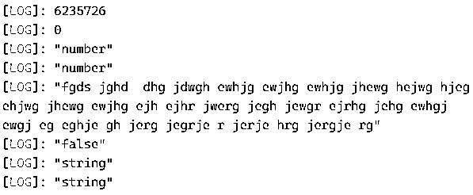

# boolean 类型脚本

> 原文：<https://www.educba.com/typescript-boolean/>




## TypeScript boolean 简介

Typescript Boolean 是基本数据类型之一，它仅用于表示真值或假值。它们通过使用接受 0 和 1 的二进制数字表示的数值来实现。一般来说，布尔值是原始数据类型布尔值的对象包装器之一，它们对于布尔对象和布尔原始数据类型都有一些不同。布尔接受并像全局函数一样工作，在这个函数中，我们希望将任何数据类型值转换为布尔原始数据类型，如布尔到字符串和字符串到布尔。

**语法:**

<small>网页开发、编程语言、软件测试&其他</small>

typescript boolean 是默认的预定义原始数据类型，只能接受 true 或 false、0 或 1 布尔值类型。通常，typescript 接受并执行使用 0 或 1 数字的布尔操作，并且该脚本还接受使用 Typescript 语言导入的其他数据类型。

```
var or let variable name: boolean;
variable name = true or false;
---some type script code logics depends upon the requirement---
```

以上代码是在脚本中使用布尔数据类型的基本语法。我们可以使用真或假，0 或 1，是或否，甚至在布尔变量引用中也接受空值。

### boolean 类型如何在 TypeScript 中工作？

我们可以使用 boolean 关键字来声明变量中值的布尔类型。当我们想要启用 isPresent:boolean = true 时，就像可以启用脚本中使用的布尔值类型的属性一样。布尔数据类型是区分大小写的类型之一，从大写字母到小写字母都不同。在 typescript 中，布尔变量将以两种不同的方式创建 1。第一件事通常是使用布尔类型分配变量引用，另一个选择是 2。我们可以全局声明这个变量，然后在布尔函数中调用它，这样我们就可以在全局的任何类型脚本区域使用布尔数据类型值。通过使用 Boolean()函数，它是一个全局函数，用于将其参数转换为原始布尔值，它将返回与返回类型相同的值。我们可以传递任何类型的值作为布尔函数中的参数，但它总是喜欢将其值转换为真或假，特定值将转换为真或假，这取决于用户输入值必须为真或假。同时布尔作为对象，它是布尔原语数据类型的包装器。所以每当我们想要创建一个布尔对象时，typescript 代码必须有构造函数。

### 类型脚本布尔值的示例

以下是下面提到的例子。

#### 示例#1

**代码:**

```
let vars:boolean
vars=Boolean(true)
console.log(vars)
vars=Boolean("hasdgvh wgedb jhwejwh jwhe54 whge wheg gehdge wehg hwgej wejhg wjehg wjhg wjegh wjeh wejh wejhg476 we wgejweg weghekwjrg jhegjewh gk jkerhje whrk hjekgkj3ehgjkehjewkhkj hj hhej jhew jhej jhejhj")
console.log(vars)
vars=Boolean("5234x152x5214x 25 52 245 245 2r5 25 253 2536 2532 356 532 5236 5326532 6 253 5326 35 3553 254 534 532 35365 563 365 3535 6 536 6536 356 356 3656 356 5365 36 536 653 653 63 365 635 3564 354 354 3554")
console.log(vars)
vars=Boolean(false)
console.log(vars)
vars=Boolean(52163365214)
console.log(vars)
vars=Boolean({})
console.log(vars)
let vars1= { name:'wyteyrf  wgef whfewg hewf hge jhewgj hewg jheg hjwegjh ewg jhewgj ewg jg jegj g3ej e3gj gej egj egj 3eg jgerj 3gr3u4 gi3 u4g j34ug j43grje hrf ejghje r'}
vars=Boolean(vars1)
console.log(vars)
vars=Boolean([])
console.log(vars)
vars=Boolean(new Date())
console.log(vars)
vars=Boolean(Infinity)
console.log(vars)
vars=Boolean(null)
console.log(vars)
```

**输出:**




在上面的例子中，我们使用了 Boolean()函数，它将被赋予 var 或 let 数据类型的变量。我们可以使用任何类型的值，如数字或非数字，但当我们想要验证这些值时，它会根据后端的输入验证返回 true 或 false。在上面的场景中，我们使用了所有类型的输入值，但它只返回 true 或 false，因此它将验证布尔条件，我们还在脚本中使用了布尔函数。此外，我们添加了日期类对象作为单独的变量引用存储，它还在后端验证日期条件，并返回 true，因此它满足并通过了布尔条件。

#### 实施例 2

**代码:**

```
let vars=new Boolean("fs hfsa hasf afgs sga asf ahsf ahshf hasg hasga hsgha sga ghs ahg jagshj agsj ags")
console.log(vars)
console.log(typeof(vars))
let vars2=new Boolean("ffs h3fsa ha2sf af23gs 6235 3847 asf ahsf ahshf 746hasg hasga hsgha sga ghs ahg jagshj agsj ags")
console.log(vars2)
console.log(typeof(vars2))
console.log(vars.valueOf())
console.log(typeof(vars.valueOf()))
var vars1  = new Boolean(false);
console.log(vars1.valueOf())
if (vars1) {
console.log("Welcome To My Domain your input value is validated please check your output:");
}
```

**输出:**




在第二个例子中，我们以不同的方式使用了 boolean 原语类型，我们使用了 typeof()和 valueof()方法，它将返回原语布尔值。我们还创建了布尔类的实例，它将默认参数作为值，如“false ”,它将通过使用 if 条件调用 valueof()方法来打印变量引用，它将验证这些值并在输出控制台上打印它们。

#### 实施例 3

**代码:**

```
let vars=Number(6235726)
let vars1=Number(false)
console.log(vars);
console.log(vars1);
console.log(typeof(vars))
console.log(typeof(vars1))
let vars2=String("fgds jghd  dhg jdwgh ewhjg ewjhg ewhjg jhewg hejwg hjeg ehjwg jhewg ewjhg ejh ejhr jwerg jegh jewgr ejrhg jehg ewhgj ewgj eg eghje gh jerg jegrje r jerje hrg jergje rg");
let vars3=String(false);
console.log(vars2)
console.log(vars3)
console.log(typeof(vars2))
console.log(typeof(vars3))
```

**输出:**




在最后一个例子中，我们使用了一些值转换，比如布尔到数字和布尔到字符串。我们可以使用默认方法，如 Numbers()、String()和 typeof()来验证输入条件，并将值从一种类型转换为另一种类型。

### 结论

一般来说，boolean 是 Typescript 中的基本类型之一，它也有 boolean 对象，用于调用应用程序中任何需要的默认方法。此外，我们希望将 boolean 类型转换为其他数据类型，并且它也接受 null 值作为函数中的参数。

### 推荐文章

这是一个 boolean 类型脚本的指南。这里我们讨论布尔类型如何在 TypeScript 和示例中工作，以及代码和输出。您也可以看看以下文章，了解更多信息–

1.  [打字词典](https://www.educba.com/typescript-dictionary/)
2.  [打字稿通用](https://www.educba.com/typescript-generic/)
3.  [什么是 TypeScript？](https://www.educba.com/what-is-typescript/)
4.  [打印面试问题](https://www.educba.com/typescript-interview-questions/)


