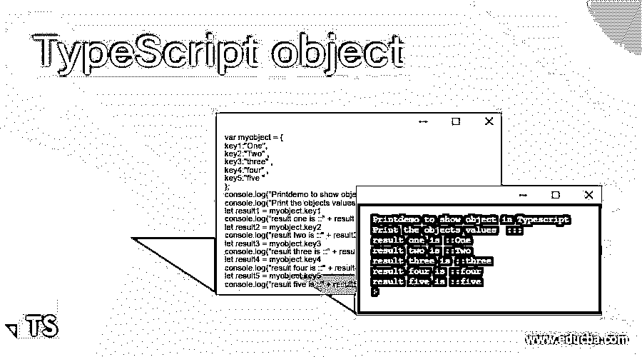
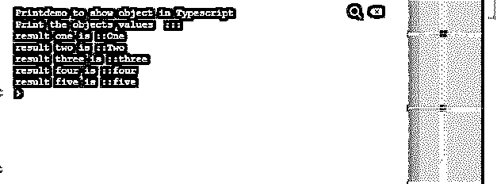

# TypeScript 对象

> 原文：<https://www.educba.com/typescript-object/>




## TypeScript 对象简介

对象用于表示键值对形式。通过使用对象，我们可以创建一个键并将其赋给一个值，如果我们想要处理任何小对象，而不需要在 TypeScript 中创建任何模型或 POJO 类，那么我们可以使用该对象。它们使用方便，易于理解。我们可以通过使用不同的类型来创建对象，它们也像我们在 TypeScript 中声明和使用的任何其他变量一样。在下一节中，我们将详细讨论更多的对象，探索它们在编程时的用法，以使它们更有效。

**语法:**

<small>网页开发、编程语言、软件测试&其他</small>

正如我们所讨论的，它们使用起来非常简单方便，而且我们必须在它们内部给出值作为键值对。让我们看看它的简单语法，以便更好地理解和使用，见下文；

```
var your_object__name = {
key1: "value1",
key2: "value2",
key3: "value3",
so on....
}
```

正如你在上面的语法行中看到的，我们只是创建了一个简单的变量，在它里面，我们把它的值作为键值对。为了清楚起见，让我们看一个练习语法，见下文；

例如:

```
var demo = {
key1: "100",
key2: "200",
key3: "300"
}
```

在下一节中，我们将更详细地讨论它的内部工作和对象内部其他类型的声明。

### 对象如何在 TypeScript 中工作？

我们已经知道，object 就像在 TypeScript 中声明任何其他变量一样。但是我们有一个不同之处，我们可以在对象内部为变量赋一个键。这使得它们易于使用。在创建对象之后，我们可以通过使用“key”名称来访问它们。同样在 TypeScript 中的对象内部，我们可以很容易地调用我们的函数，声明一个数组，还有另一个对象，等等。这不是强制性的，我们只能指定字符串或数字类型，只有它支持从 TypeScript 的一切。这个对象类似于 java 的 POJO 类，它保存来自实体或请求元素的数据。在 TypeScript 中，我们为此创建了一个模型，但是如果我们有一个小对象，我们只想在一个类中使用，那么我们可以在 TypeScript 中使用该对象。

让我们尝试在 TypeScript 中的现有对象内声明函数、数组和另一个对象。

1)函数:我们可以在其中声明我们的函数，就像我们声明的任何其他值一样，见下文。

**代码:**

```
functionObject = {
key1: function() {
//your logic will goes here.
},
};
```

在上面几行代码中，我们在对象内部使用了一个函数。这是一个需要记住的非常简单的语法。

2)数组:我们也可以在对象实例中声明一个数组，如下所示；

**代码:**

```
var arrayObject = {
key1:["val1", "val2", "val3" .. so on ]
};
```

在上面几行代码中，我们在 object 实例中声明了一个数组，非常简单易用。之后，我们可以通过键名来访问这个数组。

**对象值的存取:**

要访问对象内部的值，我们可以直接使用它们的名称。但是要确保它是正确的，并且存在于对象内部，否则它将在运行时出错。让我们举下面的例子；

**代码:**

```
var myobject = {
key1: "100"
};
let result  = myobject.key1;
```

在这种情况下，我们可以使用上面的语法来访问值。正如你所看到的，它使用起来非常简单。

### 对象的类型

在 TypeScript 中，我们可以使用不同的可用类型来定义对象，如下所示:

1)类型别名:我们可以使用“类型”别名在 TypeScript 中定义或声明我们的对象，它们是 TypeScript 中另一种类型的对象。让我们看看它的语法以及如何在 TypeScript 中使用和创建；

**语法:**

```
type Object_name = {
// variables goes here ..
};
```

正如你在上面的代码行中所看到的，我们在对象名前使用了“type”关键字，使它像 TypeScript 中的类型别名一样工作，在这里，我们可以定义我们的成员变量，它可以是任何东西或任何类型。

**代码:**

```
type Demo = {
rollno: number;
city: string;
name: string;
};
```

2)使用接口:我们也可以使用接口在 typescript 中定义我们的对象，这是 TypeScript 中声明对象的另一种类型。让我们看看它的语法，以便更好地理解；

**语法:**

```
interface object_name {
// variables goes here ..
}
```

正如你在上面的代码行中所看到的，我们在对象名前使用了“interface”关键字，使它像 TypeScript 中的对象一样工作，在这里，我们可以定义变量或成员变量。

**代码:**

```
interface Demo = {
rollno: number;
city: string;
name: string;
};
```

### 例子

1)在本例中，我们试图展示 Typescript 中的对象功能。我们已经创建了一个内部有几个值的对象。最后，我们还使用键作为引用来访问其中的值，并在控制台上打印它们。

**代码:**

```
var myobject = {
key1:"One",
key2:"Two" ,
key3:"three" ,
key4:"four" ,
key5:"five "
};
console.log("Printdemo to show object in Typescript")
console.log("Print the objects values  :::")
let result1 = myobject.key1
console.log("result one is ::" + result1)
let result2 = myobject.key2
console.log("result two is ::" + result2)
let result3 = myobject.key3
console.log("result three is ::" + result3)
let result4 = myobject.key4
console.log("result four is ::" + result4)
let result5 = myobject.key5
console.log("result five is ::" + result5)
```

**输出:**




### 对象的规则和规定

因此，对于对象没有规则或限制，但我们有一些需要遵循的标准，见下文；

1)每个新值都应该用'，'分隔开。

2)对象应该用“{}”大括号括起来。

3)要访问这些值，我们可以使用它们的键作为引用。

4)在使用它们之前，密钥应该存在于对象中，否则它将抛出运行时错误，提示“未知属性”

### 结论–类型脚本对象

正如我们现在所知道的，对象非常容易使用，如果不需要的话，可以替换模型对象。我们还详细讨论了对象类型。要使用它们，只需在对象名前使用一个关键字。

### 推荐文章

这是一个类型脚本对象的指南。这里我们讨论 object 如何在 TypeScript 中工作，以及类型和示例。您也可以看看以下文章，了解更多信息–

1.  [打字词典](https://www.educba.com/typescript-dictionary/)
2.  [类型脚本转换对象](https://www.educba.com/typescript-cast-object/)
3.  [打字稿操作符](https://www.educba.com/typescript-operators/)
4.  [如何安装 Typescript](https://www.educba.com/install-typescript/)


