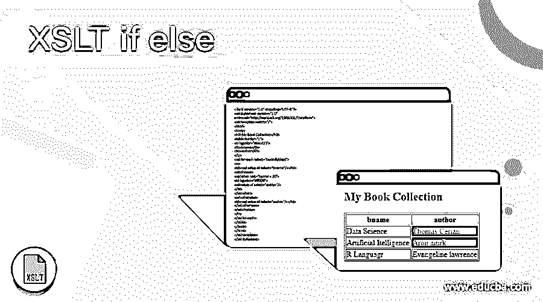
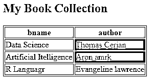
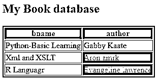
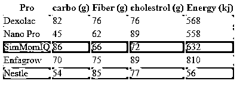

# XSLT if else

> 原文：<https://www.educba.com/xslt-if-else/>

## XSLT if else 简介

XSL 提供了简单或复杂的条件模式功能语句。XSLT if-else 元素包含一系列条件，这些条件的表达式值在使用<xsl: when="">语句的条件为真时起作用。这个<when>指定了无限的指令。XSL 规范隐含了一个函数<xsl: choose="">来实现 if-else 语句的功能。为了处理多个选项，我们应该将<choose>与<otherwise>一起使用，后者等同于任何其他选项。评估该属性，直到处理器发现满足的条件为真。如果语句只检查一个条件。<xsl: if="">函数不支持 else 关键字。</xsl:></otherwise></choose></xsl:></when></xsl:>

**语法:**

<small>网页开发、编程语言、软件测试&其他</small>

if-else 语句语法带有 when 和 else，如下所示:

`<xsl: choose>                                                               // Executes if part
<xsl:when test="$Createdtime > $checkDate">   // executes then part
<h2>suppose </h2>
</xsl:when>
<xsl:otherwise>                                                           // Executes else part.
<h2>welcome</h2>
</xsl:otherwise>
</xsl: choose>`

上述语句有两个子类型 when 和 otherwise。when 类似于 if 部分，否则充当 else 部分。

### XSLT 中 if-else 语句如何工作？

当我们碰巧用条件模式操作 XML 文档时，XSLT 有一种强大的技术。<if>语句，编程语言最好的决策部分之一，测试属性给出布尔值。if-else 语句中没有直接声明。相反，我们使用选择一个关键字来处理语句。如果相应的条件满足 false，则运算基于 Xpath 表达式。简单地说，我们可以使用前面所示的 choose-when-otherwise 结构。上面的语法相当于这里的 if-else 代码:</if>

`if ($Createdtime > $checkDate){output: <h2> Suppose</h2>}else if ($Createdtime = $checkDate){output: <h2>Welcome to my page</h2>}else{output: <h2>Exit the Page</h2>}`

**样品 2**

`<xsl:choose>
<xsl:when test="$tonum = '6'">
<xsl:variable tname="dType" select="Thursday"/>
</xsl:when>
<xsl:when test="$tonum = '7'">
<xsl:variable tname="dType" select="Friday"/>
</xsl:when>
<xsl:otherwise></xsl:otherwise>
</xsl:choose>`

使用 if-else 条件和一条<if>语句的另一种方法如下所示:</if>

`<xsl:if match="employee[EName='Gabby john']">
</xsl:if>`

else 后面应该是

`<xsl:if match="employee[EName!='Gabby john']">
</xsl:if>`

甚至我们可以在 xsl:when 中使用嵌套 xsl <if>来启用进一步的过滤选项。</if>

`<xsl:choose>
<xsl:when test="the given statement">
<xsl:when test="pub[@name='The third Race case'][@status='closed'][@labours in &gt; 2]">
<xsl:if test="@exittime = 'final orders'">get to the engine as soon</xsl:if>
</xsl:when>
<xsl:otherwise...
</xsl:choose>`

这是一个很好的有条件结构的性能助推器。

### 例子

在本节中，我们将看到一些 if-else 模式的例子，这是使用<choose>构造实现的最简单的函数。XSL 规范如下所示:</choose>

#### 示例#1

使用单个选择属性检查奖励条件的图书详细信息

**book.xml**

`<?xml version="1.0" encoding="UTF-8"?>
<bookdb>
<dept>
<bname>Data Science</bname>
<author>Thomas Cerian</author>
<country>USA</country>
<bprice>20.90</bprice>
<pubyear>1975</pubyear>
</dept>
<dept>
<bname>Artificial Itelligence</bname>
<author>Aron amrk</author>
<country>Italy</country>
<bprice>22.90</bprice>
<pubyear>1965</pubyear>
</dept>
<dept>
<bname>R Languagr</bname>
<author>Evangeline lawrence</author>
<country>German</country>
<bprice>15.90</bprice>
<pubyear>1995</pubyear>
</dept>
</bookdb>`

**book.xsl**

`<?xml version="1.0" encoding="UTF-8"?>
<xsl:stylesheet version="1.0"
xmlns:xsl="http://www.w3.org/1999/XSL/Transform">
<xsl:template match="/">
<html>
<body>
<h2>My Book Collection</h2>
<table border="1">
<tr bgcolor="#9acd32">
<th>bname</th>
<th>author</th>
</tr>
<xsl:for-each select="bookdb/dept">
<tr>
<td><xsl:value-of select="bname"/></td>
<xsl:choose>
<xsl:when test="bprice > 20">
<td bgcolor="#ff00ff">
<xsl:value-of select="author"/>
</td>
</xsl:when>
<xsl:otherwise>
<td><xsl:value-of select="author"/></td>
</xsl:otherwise>
</xsl:choose>
</tr>
</xsl:for-each>
</table>
</body>
</html>
</xsl:template>
</xsl:stylesheet>`

**解释**

一个带有<choose>的典型简单规则被应用于 XSL 文件和 XML 文件，输出如下:</choose>

**输出:**

#### 实施例 2

**booky.xml**

`<?xml version="1.0" encoding="UTF-8"?>
<bookdb>
<dept>
<bname>Python-Basic Learning</bname>
<author>Gabby Kaate</author>
<country>USA</country>
<bprice>9.90</bprice>
<pubyear>1975</pubyear>
</dept>
<dept>
<bname>Xml and XSLT</bname>
<author>Aron amrk</author>
<country>Italy</country>
<bprice>22.90</bprice>
<pubyear>1965</pubyear>
</dept>
<dept>
<bname>R Languagr</bname>
<author>Evangeline lawrence</author>
<country>German</country>
<bprice>15.90</bprice>
<pubyear>1995</pubyear>
</dept>
</bookdb>`

**pr.xsl**

`<?xml version="1.0" encoding="UTF-8"?>
<xsl:stylesheet version="1.0"
xmlns:xsl="http://www.w3.org/1999/XSL/Transform">
<xsl:template match="/">
<html>
<body>
<h2>My Book database</h2>
<table border="2">
<tr bgcolor="red">
<th>bname</th>
<th>author</th>
</tr>
<xsl:for-each select="bookdb/dept">
<tr>
<td><xsl:value-of select="bname"/></td>
<xsl:choose>
<xsl:when test="bprice >= 10">
<td bgcolor="blue">
<xsl:value-of select="author"/>
</td>
</xsl:when>
<xsl:when test="bprice > 16">
<td bgcolor="yellow">
<xsl:value-of select="author"/></td>
</xsl:when>
<xsl:otherwise>
<td><xsl:value-of select="author"/></td>
</xsl:otherwise>
</xsl:choose>
</tr>
</xsl:for-each>
</table>
</body>
</html>
</xsl:template>
</xsl:stylesheet>`

**解释**

上面的代码使用 Book.xml 文件来选择基于价格的条件。

**输出:**

#### 实施例 3

**pr.xml**

`<?xml version="1.0"?>
<Product_list>
<Pro type="Babymilk">
<pname>Dexolac</pname>
<vitamin>76</vitamin>
<carbohydrates>82</carbohydrates>
<protein>76</protein>
<minerals>568</minerals>
</Pro>
<Pro type="Babymilk">
<pname>Nano Pro</pname>
<vitamin>62</vitamin>
<carbohydrates>45</carbohydrates>
<protein>89</protein>
<minerals>558</minerals>
</Pro>
<Pro type="Babymilk_present">
<pname>SimMomIQ</pname>
<vitamin>66</vitamin>
<carbohydrates>86</carbohydrates>
<protein>72</protein>
<minerals>632</minerals>
</Pro>
<Pro type="Babymilk">
<pname>Enfagrow</pname>
<vitamin>75</vitamin>
<carbohydrates>70</carbohydrates>
<protein>89</protein>
<minerals>810</minerals>
</Pro>
<Pro type="Babymilk_new">
<pname>Nestle</pname>
<vitamin>54</vitamin>
<carbohydrates>85</carbohydrates>
<protein>77</protein>
<minerals>56</minerals>
</Pro>
</Product_list>`

**pr.xsl**

`<?xml version="1.0"?>
<xsl:stylesheet version="1.0"
xmlns:xsl="http://www.w3.org/1999/XSL/Transform">
<xsl:template match="/">
<xsl:apply-templates/>
</xsl:template>
<xsl:template match="Product_list">
<table>
<tr style="background-color:##a57c6c">
<th>Pro</th>
<th>carbo (g)</th>
<th>Fiber (g)</th>
<th>cholestrol (g)</th>
<th>Energy (kj)</th>
</tr>
<xsl:for-each select="Pro">
<xsl:choose>
<xsl:when test="@type = 'Babymilk_new'">
<tr style="background-color:#40e0d0">
<td>
<xsl:value-of select="pname"/>
</td>
<td>
<xsl:value-of select="vitamin"/>
</td>
<td>
<xsl:value-of select="carbohydrates"/>
</td>
<td>
<xsl:value-of select="protein"/>
</td>
<td>
<xsl:value-of select="minerals"/>
</td>
</tr>
</xsl:when>
<xsl:when test="@type = 'Babymilk_present'">
<tr style="background-color:#d27025">
<td>
<xsl:value-of select="pname"/>
</td>
<td>
<xsl:value-of select="carbohydrates"/>
</td>
<td>
<xsl:value-of select="vitamin"/>
</td>
<td>
<xsl:value-of select="protein"/>
</td>
<td>
<xsl:value-of select="minerals"/>
</td>
</tr>
</xsl:when>
<xsl:otherwise>
<tr style="background-color:#cccccc">
<td>
<xsl:value-of select="pname"/>
</td>
<td>
<xsl:value-of select="carbohydrates"/>
</td>
<td>
<xsl:value-of select="vitamin"/>
</td>
<td>
<xsl:value-of select="protein"/>
</td>
<td>
<xsl:value-of select="minerals"/>
</td>
</tr>
</xsl:otherwise>
</xsl:choose>
</xsl:for-each>
</table>
</xsl:template>
</xsl:stylesheet>`

**解释**

上面用背景色突出显示了产品表的内容，输出如下所示。因此，在 XSL 文件中，我们选择了属性 product list，并使用“@”找到了值。并且相应的 pname 用不同的颜色突出显示。如果没有选择 pname，它会自动指向<otherwise>。</otherwise>

**输出:**

### 结论

最后，与其他语言相比，XSL 中的 if-else 语句以不同的结构表示。在本文中，我们使用了名为 choose 和 otherwise 的不同结构，其中 XSL 在搜索位置或确切值时采用了分层递减的方式。这种机制导致提供精确输出的不良实践，但是它取决于环境。

### 推荐文章

这是 XSLT if else 的指南。这里我们讨论 if-else 语句如何在 XSLT 中工作，以及示例和输出。您也可以看看以下文章，了解更多信息–

1.  [PHP 中的 if else 语句](https://www.educba.com/if-else-statement-in-php/)
2.  [Python 中的 if else 语句](https://www.educba.com/if-else-statement-in-python/)
3.  [Else If in C#](https://www.educba.com/else-if-in-c-sharp/)
4.  [如果在 PowerShell 中有 Else](https://www.educba.com/if-else-in-powershell/)

