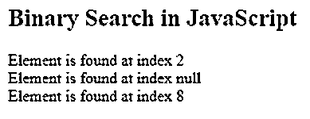

# 二分搜索法 JavaScript

> 原文：<https://www.educba.com/binary-search-javascript/>


## 二分搜索法 JavaScript 简介

二分搜索法 JavaScript 是一种基于分而治之方法的搜索技术。因为搜索是 IT 领域中最常执行的任务之一，所以现在存在许多数据结构和算法来使搜索更加有效。二分搜索法意味着半区间搜索；它查找位于数组中的特定元素，即只处理排序后的数组。它比基于快速性的线性搜索算法更有优势，效率也更高。二分搜索法是一种非常简单、高效和直观的搜索算法，但其局限性之一是仅适用于排序数组，因此，这需要在实现数组的二分搜索法之前进行一些预处理。让我们看看二分搜索法是如何工作的，以及它的算法和几个例子。

### 二分搜索法 JavaScript 的语法

基本上，任何搜索算法都不会有这样的语法，而是遵循一个流程，即流程图或算法步骤来实现。

<small>网页开发、编程语言、软件测试&其他</small>

**算法:**

第一步:首先，我们需要找到数组的中间元素

**步骤 2:** 然后，开始将中间元素与正在搜索的值(即关键元素)进行比较

1.  如果关键元素小于中间元素，则从数组的左半部分开始搜索
2.  如果关键元素多于中间元素，则从数组的右半部分开始搜索
3.  如果关键元素等于中间元素，则返回中间元素的索引

**步骤 3:** 继续上述步骤，直到只剩下一个元素

**第四步:**如果没有找到关键元素，则返回-1

为了更好地理解上面的算法，我们举一个例子。

**输入数组** : 2 4 6 8 10 12 14 16 18 20 22

**关键元素** : 16

*   现在，让我们检查数组的中间元素，即 12
*   将 12 与 16 进行比较:由于 16>12，我们将忽略左边部分，开始搜索右边部分。
*   因此，数组将是 14 16 18 20 22
*   现在，中间的元素是 18。
*   让我们比较一下 18 和 16，因为 16<18，我们将忽略右半部分，用左半部分。
*   因此，数组将只有两个元素，即 14，16
*   由于数组中只剩下两个元素，我们将使用中间的元素作为 14。
*   我们现在来比较一下，16>14，只考虑数组的右边部分，忽略左边部分。
*   现在，我们只剩下数组中的一个元素，即 16。
*   现在比较 key 元素和 array 元素，16=16，这意味着找到了 key 元素。从上面的例子可以看出，很少进行比较来找到 key 元素。

### 二分搜索法 JavaScript 的例子

下面是一些例子:

#### 示例#1

**JavaScript 中的二分搜索法算法采用递归方式**

**代码:**

```
<!DOCTYPE html>
<html>
<body>
<h2>Binary Search in JavaScript</h2>
<script>
let binarySearch = function (inputArray, x, startEle, endEle) {
if (startEle>endEle) return false;
let midEle=Math.floor((startEle + endEle)/2);
if (inputArray[midEle]===x) return true;
if(inputArray[midEle] > x)
return binarySearch(inputArray, x, startEle, midEle-1);
else
return binarySearch(inputArray, x, midEle+1, endEle);
}
let inputArray = [2, 4, 6, 8, 10, 12, 14, 16, 18, 20, 22];
let x = 16;
if (binarySearch(inputArray, x, 0, inputArray.length-1))
document.write("Element " + x + " found in input array!<br>");
else document.write("Element " + x + " is not found in the input array!<br>");
x = 9;
if (binarySearch(inputArray, x, 0, inputArray.length-1))
document.write("Element " + x + " found in input array!<br>");
else document.write("Element " + x + " is not found in the input array!<br>");
</script>
</body>
</html>
```

**输出:**


在这里，您可以看到我们手动解决的上述示例，为程序提供了相同的输入数组，并且输出符合要求。

#### 实施例 2

**迭代方式的二分搜索法算法**

**代码:**

```
<!DOCTYPE html>
<html>
<body>
<h2>Binary Search in JavaScript</h2>
<script>
constbinaryalgo = (listArray, key) => {
let lowVal = 0
let highVal = listArray.length - 1
while (lowVal<= highVal) {
constmidVal = Math.floor((lowVal + highVal) / 2)
const x = listArray[midVal]
if (x === key) {
return midVal
}
if (x > key) {
highVal = midVal - 1
} else {
lowVal = midVal + 1
}
}
return null
}
document.write("Element is found at index " + binaryalgo([3, 1, 5, 4, 6 ,7, 5, 9, 10], 5) + "<br>");
document.write("Element is found at index " + binaryalgo([3, 1, 5, 4, 6 ,7, 5, 9, 10], 2) + "<br>")
document.write("Element is found at index " + binaryalgo([3, 1, 5, 4, 6 ,7, 5, 9, 10], 10) + "<br>")
</script>
</body>
</html>
```

**输出:**

给定输入数组和要搜索的关键字元素后，如果没有可用的值，它将返回-1 或 null。




### 二分搜索法算法的效率

*   二分搜索法的时间复杂度为 O(log <sub>2</sub> n ),其中 n =数组中元素的数量。
*   这个时间复杂度远远优于线性搜索，线性搜索的时间复杂度实际上是 O(n)。
*   二分搜索法直接在原始阵列上工作，不创建任何拷贝。
*   由于二分搜索法需要一个有序的数组，因此时间复杂度为 O(nlogn)是适用的。
*   如果数组的长度很小，那么可以使用强力算法作为更好的方法。

### 结论

至此，我们将结束“二分搜索法 JavaScript”这个主题。我们已经看到了二分搜索法的含义以及它是如何通过算法实现的。我们还手动解决了一个示例，并且我们以编程方式实现了同一个示例。已经实现了两种类型的方法，即递归和迭代方法。我们也看到了二分搜索法在线性搜索上花费的时间复杂度。

### 推荐文章

这是一个二分搜索法 JavaScript 的指南。在这里，我们还讨论了二分搜索法 javascript 的介绍和语法，以及不同的例子和它的代码实现。您也可以看看以下文章，了解更多信息–

1.  [Dart vs JavaScript](https://www.educba.com/dart-vs-javascript/)
2.  [在 JavaScript 中排序字符串](https://www.educba.com/sort-string-in-javascript/)
3.  [JavaScript 表单](https://www.educba.com/javascript-modulo/)
4.  [JavaScript hash()](https://www.educba.com/javascript-hash/)


