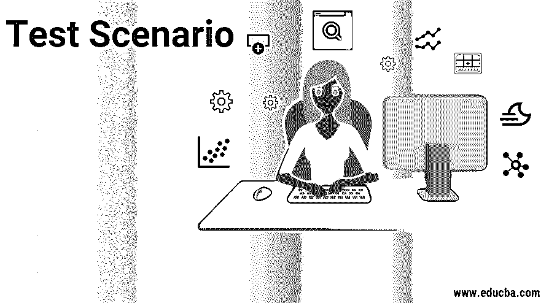

# 测试场景

> 原文：<https://www.educba.com/test-scenario/>

## 测试场景介绍

正如我们所知，为了测试任何软件应用程序，都要创建并执行测试用例，以测试应用程序是否按预期工作。一般来说，测试场景是描述任何应用程序功能的陈述。它检查任何应用程序的端到端功能/特性和业务需求。测试场景是一行语句，可以进一步包括每个需求的具体正面和负面测试用例。我们可以说测试场景是从用例中派生出来的需求的高级分类。它有助于降低测试需求的复杂性。

### 为什么我们需要测试场景？

下面给出了在测试任何软件应用程序时需要测试场景的一些重要原因:

<small>网页开发、编程语言、软件测试&其他</small>

*   由于创建详细的测试用例需要花费更多的时间和精力，所以它是一种简单快捷的方式来编写测试需求。
*   它确保了客户根据需求给出的所有用例都被覆盖。
*   创建测试场景可以确保最大的测试覆盖率。
*   在项目运行时间有限的情况下，测试场景而不是单个测试用例的测试就像一个救星，它给出了一个完成应用程序端到端测试的想法。
*   在开始应用程序测试之前创建测试场景有助于获得客户对应用程序测试的信心。
*   这有助于节省时间和精力，因为测试用例可以很容易地在测试场景中创建。
*   在开始测试应用程序之前，可以向客户和其他利益相关者展示测试场景，以确认他们的需求，这有助于避免未来的模糊性。

### 如何用实例编写测试场景？

下面给出了为一个特性编写测试场景的一步一步的过程:

**步骤 1:** 编写测试场景的首要步骤是阅读描述需求的重要文档，如 SRS(软件需求规格说明书)、FRS(功能需求规格说明书)、BRS(业务需求规格说明书)等，以了解被测系统或功能。

第二步:第二步是找到一个需求可能发生的用户行为。有了附加的技术需求，以批判的心态找到最大的场景是很重要的。

**步骤 3:** 在找出最大的用户动作之后，现在重要的是列出各种可能的场景来检查应用程序的各种需求/特性。

第四步:测试每个需求是否覆盖了各自的测试场景是很重要的。为了验证这一点，创建了可追溯性矩阵，以验证是否涵盖了所有产品特性/要求。

步骤 5: 重要的是，创建的测试场景由主管和其他风险承担者验证，以检查团队是否在正确的方向上前进。最后一步是验证创建的测试场景，并根据需求修改/添加测试用例。

#### 示例:

**考虑一个创建脸书应用程序测试场景的例子**

**场景 1:** 验证应用程序的登录工作正常

它可能由特定的测试用例组成，如:

*   登录屏幕包含必需的元素，如用户名、密码和登录按钮。忘记密码链接等。
*   验证用户名和密码是否有效的应用程序行为
*   验证无效用户名和密码的应用程序行为。
*   验证应用程序在提交用户名和密码空白字段时的行为。
*   验证“忘记密码”链接是否正常工作。

**场景 2:** 验证主屏幕功能工作正常

它可能由特定的测试用例组成，如:

*   验证所有元素在屏幕上的正确位置。
*   验证新闻源是否正确加载。
*   验证是否显示了用于发布消息和照片的文本框。
*   验证照片或文本是否成功发布。

**场景 3:** 验证搜索功能是否工作正常

**场景 4:** 验证用户配置文件工作正常

**场景 5:** 验证通知的功能。

### 优势

一些优点如下:

1.  这有助于节省未来的工作，因为它们可以在创建测试用例之前呈现给客户(这是非常耗时的)，因为在这个阶段修改是非常容易的。
2.  对于具有许多特性和测试需求的大型项目来说，这是一个覆盖测试需求的简单方法。
3.  通过根据测试需求创建所有的测试场景，它有助于确定未来在时间和资源方面需要付出的努力。
4.  为了在截止日期前完成测试，在不深入细节的情况下对应用程序进行端到端测试非常有帮助。
5.  在大型项目中，创建测试场景是非常有用的，在大型项目中，有一个特定的团队在开发一些功能，这样团队成员也可以了解其他团队正在做什么，或者他们没有开发的功能的基本功能。

### 不足之处

下面列出了一些缺点:

1.  当任何特性的需求不固定并随着时间不断变化时，创建测试场景并及时更新它们是没有用的，因为这会导致团队努力的浪费。
2.  有时，测试人员创建的是一行程序，不够详细，以至于花费时间回到产品特性，讨论和理解确切的功能。
3.  如果测试场景是由一个团队编写的，然后另一个不同的测试团队在工作，那么在创建详细的测试用例时，可能会产生理解上的问题。
4.  有时，创建测试场景会消耗测试团队的大量时间，这可能会妨碍项目的最后期限。
5.  对于低预算项目，创建测试场景需要一个专门的测试团队，这会影响项目预算。

### 结论

在真实的场景中，不可能通过在应用程序中使用不同的测试数据组合来覆盖每一个测试用例。对于应用程序的不同类型的测试，如 GUI 测试、数据库测试、功能测试等，快速检查覆盖所有业务流程和 bug 日志的测试场景可以很好地适应现代敏捷项目。它也有助于满足最后期限，并以相对较少的努力保持系统的简单性。

### 推荐文章

这是测试场景的指南。在这里，我们讨论如何编写一个带有示例的测试场景，以及优缺点。您也可以阅读以下文章，了解更多信息——

1.  [大型机测试的方法论](https://www.educba.com/mainframe-testing/)
2.  如何进行临时测试？
3.  [黑盒测试技术](https://www.educba.com/black-box-testing-techniques/)
4.  什么是电子商务测试？

