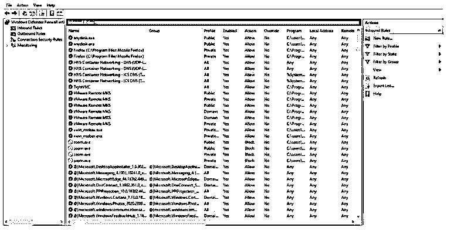
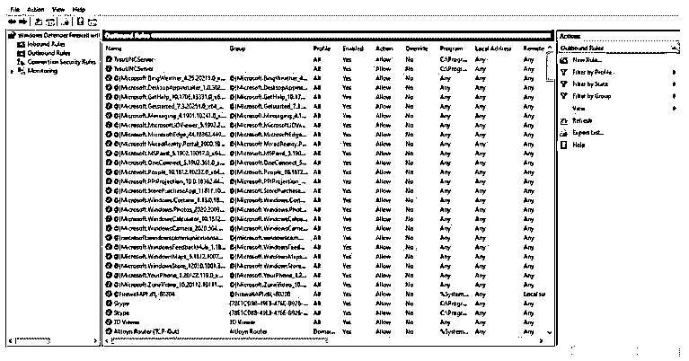
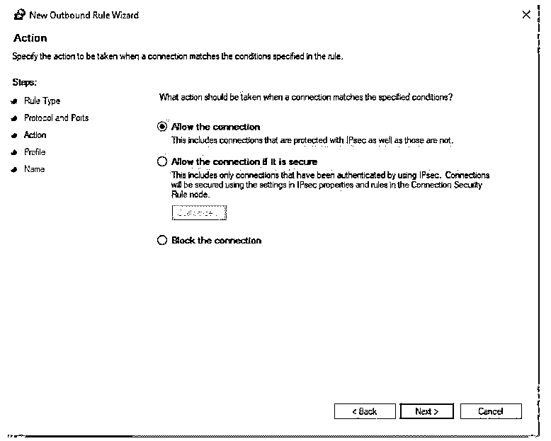
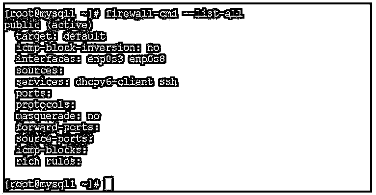
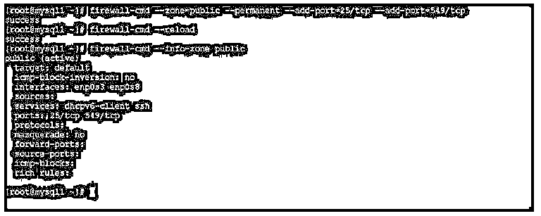

# 防火墙规则

> 原文：<https://www.educba.com/firewall-rules/>

## 防火墙规则介绍

我们需要用来管理传入流量和传出流量的防火墙规则。在网络中，我们主要遵循 TCP 和 UDP 这两种协议。TCP 协议将为消息提供确认可靠性。但是另一方面，在 UDP 协议中，我们没有得到任何消息传递的可靠性来确认。在防火墙级别，通常，我们使用 TCP 协议。在这里，防火墙将在第 7 层工作。7 级不过是应用级。在防火墙级别，我们也可以在应用程序级别直接应用策略。防火墙规则管理因平台而异，如操作系统、硬件等。我们还可以根据软件级别和硬件级别来管理防火墙规则。

**防火墙规则的语法**

<small>网页开发、编程语言、软件测试&其他</small>

在句法上，我们可以把它分为两个不同的部分。一是实际硬件层面，二是操作系统层面。

*   **硬件级别:**市场上有许多防火墙硬件设备。每个设备属于不同的供应商，具有不同的功能和配置。因此，有不同的方法来配置文件规则。
*   **操作系统:**每个操作系统像 Linux，Windows，MAC 都有自己的防火墙。在这里，如果我们需要更改防火墙规则，您可以根据操作系统的可用性使用 UI 或 CLI。

**语法:**

`firewalld [OPTIONS...]`

*   **firewalld:** 我们可以在语法或命令中使用 firewalld 关键字。它将接受不同的参数，如兼容选项等。根据提供的输入，防火墙将能够在防火墙级别进行更改。因此，firewalld 命令也有助于管理不同的防火墙相关任务。
*   **选项:**根据需要，我们可以提供不同的标志作为与 firewalld 命令兼容的选项。

**Note:** The above syntax is for the Linux environment.

### 防火墙规则如何工作？

*   正如我们所见，防火墙规则是用于流量过滤的。当我们添加任何防火墙规则时，将在防火墙配置中创建规则条目。当任何网络流量到来时，文件将检查可用的规则集。根据规则，防火墙将做出决定。决策有三个选项，如接受、放弃或拒绝。每个动作都有它自己的意义。相同的关键字将有助于防火墙对其采取必要的操作。换句话说，接受、丢弃或拒绝是防火墙的一个动作。根据必要的动作，防火墙将采取必要的动作。如果接受，防火墙将允许网络流量在特定的 URL 或端口上流动。如果是拒绝操作，防火墙将阻止网络流量在特定 URL 或端口上流动，并提供类似“无法到达”的错误消息。如果是丢弃操作，防火墙将丢弃网络流量，使其在特定的 URL 或端口上流动，而不会显示任何错误消息。
*   在防火墙规则中，它取决于传入和传出流量。在正常的服务器和客户端通信中，有传入和传出流量。传入流量将有助于了解网络资费或网络数据包是否来自外部世界。流量包含端口号、URL 地址、数据信息等基本信息。在传入防火墙规则中，我们需要确定数据或网络流量来自外部世界。孰是孰非。如果它是正确的，那么只有防火墙将允许流量传递到系统。同样，也有传出流量。通常在出站规则中，我们对所有网络流量开放。这将取决于我们是否需要定义出站规则的要求。

### 防火墙规则的示例

以下是防火墙规则的示例:

#### 示例#1

防火墙规则:在 Windows 平台上。

正如我们已经看到的，有不同的防火墙设备(来自不同的供应商)可用。因此，在防火墙规则方面，我们需要遵循不同的流程和方法。同样，我们也可以从硬件或软件层面管理防火墙规则。这里，我们正在研究 windows 操作系统防火墙规则。

**代码:**

它不是特定的语法；我们只需要遵循访问流程。

`Windows key -> search for control panel -> windows firewall -> Advance setting -> Click for the new rules.`

**说明:**

*   按照上面的流程，我们能够在 Windows 环境中添加新的防火墙规则。在 windows 环境中，这样做有点容易。但我们需要一个管理员或完全访问各自的操作系统。

**输出:**

#### 实施例 2

防火墙规则:在 Linux 平台上。

在每个操作系统中，防火墙服务都在运行。我们还可以管理防火墙规则。例如，它将有助于允许或禁用系统中的网络流量。

**代码:**

`firewall-cmd --zone=public --permanent --add-port=25/tcp --add-port=549/tcp
firewall-cmd –reload
firewall-cmd --info-zone public`

**说明:**

*   按照上面的命令，我们使用了 3 个命令。根据下面的截图，我们得到了默认的防火墙区域信息。我们正在更改防火墙规则，并添加了包含端口 25 和 549 的新规则。

**输出:**

### 结论

我们已经看到了“防火墙规则”的完整概念，以及正确的示例、解释和带有不同输出的命令。它有助于过滤入站网络流量和出站网络流量。防火墙工作在第 7 层的 TCP 层。

### 推荐文章

这是防火墙规则指南。在这里我们讨论一下入门，防火墙规则是如何工作的？和示例。您也可以看看以下文章，了解更多信息–

1.  [防火墙设备](https://www.educba.com/firewall-devices/)
2.  [防火墙使用](https://www.educba.com/firewall-uses/)
3.  [防火墙的类型](https://www.educba.com/types-of-firewall/)
4.  [什么是防火墙？](https://www.educba.com/what-is-a-firewall/)

