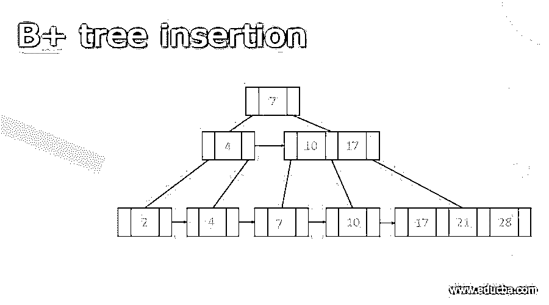
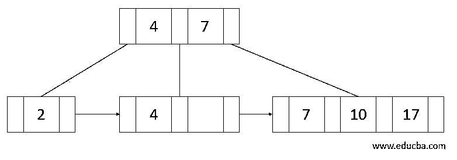
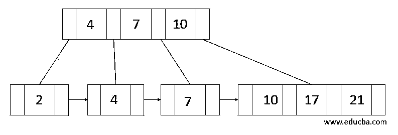
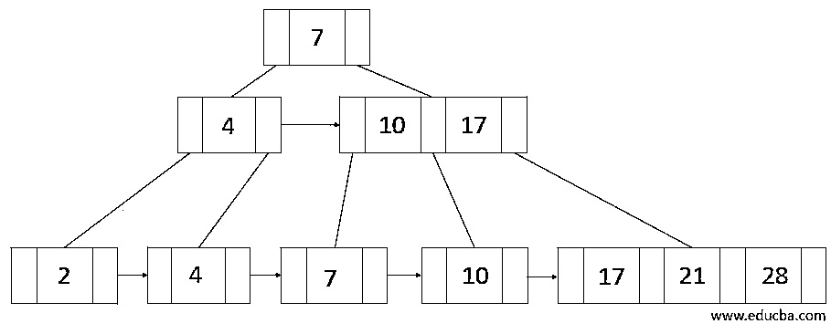
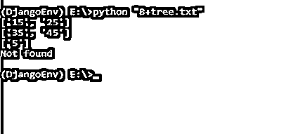

# B+树插入

> 原文：<https://www.educba.com/b-tree-insertion/>

## B+树插入简介

下面的文章提供了 B+树插入的概要。B+树用于通过实现动态多级索引来实现数据库索引。在 B+树中，叶节点表示实际的数据指针，这是 B+树的主要缺点。在 B+树中，所有叶节点都在同一高度。这个过程减少了进入 B+树节点的条目数量，并减少了搜索时间。

在 B+树中，使用链表来链接叶节点，以支持元素的随机访问和顺序访问。因为它将信息存储在链表中，所以它比 B 树占用更多的空间。

<small>网页开发、编程语言、软件测试&其他</small>

### B+树的特征

*   数据点仅存储在叶节点中。
*   内部节点包含键。
*   为了直接搜索元素，我们使用 B+树中的键。
*   如果有“m”个元素，则最多有“m-1”个键，至少有“[m/2] -1”个键。
*   根节点至少有两个子节点和一个键。
*   对于“m”个元素，除了根之外的每个节点至少可以有“m/2”个子节点，最多可以有“m”个子节点。

### 在 B+树中插入数据点的步骤

1.  每个元素都将被插入到叶节点中。
2.  如果叶节点中出现溢出情况，请遵循以下步骤:

*   将叶节点与其他节点一起分割成两个独立的节点。
*   第一个节点包含(m-1)/2 的上限值。
*   第二个节点包含上述节点中的剩余节点。
*   在右偏树的左侧父节点中插入元素。

### B+树的表示和插入数据点

在继续讨论算法之前，让我们看看这个 B+树的工作模式和属性。

1.  让我们以如下所示的七个元素为例。

2, 4, 7, 10, 17, 21, 28

2.  假设顺序是三，那么每个节点必须包含至少三个节点和两个键。

3.  由于我们没有空间插入 10，这是三个元素的节点中的溢出条件，我们将拆分中间的元素，然后插入它，如图所示。
4.  同样，我们将在第三个节点的 10 后面插入 17。

5.  由于在上述第三个节点中，我们在 17 之后没有空间来插入 21，我们将通过在根节点中的 7 之后放置 10 来从最后一个叶节点拆分 10 以插入 21，如图所示。

6.  要插入 28，我们需要向上面的节点发送 17，但是没有空间来插入 17，所以我们需要拆分 7 来放置 17，最后插入 28。

**第四步:**如果叶子是满的，插入元素然后平衡树来维持顺序。

7.  在最后一步中，我们输入的任何数据点都到达了叶节点。

### B+树插入算法

下面是将一个元素插入 B+树的算法。

**步骤 1:** 检查根节点是否至少有两个子节点。

**第二步:**遍历树到叶节点。

**第三步:**如果叶未满，则按升序将元素插入键中。

**步骤 5:** 为了平衡树，在第 m/2 个位置断开插入的节点

**第六步:**给父节点添加第 m/2 个键。

**步骤 7:** 如果父节点已满，递归调用步骤 2 和步骤 3。

**将元素插入 B+树的源代码**

`temp2 = current_node.values
for i in range(len(temp2)):
if (value == temp2[i]):
current_node = current_node.keys[i + 1] break
elif (value < temp2[i]):
current_node = current_node.keys[i] break
elif (i + 1 == len(current_node.values)):
current_node = current_node.keys[i + 1] break
return current_node
# Find the node
def find(self, value, key):
l = self.search(value)
for i, item in enumerate(l.values):
if item == value:
if key in l.keys[i]:
return True
else:
return False
return False
# Inserting at the parent
def insert_in_parent(self, n, value, ndash):
if (self.root == n):
rootNode = Node(n.order)
rootNode.values = [value] rootNode.keys = [n, ndash] self.root = rootNode
n.parent = rootNode
ndash.parent = rootNode
return
parentNode = n.parent
temp3 = parentNode.keys
for i in range(len(temp3)):
if (temp3[i] == n):
parentNode.values = parentNode.values[:i] + \
[value] + parentNode.values[i:] parentNode.keys = parentNode.keys[:i +
1] + [ndash] + parentNode.keys[i + 1:] if (len(parentNode.keys) > parentNode.order):
parentdash = Node(parentNode.order)
parentdash.parent = parentNode.parent
mid = int(math.ceil(parentNode.order / 2)) - 1
parentdash.values = parentNode.values[mid + 1:] parentdash.keys = parentNode.keys[mid + 1:] value_ = parentNode.values[mid] if (mid == 0):
parentNode.values = parentNode.values[:mid + 1] else:
parentNode.values = parentNode.values[:mid] parentNode.keys = parentNode.keys[:mid + 1] for j in parentNode.keys:
j.parent = parentNode
for j in parentdash.keys:
j.parent = parentdash
self.insert_in_parent(parentNode, value_, parentdash)
# Print the tree
def printTree(tree):
lst = [tree.root] level = [0] leaf = None
flag = 0
lev_leaf = 0
node1 = Node(str(level[0]) + str(tree.root.values))
while (len(lst) != 0):
x = lst.pop(0)
lev = level.pop(0)
if (x.check_leaf == False):
for i, item in enumerate(x.keys):
print(item.values)
else:
for i, item in enumerate(x.keys):
print(item.values)
if (flag == 0):
lev_leaf = lev
leaf = x
flag = 1
record_len = 3
bplustree = BplusTree(record_len)
bplustree.insert('5', '33')
bplustree.insert('15', '21')
bplustree.insert('25', '31')
bplustree.insert('35', '41')
bplustree.insert('45', '10')
printTree(bplustree)
if(bplustree.find('5', '34')):
print("Found")
else:
print("Not found")`

**输出:**

### 结论

*   B+树用于通过实现动态多级索引来实现数据库索引。
*   对于“m”个元素，除了根之外的每个节点至少可以有“m/2”个子节点，最多可以有“m”个子节点。
*   在 B+树中，使用链表来链接叶节点。

### 推荐文章

这是一个 B+树插入的指南。在这里，我们讨论 B+树的表示，以及插入数据点和算法。您也可以看看以下文章，了解更多信息–

1.  [二叉树 JavaScript](https://www.educba.com/binary-tree-javascript/)
2.  [在数据结构中展开树](https://www.educba.com/splay-tree-in-data-structure/)
3.  [树遍历 Python](https://www.educba.com/tree-traversal-python/)
4.  [生成树算法](https://www.educba.com/spanning-tree-algorithm/)

