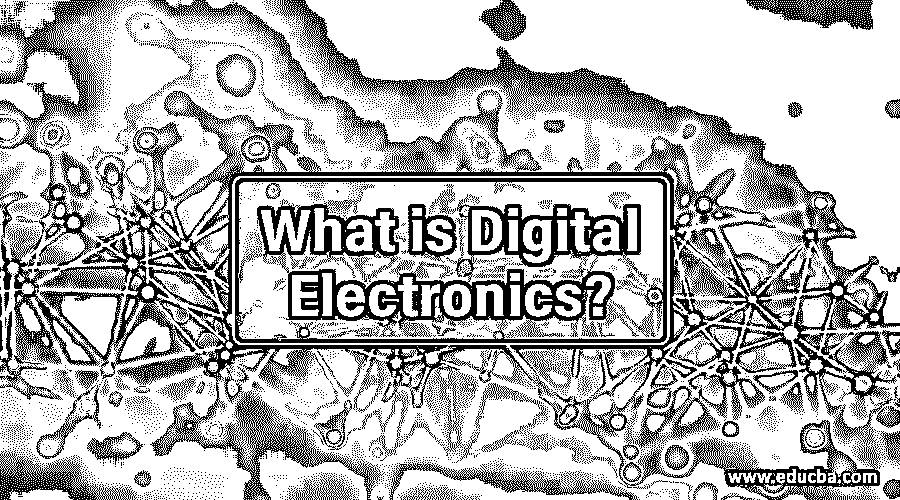

# 什么是数字电子？

> 原文：<https://www.educba.com/what-is-digital-electronics/>

## 数字电子学的定义

数字电子是电子领域，包括数字信号领域和产生高生产力的工程元素。它由集成电路形式的多个逻辑门组成。复杂的装置需要一个简单的布尔逻辑功能的电子骨架。数字信号以数字方式表示，没有任何噪声干扰。不间断的音频信号以 0 和 1 的顺序传递。数字信号可以在没有任何误差和噪声的情况下构建，因此它被吸引到所有数字电子领域以获得恒定的生产率。本文简要讨论了数字电子技术的需求、类型和优势。

### 为什么我们需要数字电子？

可以使用更多的二进制数字来产生数字信号的更精确的表示，并且具有独特的表示方式。尽管它需要多个数字电路来管理信号，并且每个数字都由一组类似的硬件组件处理，在一个简单的缩放系统中实现。而在模拟领域，附加分辨率需要在信号链的每一步管理噪声特性和线性度方面进行基本改进。在计算机处理的数字系统的支持下，趋势函数可以输入到软件版本中，不需要改变硬件。但是这是在制造工厂之外通过通知产品的软件来进行的。

<small>网页开发、编程语言、软件测试&其他</small>

一旦产品交付到客户手中并收到他们的反馈，产品的设计错误就可以得到纠正。与模拟系统相比，在数字系统中存储信息更容易。数字系统对噪声的抗扰性允许数据在没有任何退化的情况下被检索和存储。在模拟系统中，老化噪声可能由于存储信息的磨损特性而变化。但是在数字中，如果噪声低于建议的水平，数据可以被完美地恢复。即使存在任何显著的噪声，冗余的使用也允许恢复实际数据，并提供对错误的强抵抗力。在某些情况下，数字电路需要比模拟系统更高的能量来完成相同的任务，并产生更多的热量，增加了电路的复杂性，如散热片内含物。在面向电池或便携式电池系统中，这些原理限制了数字系统的应用。例如，电池供电的移动电话大多倾向于在模拟中使用最小功率来调谐无线电信号和放大前端信号。

基站需要电网电源，对软件无线电信号来说过于灵活。这种类型的基站可以容易地被编程用于新的移动标准中隐含的信号处理。数字系统将连续的模拟信号转换成不同的数字信号，这导致量化误差，如果系统存储有方便的数字数据，则可以限制量化误差。它用于标记信号，以获得所需的保真度。很少有定理给出计算表示给定模拟信号需要多少数字数据的重要准则。

### 数字电子产品的类型

组合数字逻辑系统基本上是使用逻辑门构建的，例如或门、与门、通用门、或非门和与非门、非门。这些门被合并以发展复杂的开关电路。逻辑门由多个组合逻辑电路构成。在组合逻辑系统中，输出可以基于在正确的瞬时时间的给定输入在任何时间被传递，并且组合技术不持有任何存储设备。时序数字系统不同于组合逻辑系统。这里，任何逻辑器件的输出都不是基于组件的给定输入，而是取决于过去的给定输入。换句话说，时序电路的输出基于给定的输入和设备的当前状态。时序电路具有存储元件来保存过去的输出。这里，时序电路是简单的电路，如具有存储器件的组合电路，并使用有限状态电路开发。它类似于触发器和计数器，使用逻辑存储器和门构建。两个输入由组合电路处理以给出不同的输出。从存储器组件获得的输出被提供给组合电路。辅助输入部件是由存储部件产生的状态变量，辅助设备用于激励存储元件。

### 优势

*   在数字系统中，数据存储可以比模拟电路简单。数字系统中的抗扰度允许在没有任何数据丢失的情况下检索和存储数据。数据中的噪声退化允许在没有任何数据贬值的情况下存储和重新推导。
*   数字信号的脆弱性可以通过数字系统来限制，以获得稳健的速度。其他错误管理或方比特可以被提供给信号路径。它有助于检测错误，然后支持纠错和数据重传。
*   只要整体噪声水平低于容许水平，噪声的存在就会降低模拟和数字系统中的数据质量。如果是这样，噪声可以被完美地去除。
*   在少数系统中，如果数字数据的任何单元块被曲解或丢失，巨大块的意义可能与数据相关联，从而产生完全的变化。例如，存储的音频数据的单个比特中的错误可以被限制为脉冲码的直接调制，这会导致更差的操作。相反，大多数人使用音频压缩来存储空间和下载存储时间，但单个错误位会造成巨大的破坏。由于悬崖效应，用户可以通过复杂程度来判断任何特定系统是直接处于故障边缘，还是在电路出现故障之前能够承受最大噪声。

### 推荐文章

这是一本什么是数字电子的指南？.在这里，我们还讨论了数字电子的定义和需求，以及类型和优势。您也可以看看以下文章，了解更多信息–

1.  [数字电子面试试题](https://www.educba.com/digital-electronics-interview-questions/)
2.  [什么是数字取证？](https://www.educba.com/what-is-digital-forensics/)
3.  [需求工程](https://www.educba.com/requirement-engineering/)
4.  [数字签名 vs 数字证书](https://www.educba.com/digital-signature-vs-digital-certificate/)

