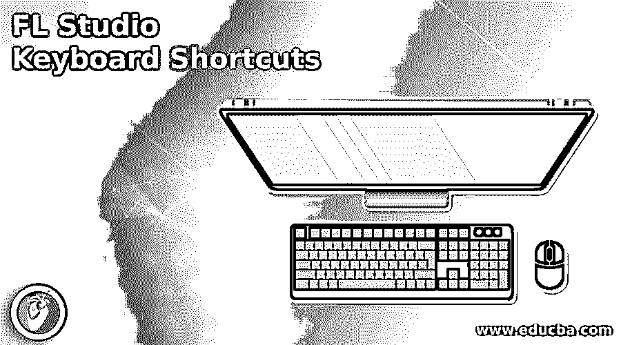

# FL Studio 键盘快捷键

> 原文：<https://www.educba.com/fl-studio-keyboard-shortcuts/>

## FL Studio 键盘快捷键介绍

FL Studio 键盘快捷键有助于您在处理音频编辑、处理和操作时加快在该软件中的工作速度。键盘快捷键是键盘按键的组合，通过组合按下它们，我们可以非常快速地访问任何命令，例如您可以按下键盘的 Ctrl + Shift + R 按钮激活导出 Mp3 文件命令，F4 用于下一个带有命名对话框的空模式，等等。我会告诉你这个软件的一些快捷方式，但你也可以从菜单栏的上下文菜单中查看更多快捷方式。

在我们开始讨论不同的快捷键之前，我想告诉你 Windows 和 Mac 的等价键，这样你就可以理解这两种快捷键了。

<small>网页开发、编程语言、软件测试&其他</small>

Windows 的 Alt 键相当于 Mac 的 Option 键，这意味着如果有任何键与 Windows 的 Alt 键组合，如果您在 Mac OS 上使用该特定组合，您必须按 Option 键才能在 Mac 中访问该快捷键。

### FL Studio 的键盘快捷键

我们来看看 FL Studio 快捷键。

*   **退格=删除(<X):**Windows 的退格，按 Mac 的删除(< X)键。
*   **Ctrl = Command:** 对于 Windows 的 Ctrl 键，按 Mac 的 Command 键。
*   **Delete = fn + Delete ( < ):** 对于 Windows 的删除按钮，按下 Mac 的 fn+ Delete ( < X)键。
*   **Insert = fn + Return:** 对于 Windows 的 Insert 按钮，按下 Mac 的 fn + Return 键。
*   **Windows = Command:** 对于 Windows 图标按钮，按 Mac 的 Command 键。

**FL Studio 的基本快捷键:**

*   **撤销/重做上一次编辑(Ctrl + Z):** 如果您想返回到工作中的上一步，您可以按键盘上的 Ctrl (Command) + z 键。
*   **逐步撤消(Ctrl + Shift + Z):** 如果您想逐个返回到前面的步骤，那么您可以按键盘的 Ctrl + Shift + Z 键。
*   **打开文件(Ctrl +O):** 要打开您现有的音轨文件或您之前保存的文件，您可以按 Ctrl +O。
*   **保存文件(Ctrl + S):** 按 Ctrl + S，可以直接出现保存对话框，保存您工作的任何文件。
*   **保存新版本(Ctrl + N):** 通过按 Ctrl + N 按钮，您可以保存您的音频编辑工作的新版本。
*   **另存为(Ctrl + Shift + S):** 如果您想在新的位置或以新的文件格式再次保存您保存的工作，那么您可以按 Ctrl + Shift + S 作为另存为选项。
*   **导出波形文件(Ctrl + R):** 要从本软件中导出任意波形文件，可以通过按键盘上的 Ctrl + R 键来执行导出命令。
*   **导出 mp3 文件(Ctrl + Shift + R):** 通过导出 wave 文件的相同方式，您也可以从该软件中导出 Mp3 文件，并且对于该命令，您需要按下键盘的 Ctrl + Shift + R 按钮。
*   **导出 MIDI 文件(Ctrl + Shift + M):** 按 Ctrl + Shift + M，可以导出任何 MIDI 文件格式的文件。
*   **打开最近使用的文件(Ctrl + 0，1，…9):**按 Ctrl + 0，Ctrl + 1…可以非常快速地打开该软件最近使用的文件。诸如此类；也就是说，如果你按 Ctrl + 0，它将只打开最后使用的文件，如果你按 Ctrl + 1，它将打开最后使用的文件之前使用的文件，依此类推。
*   **重新排列窗口(Ctrl + Shift + H):** 按下键盘的 Ctrl + Shift + H 键，可以重新排列本软件打开的窗口或标签页。
*   **选择图案(1…9):** 您可以按键盘上的 1 到 9 数字键依次选择图案。
*   **下一个图案(+):** 如果要移动到图案面板的下一个图案，请按键盘上的+按钮。
*   **上一个图案(-):** 与移动到下一个图案相同，您也可以通过按键盘上的–键移动到上一个图案。
*   **打开名称编辑器(F2):** 按键盘的 F2 功能键，打开所选图案的名称编辑器对话框，重复此键，将随机选择颜色。
*   **下一个空图案对话框(F4):** 要进入下一个空图案的名称对话框，请按键盘的 F4 功能键。
*   **下一个空模式(Ctrl + F4):** 如果你想有下一个空模式，那么按 Ctrl + F4。
*   **选择上面的频道(向上箭头):**要选择上面的频道，请按键盘上的向上箭头按钮。
*   **选择下面的频道(向下箭头):**要选择下面的频道，按键盘上的向下箭头按钮。
*   **选择下一个频道组(向上翻页):**按键盘上的向上翻页按钮，可以选择下一个频道组。
*   **选择上一个频道组(向下翻页):**按键盘上的向下翻页按钮，可以选择整个上一个频道组。
*   **删除频道(Alt + Del):** 如果您想要删除选定的一个或多个频道，只需选择这些频道并按下键盘上的 Alt + Del 键。
*   **向上移动频道(Alt +向上箭头):**如果要向上移动选定的频道，请按键盘的 Alt +向上箭头按钮。
*   **向下移动频道(Alt +向下箭头):**如果要向下移动选定的频道，请按键盘的 Alt +向下箭头按钮。
*   **克隆频道(Alt + C):您可以通过按键盘上的**Alt+C 按钮来克隆所选频道。
*   **分组频道(Alt + G):** 如果您愿意，您可以将频道分组，只需选择您想要分组的频道，然后按键盘上的 Alt + G 按钮。

### 结论

我告诉了你这个软件的一些重要的快捷方式，但是这里有更多的快捷方式，你可以在你的使用中慢慢地采用。因此，只要使用快捷键启动这个软件，它就会随着时间的推移自动在你的脑海中出现。

### 推荐文章

这是一个关于 FL Studio 键盘快捷键的指南。在这里，我们也讨论了 FL Studio 的介绍和键盘快捷键以及详细的解释。您也可以看看以下文章，了解更多信息–

1.  [FL 工作室备选](https://www.educba.com/fl-studio-alternative/)
2.  [Revit 键盘快捷键](https://www.educba.com/revit-keyboard-shortcuts/)
3.  [Linux 键盘快捷键](https://www.educba.com/linux-keyboard-shortcuts/)
4.  [OneNote 快捷方式](https://www.educba.com/onenote-shortcuts/)

