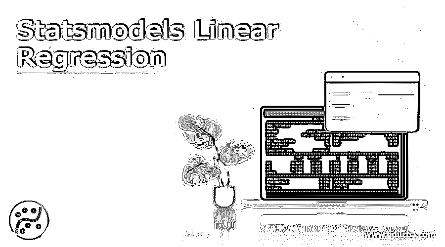
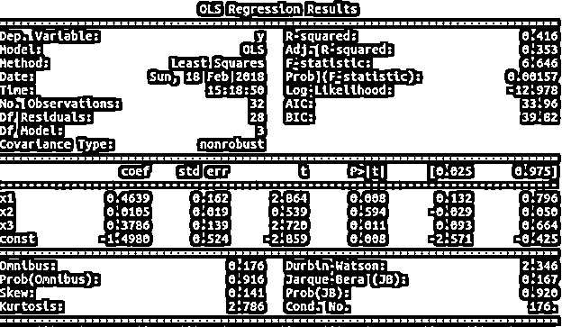

# 统计模型线性回归

> 原文：<https://www.educba.com/statsmodels-linear-regression/>

## stats 模型线性回归简介

线性回归统计模型是帮助我们预测的模型，用于拟合一个参数直接依赖于另一个参数的情况。这里，我们有一个因变量和另一个自变量。根据自变量数值的变化，我们需要预测因变量的变化。

通过使用线性回归方法，我们可以有多种方法来拟合模型。在本文中，我们将大致了解 statsmodels 中线性回归的概述、其中使用的参数、使用 statsmodel 的线性回归的方法，了解简单和多元线性回归模型，并借助示例了解其实现。最后，我们将结束我们的发言。

<small>网页开发、编程语言、软件测试&其他</small>

### 统计模型线性回归概述

线性回归是与以相同方式分布的自变量和误差一起工作的统计模型。这些误差是在考虑自相关和异方差的情况下产生的。线性回归模型支持使用广义可行最小二乘法和 AR (p ),它们只不过是自相关误差、广义最小二乘法、加权最小二乘法以及普通最小二乘法。每个命令和参数的用法都不同。

线性回归的简单例子可以用下面的等式来表示，该等式也构成了图上直线的等式

`B = p + q * A`

其中 B 和 A 是变量。b 是因变量，其值随着 A 值的变化而变化。A 是自变量，是我们传递给回归模型的输入值。b 也称为要预测或估计其值的值或输出。q 是回归线的斜率，表示 A 对 b 值的影响。p 是常数值，也表示 Y 截距，即回归线与 Y 轴的交点。

### 统计模型线性回归参数

实施线性回归描述中涉及的参数如下所述

*   cholsimgainv——是由 n* n 维三角矩阵组成的数组，满足一些约束条件。
*   df _ model–它是表示模型自由度的 float 数据类型值，该值与 p-1 完全相同。这里，p 代表回归数。每当我们计算这里的自由度时，我们不考虑这里的截距。
*   pinv _ wexog–这是一个维数为 p * n 的数组，是 Moore 和 Penrose 伪逆矩阵。
*   df _ resid–它是一个浮点值，对应于本质上是剩余的自由度，参数值等于 n-p，其中 p 是传递的参数的数量，而 n 是观察的数量。这里截距是计算自由度的参数。
*   nobs——该参数代表观察次数，通常用 n 表示。
*   llf–它是一个浮点值，表示与拟合模型相对应的似然函数。
*   适马–它是一个 n*n 维的数组，代表一个带有误差项的协方差矩阵。
*   归一化 cov 参数–这是一个 p* p 维的数组，具有归一化协方差值。
*   适马——这是一个 n * n 维数组和一个包含误差项的协方差矩阵。
*   wendog–它是白化响应的变量，属于数组数据类型。
*   wexog–它是一个数组，由白化设计矩阵组成。

### 如何使用 statsmodels 线性回归？

回归模型有四个可用的属性类别，有助于我们使用 statsmodel 线性回归。这些类别如下所列

*   OLS-普通最小二乘法
*   WLS 加权最小二乘法
*   GLS–广义最小二乘法
*   GL sar–可行的广义最小二乘以及自相关误差。

我们可以按照相同的结构和相同的方法，以相同的方式利用所有上述回归模型。除了滚动 WLS、递归最小二乘和滚动 OLS，其他回归类有 GLS 超类。

**简单线性回归**

当只有一个自变量的值在变化时，我们希望预测一个依赖于自变量的因变量的值，那么这种情况的实现称为简单线性回归。

**多元线性回归**

当多个自变量的值不同时，我们希望预测依赖于所有自变量的一个因变量的值，这种情况的实现称为多元线性回归。

### stats 模型线性回归示例

在您学习了使用 statsmodel 的基础知识之后，现在是时候转向更复杂的部分了，我们将在 statsmodel 包的帮助下在源数据中实现线性回归。我们将遵循上述示例中提到的相同步骤，为 OLS 模型添加一个额外的部分。让我们直接跳到代码，然后试着理解它

`// importing the necessary packages
import numpy as educbaSampleNumpy
import stateducbaSampleStatsodels.api as educbaSampleStats
// Loading the source data set
educba_data = educbaSampleStats.datasets.spector.load()
// Adding constants to the data file
educba_data.exog = educbaSampleStats.add_constant(educba_data.exog, prepend=False)
//Fitting the model which is in OLS
educbaModel = educbaSampleStats.OLS(educba_data.endog, educba_data.exog)
res = educbaModel.fit()
// Summarize the statistical results and printing the same on console
print(res.summary())`

我们可以很容易地从输出中读出结果的细节。执行上述代码会产生以下输出–

### 结论

当独立变量发生变化时，Statsmodel 线性回归模型有助于预测或估计因变量的值。

### 推荐文章

这是一个统计模型线性回归的指南。在这里，我们讨论介绍，概述，参数，如何使用 statsmodels 线性回归，并举例说明。您也可以看看以下文章，了解更多信息–

1.  [什么是线性回归？](https://www.educba.com/what-is-linear-regression/)
2.  [R 中的多元线性回归](https://www.educba.com/multiple-linear-regression-in-r/)
3.  [多元线性回归](https://www.educba.com/multiple-linear-regression/)
4.  [线性回归 vs 逻辑回归](https://www.educba.com/linear-regression-vs-logistic-regression/)

