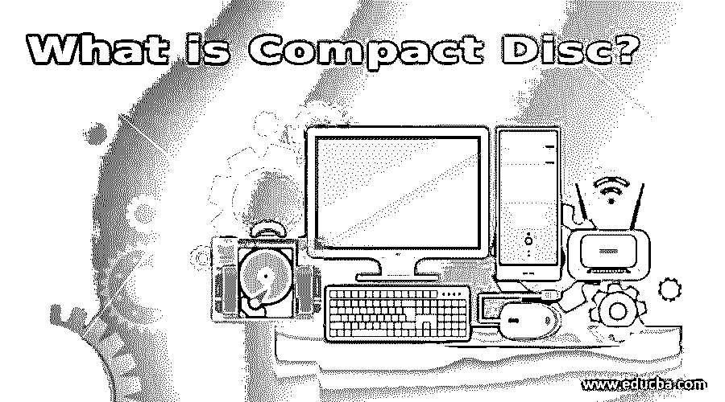

# 什么是光盘？

> 原文：<https://www.educba.com/what-is-compact-disc/>

## 光盘的定义

光盘可以定义为一种盘状存储设备，它由塑料材料制成，用于存储数据和从存储设备访问存储的数据。它是作为软盘存储器的替代选择而发明的，因为它是一种提供更快访问和更大存储容量的现代方式。它经常用于存储、传输和取回存储的媒体文件，如音频和视频文件。这些存储设备的可访问性由设备的类型决定，它们是 CD–R、CD–RW、CD–MO、VCD 和 DVD。

### 光盘的历史

在不接触磁盘的情况下，用光从预先录制的表面读取数据的想法首先是由詹姆斯·t·拉塞尔在巴特尔纪念研究所工作时提出的。经过多年对基于这一概念建造的各种原型的研究，罗素终于发明了第一个用于光学记录和回放设备的数字存储设备，并于 1970 年获得了专利。这些努力，就像任何其他数字发明一样，吸引了许多投资者对其进行进一步开发，并将其引入商业市场。这包括飞利浦电子公司和索尼公司。

<small>网页开发、编程语言、软件测试&其他</small>

索尼和飞利浦都是通过向巴特尔研究所支付各自的版税来接受这个想法的。索尼随后在 1982 年推出了第一款商用设备，名为 CDP -101，这是一款用于访问 CD 的 CD 播放器。此外，在 1985 年，Russell 又提出了 26 个 CD-r om 技术的专利创意，并获得了独家注册权。最终，Russell 继续他在 CD 和光学记录技术方面的工作，这导致他拥有了 11 项光学记录和回放的专利权，特别是在随机存取存储器方面。

CD 随后成为存储和数据访问的主要来源，因为它是便携式的，比当时使用的任何其他存储设备都具有更快更高的存储容量。它主要用于存储、检索和从一部电影到另一部电影的传输，而不必每次都付费，因为购买 CD 和重复使用它需要一次性付款。除了 CD-ROM，所有其他类型的 CD 都可以重复使用，因为 ROM 只允许对 CD 存储器进行可读访问。

### 光盘是如何工作的？

通常，光盘或 CD 的尺寸为 12 厘米，即直径为 4.5 英寸。它由四个不同的层组成。他们是，

*   顶层
*   漆层
*   反射层
*   聚碳酸酯盘层

顶层用于在光盘上标记识别标记，并且它还可以具有指示或名称的印刷形式，以指示设备内部存储了什么。位于顶层之下的漆层用于防止设备暴露于大气中而导致氧化。在漆层下面是由铝材料制成的反射层，激光束被导向该反射层以接收反射，该反射层又可以读取盘的内容。光盘的最底层由聚碳酸酯制成，其中的数据被编码以使光盘正常工作。

为了访问光盘，需要有一个 CD 播放器或光盘驱动器。在 CD 播放器内部，它由各种硬件部件组成，包括一个小型激光束和另一个小型电子光探测器。这里，使用半导体二极管激光器产生激光束，光电管充当电子光检测器。当 CD 播放器或磁盘驱动器通电时，仪器内部的电机使光盘以相当高的速度旋转，速度范围为每分钟 200 到 500 转。

由于这个原因，放置在内部的半导体二极管激光器被加电，用于从中心到外部轨道开始扫描盘的轨道。这是通过光盘，以便从最底层读取数据。因此，创建的反射可以从光盘上获取数据，并将其传送给访问光盘的仪器。电子光检测器可以接收反射并读取已经馈入存储单元的数字内容。

### 光盘的用途

以下是光盘被有效地用于多种应用的领域，

#### 1.营销/销售/广告

光盘通常被用作软件产品促销的关键要素，因为 CD 存储区能够存储任何格式和类型的文件。软件产品连同可读说明、支持文件、参考链接和安装密钥一起被加载到 CD 中。当涉及到软件安装和可移植性时，这提供了较少人工工作的好处。

#### 2.培训/学术/教育

因为光盘可以容纳更大容量的内容，可以更快地访问光盘中的项目，所以它有助于在一个地方存储完整的课程包。与其他存储空间不同，光盘可以处理所有常用的文件格式，让用户在同一设备上反复读/写/重写。因此，它是培训、学术和教育机构通过培训材料的首选。

#### 3.工作场所

在工作场所，员工经常需要在不同的桌子之间共享文件，以处理需要完成的工作。使用光盘等便携式存储设备传递所需的文档、文件夹和文件，而不是以物理文件的形式传递文书工作，这是一种方便且组织有序的方式。

### 优点和缺点

一些优点和缺点:

#### 优势

*   性价比高。
*   比以前的存储单元(即软盘)更快。
*   可读&读/写，根据用户要求。
*   允许任何类型的文件。

#### 不足之处

*   最新设备的存储容量增加，因此这些设备由于技术的发展而变得有用。
*   精致的设计，很容易损坏或刮伤。

### 结论

在基于 USB 的便携式存储设备如笔驱动器发明之前，光盘曾经是著名的存储选择。这是由于 CD 在允许的数据格式、存储容量和处理速度方面所提供的灵活性，用户被这种方便的存储系统所吸引。

### 推荐文章

这是一本什么是光盘的指南？.这里我们也讨论一下光盘的介绍和工作原理？有优点也有缺点。您也可以看看以下文章，了解更多信息–

1.  [计算机内存的类型](https://www.educba.com/types-of-memory-in-computer/)
2.  [什么是 MVVM](https://www.educba.com/what-is-mvvm/)
3.  [JSON 蛮](https://www.educba.com/json-pretty/)
4.  [Laravel Errors](https://www.educba.com/laravel-error/)

