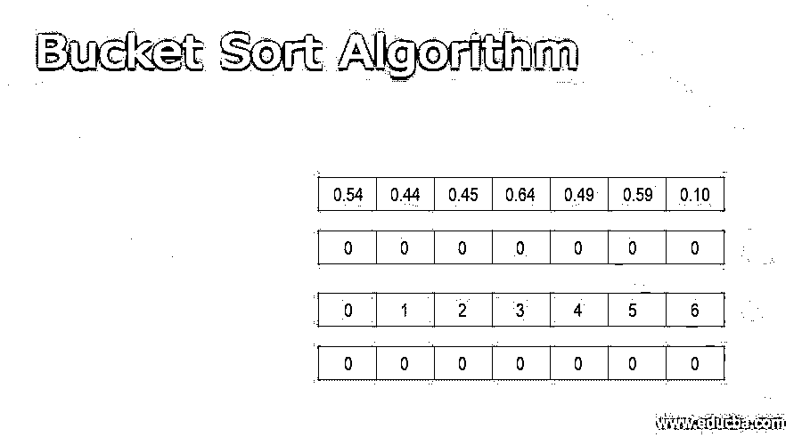
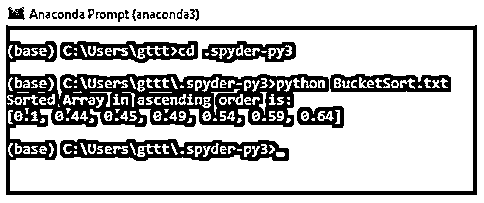

# 桶排序算法

> 原文：<https://www.educba.com/bucket-sort-algorithm/>




## 桶排序算法的定义

桶排序是一种排序技术，它基于一种算法，该算法将一个未排序的数组作为输入，并返回一个已排序元素的数组。桶排序的工作原理是将给定的数列分成几个桶，根据要求对每个桶中的数据进行排序，然后将输出一个排序元素数组的数据再次合并。

桶排序遵循分散-顺序-收集方法，因为元素首先被分散到各自的桶中，然后在桶中排序，并在最后一步收集以形成排序的数组。

<small>网页开发、编程语言、软件测试&其他</small>

### 桶排序是如何工作的？

*   让我们取一个包含 7 个元素的输入数组。

输入数组是:

| Zero point five four | Zero point four four | Zero point four five | Zero point six four | Zero point four nine | Zero point five nine | Zero point one |

*   创建一个大小为 10 的空数组，如下所示。这个列表或数组的每个槽都用作存储元素的桶。

| Zero | Zero | Zero | Zero | Zero | Zero | Zero | Zero | Zero | Zero |

*   现在，我们必须根据存储桶范围将元素插入到它们各自的存储桶中。

| **0** | **1** | **2** | **3** | **4** | **5** | **6** | **7** | **8** | **9** |

例如，在我们的代码中，我们的存储桶的范围如下图所示:

| Zero | Zero | Zero | Zero | Zero | Zero | Zero | Zero | Zero | Zero |

bucket-1 的范围从 0 到 1，bucket-2 从 1 到 2，bucket n 从(n-1)到 n。要在相应的 bucket 中插入元素，请遵循以下三个步骤:

*   让我们以输入数组中的一个元素为例，它是 0.54
*   将其乘以空数组的大小(size = 10)，并使用 int()将结果转换为整数。您将获得:

0.54 × 10 = 5.4

在将其转换为整数时，我们得到，int(5.4) = 5

*   最后，将 5.4 插入 bucket-5

| Zero point five four | Zero point four four | Zero point four five | Zero point six four | Zero point four nine | Zero point five nine | Zero point one |

| **0** | **1** | **2** | **3** | **4** | **5** | **6** | **7** | **8** | **9** |

| Zero | Zero | Zero | Zero | Zero | 0.54Zero point five nine | Zero | Zero | Zero | Zero |

类似地，0.59 也被插入到同一个 bucket-5 中，因为这两个元素的 floor 值相等。

上述过程继续进行，直到所有元素都在各自的桶中稳定下来。

| **0** | **1** | **2** | **3** | **4** | **5** | **6** | **7** | **8** | **9** |

| 0.10 | Zero | Zero | Zero | 0.44Zero point four fiveZero point four nine | 0.54Zero point five nine | 0.64 | Zero | Zero | Zero |

*   然后使用任何算法技术对每个桶的元素进行排序。在这段代码中，通过 sorted()函数使用默认的排序技术，该函数使用 Timsort 算法。

| **0** | **1** | **2** | **3** | **4** | **5** | **6** | **7** | **8** | **9** |

| 0.10 | Zero | Zero | Zero | 0.44Zero point four fiveZero point four nine | 0.54Zero point five nine | 0.64 | Zero | Zero | Zero |

*   最后，通过迭代将元素传递到原始数组中来收集桶中的元素。

| **0** | **1** | **2** | **3** | **4** | **5** | **6** | **7** | **8** | **9** |

| 0.10 | Zero | Zero | Zero | 0.44Zero point four fiveZero point four nine | 0.54

Zero point five nine

 | 0.64 | Zero | Zero | Zero |

| Zero point one | Zero point four four | Zero point four five | Zero point four nine | Zero point five four | Zero point five nine | Zero point six four |

### 桶排序算法

在进入桶排序的实际实现之前，让我们来看一下算法步骤。

*   **第一步**:创建一个列表，每个列表都可以存放另一个列表，这个列表就是桶。
*   **步骤 2** :将铲斗初始化为 0 值。
*   **第三步**:将桶范围与各元素的底值匹配，将所有元素放入桶中。
*   **步骤 4** :使用任何排序算法对每个桶中的元素进行排序。
*   **步骤 5** :从每个桶中收集元素。

### Python 中的源代码

BucketSort.py

```
# Bucket Sort in Python
def BucketSort(array):
buckets_list = []
# 1\. Create empty buckets in buckets list(buckets_list)
for i in range(len(array)):
buckets_list.append([])
# 2\. Insert elements into their respective buckets
for j in array:
index_b = int(10 * j)
buckets_list[index_b].append(j)
# 3\. Sort the elements of each bucket
for i in range(len(array)):
buckets_list[i] = sorted(buckets_list[i])
# 4\. Get the sorted elements
new_array = []
for i in range(len(array)):
for j in range(len(buckets_list[i])):
for k in range(len(array)):
new_array.append(buckets_list[i][j])
break
return new_array
array = [.54, .44, .45, .64, .49, .59, .10]
print("Sorted Array in ascending order is: ")
print(BucketSort(array))
```

**输出:**




### 桶排序的时间复杂度

*   **最坏情况复杂度:**一般来说，当存在正常范围的元素时，一个桶包含许多元素，但当存在非常接近范围的元素时，它们更有可能落在同一个桶中。因此，在这种情况下，更多的元素被放在同一个桶中，导致一些桶中的 number 元素比其他桶中的多。算法的复杂性取决于桶中元素的数量，当桶中的元素顺序相反时，情况会变得更糟。当使用插入排序对元素进行排序时，时间复杂度将为 O(n <sup>2</sup>
*   **最佳情况复杂性:**最佳情况复杂性发生在桶中有相同数量的元素时，如果桶中的元素已经排序，情况会更好。假设使用插入排序对桶中的元素进行排序。在这种情况下，总体最佳情况复杂度将为 O(n+k)，其中 O(n)是制作桶的复杂度，O(k)是对桶中的元素进行排序的复杂度。
*   **平均案例复杂度:**当元素随机分布在桶的数组中时，出现平均案例复杂度。通常，桶排序在所有情况下都以线性时间运行，直到桶大小的平方和与元素总数成线性关系。最后，这使得 O(n)成为桶排序算法的平均复杂度。

### 桶排序算法的局限性

桶排序算法的限制如下:

1.  您不能将存储桶排序算法应用于所有数据类型，因为它对每种数据类型的处理略有不同。
2.  桶排序占用更多的空间，因为您需要单独的内存来存储每个桶中的元素，并需要一个数组来存储这些桶。
3.  桶排序算法取决于输入值的分布。输入值的范围也决定了该算法的效率。所以如果输入值是紧密聚类的，这个算法是不值得的。
4.  阵列中的每个存储桶需要具有相同的大小，以应对最坏的情况。如果桶的大小与数组的大小不同，则该算法在最坏的情况下会失败。

### 结论

*   桶排序是一种排序技术，它基于一种算法，该算法将一个未排序的数组作为输入，并返回一个已排序元素的数组。
*   桶排序遵循分散-顺序-收集方法，因为它通过首先分散元素并通过获得排序顺序再次收集元素来对元素进行排序。
*   将元素乘以数组大小，并将其从 float 转换为整数，得到桶号。

### 推荐文章

这是一个桶排序算法的指南。在这里，我们还将讨论桶排序的定义和工作原理。以及桶排序的时间复杂度。您也可以看看以下文章，了解更多信息–

1.  [Python 中的排序算法](https://www.educba.com/sorting-algorithms-in-python/)
2.  [JavaScript 中的排序算法](https://www.educba.com/sorting-algorithms-in-javascript/)
3.  [Java 中的快速排序算法](https://www.educba.com/quick-sorting-algorithms-in-java/)
4.  [Java 中的归并排序算法](https://www.educba.com/merge-sorting-algorithms-in-java/)


