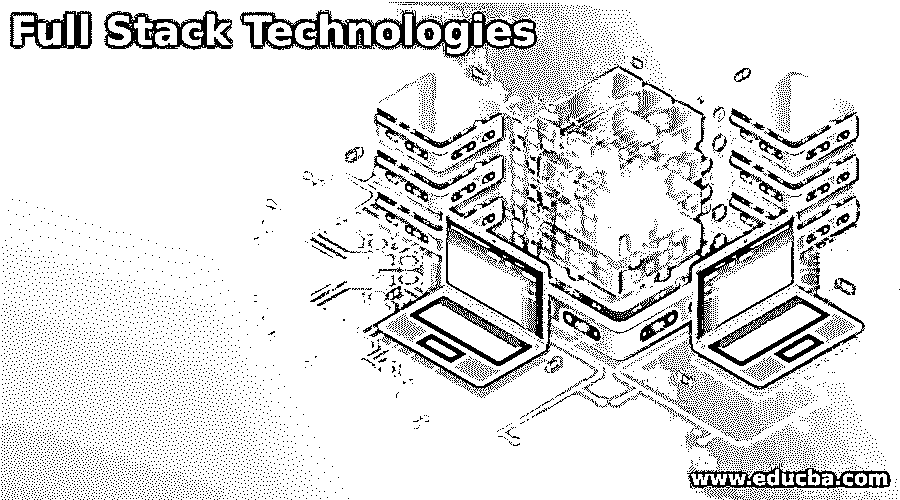

# 全栈技术

> 原文：<https://www.educba.com/full-stack-technologies/>

## 全栈技术简介

全栈技术不过是多种技术的组合，它有助于计算机应用程序的整个开发、项目、软件应用程序等的端到端开发和部署。正如我们已经说过的，它是技术的结合；因此，它与单一技术无关。

它是 Python、Clang、C++、Java、Linux、Bash 脚本、Shell 脚本、CICD 管道、Web 应用、HTML、API、Java 脚本等多种技术的结合。在全栈平台工作的人应该知道软件应用的前端和后端的完整信息。市场上有许多全栈技术。根据需求，我们需要选择相关的全栈技术并相应地工作。

<small>网页开发、编程语言、软件测试&其他</small>

### 各种全栈技术

完整的堆栈能够管理项目的完整开发。它将包括前端以及后端。有各种各样的软件可以用于全栈技术。在全栈开发中，我们需要注意两件主要的事情，即前端和后端。有许多技术可用于前端和后端。

以下是前端或客户端技术的列表:

| **Sr 号** | **前端技术** |
| One | 反应 |
| Two | jQuery |
| Three | 有角的 |
| Four | Redux |
| Five | Ember.js |
| Six | 可扩展标记语言 |
| Seven | Java Script 语言 |
| Eight | 是五个 |
| Nine | 半铸钢ˌ钢性铸铁(Cast Semi-Steel) |
| Ten | JSON |
| Eleven | 引导程序 |
| Twelve | 吞咽 |
| Thirteen | 超文本标记语言 |
| Fourteen | HTML DOM |
| Fifteen | 小说 |
| Sixteen | GraphQL |
| Seventeen | 流星. js |
| Eighteen | 咕哝 |
| Nineteen | W3.CSS 文件 |
| Twenty | 骨干网. js |

以下是后端或服务器端技术的列表:

| **Sr 号** | **后端技术** |
| One | 服务器端编程语言（Professional Hypertext Preprocessor 的缩写） |
| Two | Java 语言(一种计算机语言，尤用于创建网站) |
| Three | 大蟒 |
| Four | 动态服务器页面 |
| Five | 结构化查询语言 |
| Six | PaaS (Azure 和 Heroku) |
| Seven | Parse.com |
| Eight | 较少的 |
| Nine | 节点. js |
| Ten | 厚颜无耻 |
| Eleven | 快递. js |
| Twelve | 红宝石 |
| Thirteen | 休息 |
| Fourteen | MongoDB |
| Fifteen | Firebase.com |
| Sixteen | C++ |
| Seventeen | C# |
| Eighteen | 走 |

上述技术有助于为应用程序或计算机软件开发全栈环境。然而，在使用全栈技术时，我们需要考虑流行栈的数量，根据需求或需要选择特定的栈。

*   LAMP 堆栈将包括 Apache:JavaScript–PHP–Linux–MySQL
*   **LEMP 堆栈将包括 Nginx:**JavaScript–Linux–MySQL–PHP
*   **平均堆栈将包括 AngularJS:**JavaScript–node . js–MongoDB–Express
*   **Django 栈将包含 Python:**JavaScript–MySQL–Django
*   **Ruby on rails 将包含 SQLite:**JavaScript–Ruby–Rails

上面的栈是 python、JavaScript、MySQL、ruby、rails、node.js 等多种技术的结合。每种技术都有自己的局限性。因此，我们使用了一组有助于项目开发的堆栈。

#### 1.反应 JS

*   对于 web 开发来说，React JS 或者 React 是最流行的框架。它是前端框架。这将有助于取代角组中的领导者，等等。如今，react 框架在市场上越来越受欢迎。所以它会朝着它前进。
*   在 reactjs 技术中，我们使用 JavaScript 创建前端。它还将提供组件基础模型或基于组件的开发模型。在 react 和 angular 方面，两者在前端都有很好的功能。但是在反应上要好得多。
*   如果我们是一个 JavaScript 开发者，那么 react js 在前端开发方面会是最好的或者第一选择。如果我们在寻找最佳建议，那么我们需要参加任何 react 课程来完成课程。马克斯的《反应完全指南》是最好的课程。

#### 2.Spring Boot

*   当我们使用 Java EE 或 Java J2EE 时。spring boot 的主要优点是减少了与 java web 开发相关的痛苦。此外，spring boot 技术或框架将有助于修复与 Java web 开发相关的问题。在 spring boot 技术中，有多种功能，如自动配置、启动依赖模型，将有助于减少 java 开发人员的痛苦。此外，它将减少配置 spring 和查找兼容库的时间。这两件事应该一起工作。
*   这将有助于提高生产率，因为我们可以在很短的时间内创建 java web base 项目。因此，它将减少工作的努力。但是在使用它时，我们需要遵循正确的流程。
    无论如何，如果你是一名从事 web 开发项目的 Java 开发人员，并打算成为一名全栈开发人员，你应该学习 Spring Boot，没有比从这门面向初学者的 Spring Boot 课程开始更好的方法了。
*   如果我们需要全栈技术。我们必须学习弹簧靴技术。在前端真的会很有帮助。它还有助于使用特定的全栈模式。

#### 3.有角的

*   角度技术是一种更受欢迎的前端技术。这将有助于简化开发人员的工作。这将有助于以非常简单的方式创建复杂的前端。它是第一个最好的 java 脚本框架，有助于标准化前端开发。它也将有助于代码结构和模块。
*   在 angular 中，我们能够编写可测试的代码，类似于 java 或任何其他主流语言。如果任何开发人员不想在 react 上工作，那么 angular 是前端的最佳选择。
*   有大量的信息；网上有视频课程。所以我们可以选择其中任何一个开始探索。

#### 4.节点 JS + Express.js

*   node js 是最好的 JavaScript 开发技术或框架之一。但是对后端有帮助。在这项技术中，我们能够编写服务器端代码。
*   它已经在市场上运行了 10 年。

### 结论

我们已经看到了“全栈技术”的完整概念。全栈技术将负责应用程序的完整生命周期，包括前端和后端。

### 推荐文章

这是全栈技术指南。在这里，我们分别讨论介绍和各种全栈技术。您也可以看看以下文章，了解更多信息–

1.  [JavaScript 图像滑块](https://www.educba.com/javascript-image-slider/)
2.  [JavaScript 计算器](https://www.educba.com/javascript-calculator/)
3.  [二叉树 JavaScript](https://www.educba.com/binary-tree-javascript/)
4.  [JavaScript 下划线](https://www.educba.com/javascript-underscore/)

