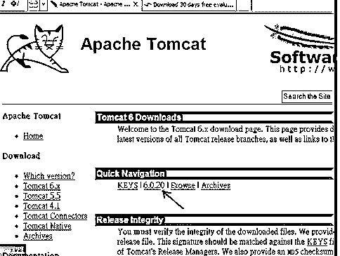
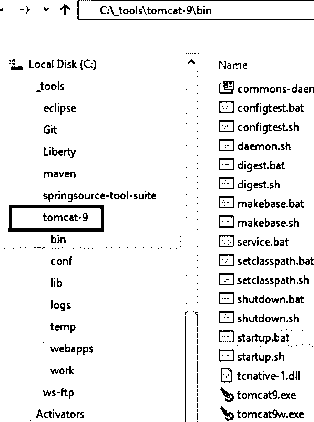
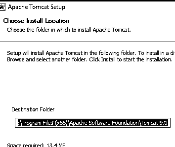

# Tomcat 本地

> 原文：<https://www.educba.com/tomcat-native/>

## Tomcat Native 简介

Apache Tomcat Native 是一个组件，它使用某些资源来获得有效的兼容性和性能。它提供对可移植库 APR 的访问，并与随机数生成器有网络连接。Tomcat 本机主要用于 web 服务器。比如基于 Java 的购物车应用 Konakart，在 Tomcat 中执行，使用 SOAP 和 Java API 作为 web 服务接口。由于 Tomcat 是开源的，所以它被大量的开发人员采用，发行版包括一个企业级服务器 SpringSource。因此，本文将简要讨论 Tomcat 的属性、应用程序和特性。

### Tomcat 原生是什么？

Tomcat Native 是开源的，它有一个 Java 服务器页面容器和 Java servlet，开发人员可以在其中实现多种企业 Java 应用程序。它也在执行 Java 代码的 HTTP web 服务器上执行。它有许多依赖于 SOAP 和 API web 服务接口的应用程序。Tomcat 项目是最好的开发人员的合作，它的关键 web 应用程序是大规模的，并且在全球范围内使用。

<small>网页开发、编程语言、软件测试&其他</small>

### 使用 Tomcat Native

如果用户想将 Apache Tomcat 用于生产环境，首先，他应该使用 Tomcat 的本地库进行高效的优化。然后，它应该在 AWS EC2 实例上执行，但大多数时候是在 Linux 系统上。

假设用户登录到 Amazon box，并可以将登录更改为需要安装 tomcat 实例的根目录和目录。可以根据用户的偏好来执行 tomcat。然后下载 Apache Tomcat 包并安装它。从 bin 目录中提取源代码。

### Tomcat 本机的启动

当在单独的 web 服务器上执行时，Tomcat 的配置具有与安全套接字相同的优势。当在 web 服务器(如 Microsoft IIS 或 Apache)后面将主 Tomcat 作为 JSP 或 servlet 容器执行时，必须配置主 web 服务器来管理来自用户的 SSL 连接。服务器可以处理 SSL 的所有功能，并请求到达 Tomcat 的容器来解密它。

Tomcat 将在执行到用户浏览器之前，对加密的明文执行响应。这里，Tomcat 知道客户端和 web 服务器之间在安全连接上的通信，但不参与解密或加密。

### Tomcat 本地需求

本地库需要 Apache portable runtime 和 OpenSSL 来输入名为\opt \software 的目录。

*   然后安装 Java /h2 的 JDK 工具包。
*   然后要建立各种带开发工具的库。
*   然后下载 OpenSSL 的包并安装它
*   然后下载并配置 apache 可移植运行时(APR)
*   最后可以安装 Tomcat Native，让它高效工作。

Apache portable 运行时的特性应该是非阻塞的输入和输出，以保持请求活动。APR 库应该支持 TLS/SSL 或者 OpenSSL 那么 FIPS 140-2 应该支持 SSL/TLS 并与 OpenSSL 库相关联。那么系统应该支持 IPv6、IPv4 和 UNIX 的域套接字。

### Tomcat 本机安装

在 apache tomcat 运行时中创建环境的最后一步是选择本地库。然后，在配置文件中添加首选条目，该文件以。如果找不到文件，可以创建一个新文件。

要在 windows 上开始安装，请按照下列步骤操作，

如果用户使用 IBM installation manager 执行安装过程，他可以从 Windows 开始菜单启动服务器。或者他可以在命令行控制台中启动服务器。

如果用户将 Tomcat 服务器配置为 windows 实例，他可以直接开始服务。

要初始化服务器，选择开始、所有程序、IBM collaborative life cycle management，最后选择 team server。如果用户使用命令行启动服务器，他可以构建 installdir/server 并执行该命令。

要执行 windows 服务，请单击开始，然后单击计算机，然后在配置选项卡中选择管理服务。然后通过点击 tomcat 服务来启动它们。要暂停服务，请遵循相同的步骤，并通过右键单击来停止 tomcat 服务。

要停止服务器，遵循相同的步骤:选择开始、所有程序、IBM 生命周期管理，然后停止 team server。要从命令行停止服务器，请执行 install-dir/server 命令。

然后在启动服务后，在安装配置向导中通过自定义安装程序执行安装。

Tomcat 可以使用生产环境中提供的加密协议。Java 还具有通过 JCA 和 JCE 的加密能力，以及它可以通过 JSSE 提供的加密通信，并且它的加密算法被设置为 Tomcat。Sun JCE 支持不同的 TLS 版本，如 SSLv3 和 TLSv1。可选的 tcnative 库可以选择通过 JSSE、JCA 或 JCE 使用 OpenSSL。用户可以选择 tcnative 来启用 APR 连接器，该连接器主要用于基于加密的操作。

**在 Unix 中安装 Tomcat:**

要构建存储 tc-native 的 make 文件，请遵循基本命令

$ HOME / APR 用于查找并安装 Apache 可移植运行时包的路径和包。

$ JAVA _ HOME 用作 JDK 文件安装的路径。应该建议在 Tomcat 中使用相同版本的 JVM。

$ HOME / OPENSSL 是安装 OPENSSL 的所有文件的地方。$ CATALINA _ HOME 是库中所有需要安装的文件的保存位置。

### 结论

因此，这是关于 Tomcat Native 的基本信息，它的安装步骤也很简单。Tomcat Native 的特性、可用性和功效在被广泛使用的 Java 应用程序中得到了充分的利用。

### 推荐文章

这是一本 Tomcat Native 的指南。这里我们讨论一下 Tomcat Native 的基本信息，它的安装步骤也相当简单。您也可以看看以下文章，了解更多信息–

1.  [Spring Boot 雄猫](https://www.educba.com/spring-boot-tomcat/)
2.  [什么是阿帕奇雄猫？](https://www.educba.com/what-is-apache-tomcat/)
3.  [Java Web 服务](https://www.educba.com/java-web-service/)
4.  [Spring Boot 的优势](https://www.educba.com/spring-boot-advantages/)

