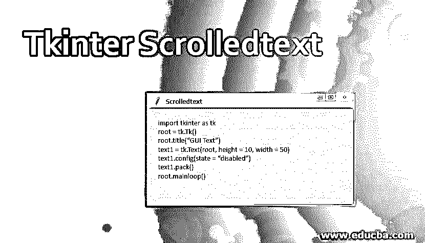
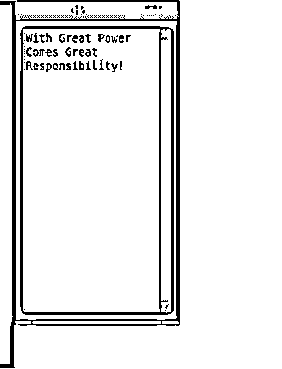
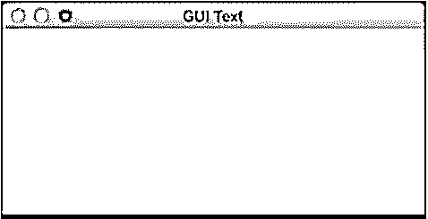
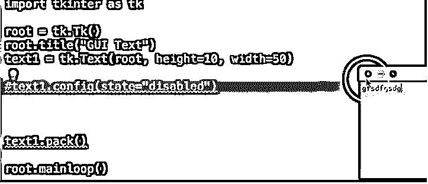
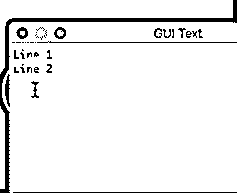
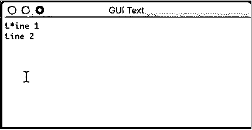
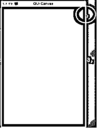

# Tkinter Scrolledtext

> 原文：<https://www.educba.com/tkinter-scrolledtext/>

## Tkinter Scrolledtext 简介

Tkinter.scrolledtext 是在屏幕上定位事物的一种更好的方式，大多数时间都会用到它。ScrolledText 小部件就像它右边的一个垂直滚动条，一个文本预算。甚至可以加到单杠上。这些条在不需要时会自动消失。此外，还可以将其移动到窗口的另一侧，并执行其他操作。

文本小部件传递配置选项。小部件框架插入文本和主控形状之间，主控形状包含小部件滚动条。文本小部件继承了大多数方法调用。但是，Place、Grid 和 Pack 等小部件会重定向到 Frame 小部件。

<small>网页开发、编程语言、软件测试&其他</small>

**Tkinter 的语法:**

要创建这个小部件，您只需要一个简单的语法:

w =文本(母版，任何可选更改)

**描述 Tkinter 小工具的参数:**

**主:**代表父窗口

**选项:**下表描述了常用的小工具选项。这些是键值对，用逗号分隔。

### Tkinter Scrolledtext 示例

ScrolledText 是 Tkinter 小部件的一个导入，它允许用户直接与 textbox 交互。

`import tkinter as tk
import tkinter.scrolledtext as tkk
win = tk.Tk()
frame1 = tk.Frame(
master = win,
bg = '#808000'
)
frame1.pack(fill='both', expand='yes')
editArea = tkk.ScrolledText(
master = frame1,
wrap   = tk.WORD,
width  = 20,
height = 20
)
editArea.pack(padx=10, pady=10, fill=tk.BOTH, expand=True)
#Text is added so as to confirm the working of scroll
editArea.insert(tk.INSERT,
"""\
With Great Power Comes Great Responsibility!
""")
win.mainloop()`

**输出:**

所以现在，在文本框中，我们将添加一些文本，修改和改变文本的格式。

`import tkinter as tk
root = tk.Tk()
root.title(“GUI Text”)
text1 = tk.Text(root, height = 10, width = 50)
text1.config(state = “disabled”)
text1.pack()
root.mainloop()`

**输出:**

这基本上是一个文本框，没有人可以输入。

在代码的第 7 行，阻止我们输入的是我们将状态设置为“disabled”

默认情况下，文本框通常是启用的，或者说是正常的。

如果不包括第 7 行而运行，则允许文本框的输出与第 7 行交互或输入。

因此，当我们禁用文本框时，我们禁止任何人访问它。

现在也可以使用一个名为 INSERT 的命令来启用它，这是 Tkinter 的一个模块。这使用户能够在我们输出的文本框中插入文本行。

在实时游戏中，你可以用游戏取他们的名字，然后禁用文本框，这样用户就不能再更改名字了。

`import tkinter as tk
root = tk.Tk()
root.title(“GUI Text”)
text1 = tk.Text(root, height = 10, width = 50)
text1.config(state = “normal”)
text1.insert(tk.INSERT,”Line 1\n”)
text1.insert(tk.INSERT,”Line 2”)
text1.config(state = “disabled”)
text1.pack()
root.mainloop()`

**输出:**

在这里，您使用 insert 将文本插入到文本框中。首先，它被配置为正常状态。这通常是正常的，或者默认为在文本框中键入。然后，在插入文本后，禁用文本框的可编辑性。

第一行写着 1 号线

第二行写着 2 号线

这就是现实世界中的理解:

012345

1 行 1

2 第 2 行

第 1 行在第一行，L 从索引 0 开始，到索引 5 结束。

因此，如果有人想在行间插入文本，可以是这样的:

`text1.insert(1.1, “*”)`

在第一行和索引一中插入一个星号。输出如下所示:

现在，让我们创建一个画布对象。Canvas 是我们将使用 tk 接口创建的一个小部件。

canvas 小部件本质上是一个可以在上面绘图的部分。

`import tkinter as tk
root = tk.Tk() #which constructs a new window
root.title(“GUI Canvas”) #Title of the window is going to be this
root.resizable = (False, False)
canvas1 = tk.Canvas (root , width = 300, height = 500,  background = “black”)
canvas1.pack()
root.mainloop()`

画布显示的宽度为 300，高度为 500，不可调整大小。默认情况下，所有窗口都可以调整大小。但是在这里，当我们将可调整大小的参数在宽度和高度上设置为 false 时，它们是不可更改的。

另一种更简单的方法是设置参数限制，允许窗口只在特定范围内调整大小。

让我们在 GUI 界面中创建一个滑块:

`import tkinter as tk
root = tk.Tk()
root.tilte(“GUI Slider”)
slide1 = tk.Scale (root,  from_=0, to = 10, orientation = tk.HORIZONTAL)
slide1.pack()
root.mainloop()`

如果我运行这个，

滑块是交互式的。您还可以将分辨率和方向更改为垂直范围。

### 结论

GUI 工具包用于导入 Tkinter。具有滚动窗口小部件文本的称为 ScrolledText。ScrolledText 不是一个人自己做不到的事情。它非常简单，只使用了几行代码。这允许在较小的空间内显示大量的文本。

### 推荐文章

这是 Tkinter Scrolledtext 的指南。这里我们讨论 Tkinter Scrolledtext 的例子以及语法和参数。您也可以看看以下文章，了解更多信息–

1.  [Tkinter 旋转盒](https://www.educba.com/tkinter-spinbox/)
2.  [Tkinter 列表框](https://www.educba.com/tkinter-listbox/)
3.  [标签帧间](https://www.educba.com/tkinter-labelframe/)
4.  [Python Tkinter 标签](https://www.educba.com/python-tkinter-label/)

