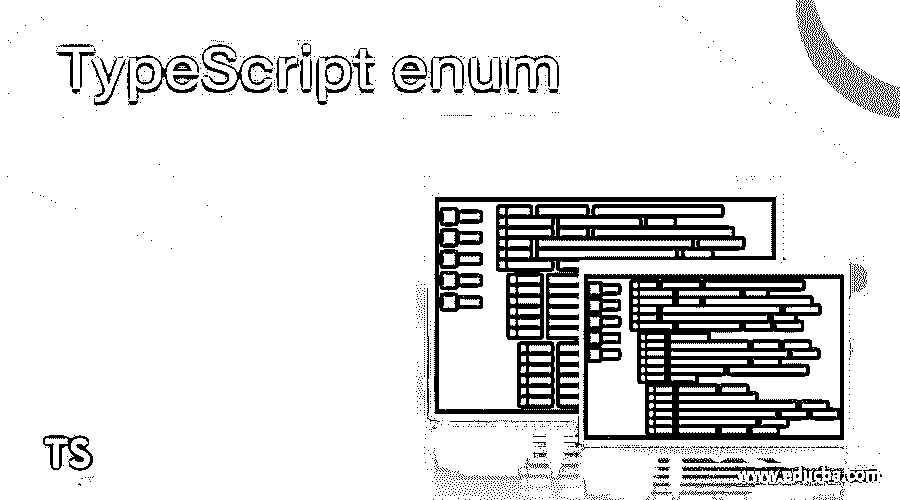

# TypeScript 枚举

> 原文：<https://www.educba.com/typescript-enum/>

## TypeScript 枚举简介

TypeScript 中支持的新数据类型称为 enumerations 或 enum，使用它我们可以声明名称，这意味着相关值的集合，这些值可以是字符串或数字，TypeScript 中有三种类型的枚举，即数字枚举、字符串枚举和异构枚举，其中数字枚举是基于数字的枚举，它们以字符串的形式存储数字， 字符串枚举是基于字符串的枚举，即它们存储字符串值，异构枚举是基于字符串和数字的枚举，即它们存储字符串和数字值。

**在 TypeScript 中声明 enum 的语法如下:**

<small>网页开发、编程语言、软件测试&其他</small>

`enum enum_name{
enum_value1,
enum_value2,
..
Enum_valuen
}`

其中 enum_name 表示枚举的名称，

enum_value1、enum_value2 和 enum_valuen 表示相关值的集合，可以是字符串或数字。

### 在 TypeScript 中使用枚举

*   TypeScript 中支持的新数据类型称为 enumerations 或 enum，使用它我们可以声明名称，这意味着相关值的集合，可以是字符串或数字。
*   关键字 enum 用于在 TypeScript 中定义 enum。
*   TypeScript 中有三种类型的枚举，即数字枚举、字符串枚举和异构枚举。
*   数字枚举是基于数字的枚举；它们以字符串的形式存储数字。
*   数字枚举的枚举值从零开始，每个数字增加 1。
*   还有一个选项是在数字枚举中自己初始化第一个枚举值，其余的值将加 1。
*   在数值枚举中，枚举值不必按顺序排列。
*   字符串枚举是基于字符串的枚举，即它们存储字符串值。
*   通过使用字符串枚举增加了程序的可读性。
*   异构枚举是基于字符串和数字的枚举；它们存储字符串和数值。

### TypeScript 枚举的示例

下面提到了不同的例子:

#### 示例#1

演示数值枚举用法的 TypeScript 程序，该枚举初始化值并作为输出显示在屏幕上:

**代码:**

`//enum keyword is used to define a related collection of numeric values
enum Country
{
India,
USA,
Germany,
London
}
//displaying the values that are initialized by enum
console.log("The values initialized by enum is as follows:");
console.log(Country.India);
console.log(Country.USA);
console.log(Country.Germany);
console.log(Country.London);`

**输出:**

在上面的程序中，通过使用关键字 enum，我们定义了一个数值 enum，它的值从零开始初始化，每个成员递增 1。然后，数值枚举的初始化值作为输出显示在屏幕上。

#### 实施例 2

TypeScript 程序，演示初始化值的数值枚举的用法，其中第一个值由我们自己初始化，并作为输出显示在屏幕上:

**代码:**

`//enum keyword is used to define a related collection of numeric values in which the first value is initialized by ourselves as 5
enum Country
{
India = 5,
USA,
Germany,
London
}
//displaying the values that are initialized by enum
console.log("The values initialized by enum is as follows:");
console.log(Country.India);
console.log(Country.USA);
console.log(Country.Germany);
console.log(Country.London);`

**输出:**

在上面的程序中，通过使用关键字 enum，我们定义了一个数值 enum，其中第一个值由我们自己初始化为 5，然后为每个成员增加 1。然后，数值枚举的初始化值作为输出显示在屏幕上。

#### 实施例 3

演示 string enum 用法的 TypeScript 程序，该程序初始化字符串值并作为输出显示在屏幕上:

**代码:**

`//enum keyword is used to define a related collection of string values
enum Capital
{
India = 'New Delhi',
USA = 'Washington',
Germany = 'Berlin',
England = 'London'
}
//displaying the values that are initialized by enum
console.log("The values initialized by string enum is as follows:");
console.log(Capital.India);
console.log(Capital.USA);
console.log(Capital.Germany);
console.log(Capital.England);`

**输出:**

在上面的程序中，通过使用关键字 enum，我们定义了一个字符串 enum，它的值被初始化为某些字符串值。然后，字符串 enum 的初始化值作为输出显示在屏幕上。

#### 实施例 4

演示异构枚举用法的 TypeScript 程序，该程序初始化字符串值和数值，并在屏幕上显示为输出:

**代码:**

`//enum keyword is used to define a related collection of both string values and numeric values
enum Capital
{
India = 1,
USA = 'Washington',
Germany = 3,
England = 'London'
}
//displaying the values that are initialized by enum
console.log("The values initialized by heterogeneous enum is as follows:");
console.log(Capital.India);
console.log(Capital.USA);
console.log(Capital.Germany);
console.log(Capital.England);`

**输出:**

在上面的程序中，通过使用关键字 enum，我们定义了一个异构的 enum，它的值被初始化为某些字符串值和某些数值。然后，异构枚举的初始化值作为输出显示在屏幕上。

#### 实施例 5

演示异构枚举用法的 TypeScript 程序，该程序初始化字符串值和数值，并在屏幕上显示为输出:

**代码:**

`//enum keyword is used to define a related collection of both string values and numeric values
enum Capital
{
India = 8,
USA = 12,
Germany = 'Berlin',
England = 'London'
}
//displaying the values that are initialized by enum
console.log("The values initialized by heterogeneous enum is as follows:");
console.log(Capital.India);
console.log(Capital.USA);
console.log(Capital.Germany);
console.log(Capital.England);`

**输出:**

在上面的程序中，通过使用关键字 enum，我们定义了一个异构的 enum，它的值被初始化为某些字符串值和某些数值。然后，异构枚举的初始化值作为输出显示在屏幕上。

### 推荐文章

这是 TypeScript 枚举的指南。在这里，我们通过定义、语法来讨论 TypeScript 中的枚举概念，并通过编程示例及其输出来讨论枚举的类型。您也可以看看以下文章，了解更多信息–

1.  [打字稿类型](https://www.educba.com/typescript-types/)
2.  [如何安装 Typescript](https://www.educba.com/install-typescript/)
3.  [打字稿数组](https://www.educba.com/typescript-array/)
4.  [打字稿功能](https://www.educba.com/typescript-functions/)

