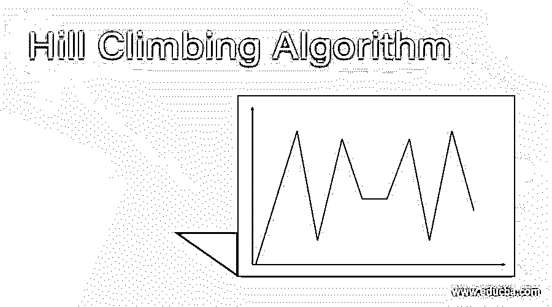

# 爬山算法

> 原文：<https://www.educba.com/hill-climbing-algorithm/>

## 爬山算法简介

爬山是人工智能算法中使用的一种自我发现和学习算法。一旦模型建立起来，接下来的任务就是评估和优化它。爬山是人工智能中使用的优化技术之一，用于寻找局部最大值。爬山是一种迭代搜索算法，从任意定义的初始状态开始求解。然后，该算法通过增量变化来寻找更好的解决方案。其思想是看到邻居状态，并将其与邻居状态的当前状态进行比较更好；邻居状态将成为当前状态，并且相同的循环继续，直到没有邻居状态比当前状态更好。

### 爬山算法的特点

1.  **本质上简单:**爬山算法是一种增量算法，
    通过比较邻居与当前状态来尝试一种简单的策略，如果邻居在启发式上更好，它将接受邻居状态。
2.  **迭代:**爬山是一种迭代算法，它从一个问题的任意初始解开始；然后，它试图通过进行增量更改来找到比当前状态更好的解决方案。

### 爬山算法的类型

基本上有 3 种类型的爬山算法

<small>网页开发、编程语言、软件测试&其他</small>

*   简单的爬山:
*   最陡上坡爬山
*   随机爬山

#### 1.简单的爬山

顾名思义，简单的爬山就是一步一步的爬山。你可以爬山，直到有可能到达比现在更高的高度。这同样适用于简单的爬山，它检查一个相邻的状态，如果它比前一个状态具有更高的成本，它认为新的状态是当前状态。

**简单爬山算法** **:**

**步骤 1:** 初始化初始状态，然后用邻居状态对此进行评估。如果它具有高成本，则算法停止并返回成功的相邻状态。如果不是，则初始状态被假定为当前状态。

**第二步:**重复同样的过程，直到达到解的状态。初始状态被假定为当前状态，并再次与相邻状态进行比较。如果新的当前状态是期望的或状态，则算法停止并返回成功。或者如果不是，则它将新的邻居作为其当前状态，并再次将其与邻居状态进行比较，并继续进行。这种迭代方法一直持续到达到解决方案或目标状态。

**第三步:**返回成功，退出。

#### 2.最陡爬坡

顾名思义，它是将最高成本状态考虑在内的最陡方法。这是简单爬山的即兴创作，算法检查当前状态附近的所有相邻状态，然后选择最高成本作为当前状态。因此，它比简单的爬山更快。

**简单爬山算法** **:**

**步骤 1:** 初始化初始状态，然后用所有邻居状态对此进行评估。如果它在相邻状态中具有最高的成本，则算法停止并返回成功。如果不是，则初始状态被假定为当前状态。

**第二步:**重复同样的过程，直到达到解的状态。初始状态被假定为当前状态，并再次与其所有相邻状态进行比较。如果新的当前状态是期望的或状态，则算法停止并返回成功。或者如果不是，则它将新的邻居作为其当前状态，并且再次将其与所有可能的邻居状态进行比较，并且在它们之中找到具有最高成本的状态，并且继续进行。这种迭代方法一直持续到达到解决方案或目标状态。

**第三步:**返回成功，退出。

#### 3.随机爬山

该算法是简单爬山算法的另一种变体。随机不评估所有相邻状态来决定哪一个是新状态。这里的即兴创作是随机的。它将选择任何邻居向前移动。这里出现的问题是为什么？

要回答这个问题，让我们看看上面的两个算法；简单的爬山只是与第一个邻居互动，如果它更好地假设它是当前状态，如果不是，它将给出一个结果并退出。另一方面，最陡的爬山法是一种贪婪的算法，它也有可能陷入局部最优。

但是选择高成本的随机邻居的好处是让随机避免局部最优。

算法的步骤几乎相同，但它随机选择邻居。

### 爬山算法中的问题

爬山是一种优化技术，优化技术的问题是陷入局部最优而不是全局最优(期望的状态)。在爬山中，基本上，有三个主要问题。

*   局部极大值
*   高原
*   山脊

#### 1.局部极大值

考虑简单的爬山，看下图所示的线图；我们可以看到有两个局部最大值和一个全局最大值。如果算法从最左边或最右边开始，它将陷入局部最优。

#### 2.山脊

当脊的任何状态看起来像峰时，脊也是爬山算法中的常见问题，因为在所有可能的方向上，运动仅是向下的。因此，一旦算法遇到脊，它就停止。

#### 3.高原

这也是优化问题中的一个经典问题，当看起来没有邻居更好，并且没有办法向前移动时，算法就停止在那里，也许还有其他的最大值，但是它不能向前移动，因为邻居是相同的。例如，看下面的图片，对于一些长度，有一个平台，然后有一个爬升

### 结论

爬山是一种优化算法。并且使用基本的技术，从任意的初始状态开始并逐渐改进。在本文中，我们讨论了 3 种不同的爬山算法:简单爬山法、最陡爬坡法和随机爬山法。我们还讨论了与这些算法相关的问题。

### 推荐文章

这是一个爬山算法的指南。这里我们讨论 3 种不同类型的爬山算法，即简单爬山法、最陡爬坡法和随机爬山法。您也可以看看以下文章，了解更多信息–

1.  [页面替换算法](https://www.educba.com/page-replacement-algorithms/)
2.  [模式识别算法](https://www.educba.com/pattern-recognition-algorithms/)
3.  [RSA 算法](https://www.educba.com/rsa-algorithm/)
4.  [Python 中的排序算法](https://www.educba.com/sorting-algorithms-in-python/)

