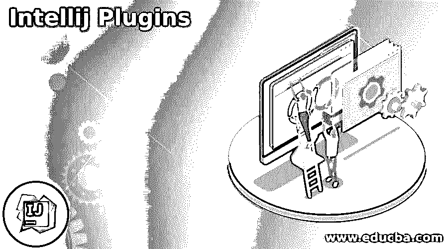
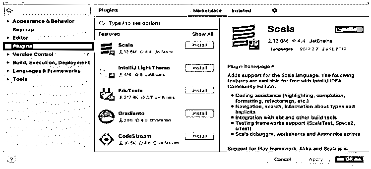
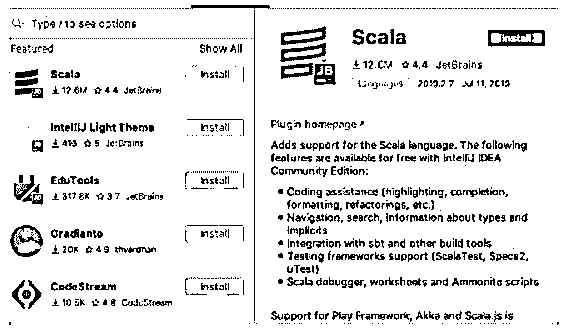
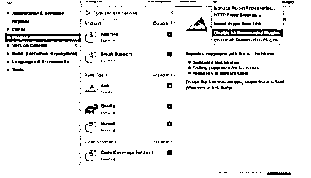
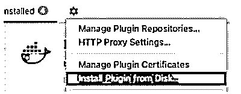
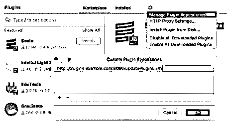

# Intellij 插件

> 原文：<https://www.educba.com/intellij-plugins/>

## Intellij 插件简介

以下文章提供了 Intellij 插件的概要。我们知道 IntelliJ 是用于开发的 ide 之一，它为用户提供了不同的特性，因此他们可以使用 IntelliJ 的特性。所以我们需要添加不同的插件来实现特性。例如，假设我们需要与系统的不同版本进行集成，我们需要跟踪问题、服务器管理和许多其他我们可以与 IntelliJ 集成的特性。

### 关键要点

*   在插件的帮助下，开发者可以以更高效的方式工作。
*   我们可以在代码、代码编写、良好的代码结构等方面实现一致性。
*   它允许提高代码的生产率，并且易于维护。
*   我们可以轻松地完成入职流程，或者我们可以说它更加用户友好。

### Intellij 插件概述

IntelliJ IDE 只不过是用于 JVM 方言的集成开发环境(IDE ),旨在提高工程师的效率。它通过提供智能代码成果、静态代码检查和重构来为您完成日常实践和枯燥的任务。它让你专注于编程进步的光辉一面，使它既有用又迷人。与表单控制框架、问题跟踪器、构造板服务器和不同设备的集成。

<small>网页开发、编程语言、软件测试&其他</small>

编码有助于支持不同的方言和结构、简单的路线提示、实时查看、文件监视器等。可以帮助你学习另一种编程语言的编码实践。IDE 插件创建 IntelliJ IDE 使用的记录，以这种方式可以从 IDE(文件-打开项目)打开任务。外部条件(计算相关的源和 Javadoc 记录)和任务条件都考虑到了。

### 如何安装 IntelliJ 插件？

让我们看看如何在 IntelliJ 中安装插件，如下所示:

*   首先，我们需要用 Ctrl+Alt+S 键打开 Intellij 的设置，按下后我们得到一些选项，如下图所示。

*   在上面的截图中，我们可以看到不同的选项，如市场和安装插件，在市场的帮助下，我们可以浏览和安装，如下图所示。

*   假设我们需要安装 Scala，那么我们需要点击 install 按钮。之后，我们可以看到所有插件的安装列表，如下图所示。

不同的插件是必需的，在安装插件的帮助下，我们可以看到所有的安装插件列表。大多数插件可以用于任何 JetBrains 项目。有些只限于商业项目，有些则需要不同的许可证。

如果一个插件依赖于其他插件，IntelliJ IDE 会告诉你这种情况。假设你的事业依赖于特定的插件；将它们添加到所需插件的列表中。如果当前的插件不能提供您真正想要的有用性，您可以为 IntelliJ IDE 创建自己的插件。

### 安装 IntelliJ 插件磁盘

让我们看看如何从磁盘安装 IntelliJ 插件，如下所示:

*   首先，我们需要下载所需插件的 zip 或 jar 文件。
*   第二步，我们需要打开 IDE 的设置，点击插件选项。在插件页面上，我们可以看到设置选项，在设置选项中，我们有从磁盘安装插件选项，所以单击该选项，如下图所示。

*   接下来，我们需要浏览下载的文件并单击 Ok 按钮。
*   单击 Ok 按钮后，我们需要重启 IDE。

### 从自定义安装插件

让我们看看如何在 IntelliJ 中安装定制插件，步骤如下:

当然，IntelliJ IDE 被设计成利用来自 JetBrains 插件库的插件。在这里，每个人都可以拥有自己的插件。尽管如此，你可以为他们建立一个自定义的插件商店。

现在按照不同的步骤进行安装:

*   和上面的观点一样，首先我们需要打开 IDe 设置，在设置里面，点击插件选项。
*   在第二步中，我们得到一个新页面，这是插件页面，在这里我们需要点击设置选项，并在设置中点击管理插件库命令。
*   单击该命令后，我们会看到自定义插件选项框，因此我们需要单击+并指定插件的 url，或者我们可以说它是一个 xml 文件，如下图所示。

*   插入所需的详细信息后，单击确定按钮。当您查找插件时，IntelliJ IDE 将显示来自默认 JetBrains 插件库和您确定的任何自定义存档的结果。要浏览特定的自定义插件商店，请在插件页面的 Marketplace 选项卡上的 hunt 字段中键入 vault:后跟 vault 的 URL。

### 移除插件

让我们看看如何从 Intellij 中删除插件，如下所示:

*   和上面一样，首先我们需要打开 IDe 设置，在设置里面，我们需要点击插件选项。
*   点击插件选项后，我们得到一个新的窗口，这里我们有两个选项，如市场和安装。因此，点击安装选项，搜索我们想要删除的插件的名称。
*   获得所需插件后，我们需要点击指定插件的设置选项，并选择卸载命令，如下图所示。

如果我们不想删除它们，但需要从 IDE 中禁用它们，那么我们可以选择根据我们的要求禁用特定的插件，而不是删除它们。

### 常见问题解答

下面是提到的常见问题:

#### Q1。IntelliJ 最好的插件有哪些？

**答案:**

有许多不同类型的插件适合 IntelliJ，如 CSV、Multirun、Duckly、GitToolBox、用于代码完成的 Tebnine、零宽度字符定位器，以及许多其他我们可以轻松集成的插件。

#### Q2。IntelliJ 中的插件是如何工作的？

**答案:**

插件只不过是。xml 文件，它给出了关于插件的所有信息，基本上，这些文件定义了关于插件的一切。它还包括名称、依赖项和操作。

#### Q3。如何在 Intellij 中下载插件？

**答案:**

我们需要访问插件的网站，在那里我们可以下载任何我们需要的插件。

### 结论

在这篇文章中，我们试图探索 Intellij 插件。在本文中，我们看到了 Intellij 插件的基本思想，以及这些 Intellij 插件的用途和特性。文章的另一点是我们如何看到 Intellij 插件的基本实现。

### 推荐文章

这是 Intellij 插件的指南。这里我们讨论一下入门，如何安装 IntelliJ 插件？并从自定义安装插件。您也可以看看以下文章，了解更多信息–

1.  [IntelliJ 版本](https://www.educba.com/intellij-version/)
2.  [reCAPTCHA Javascript](https://www.educba.com/recaptcha-javascript/)
3.  [WebGL javaScript](https://www.educba.com/webgl-javascript/)
4.  [JavaScript 项目](https://www.educba.com/javascript-projects/)

