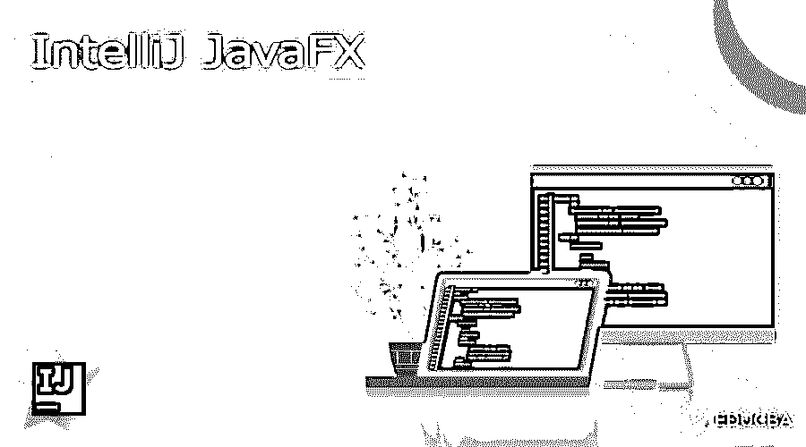
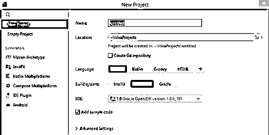
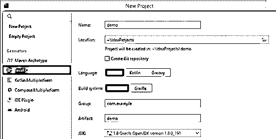
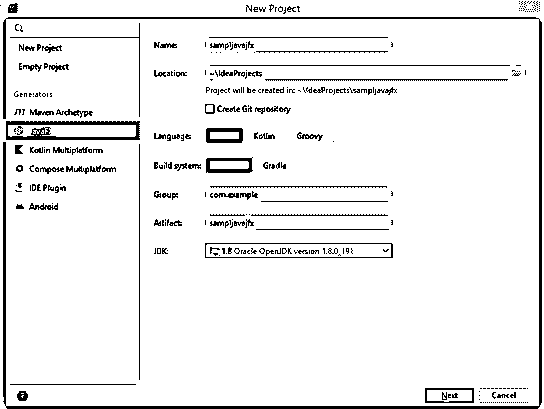
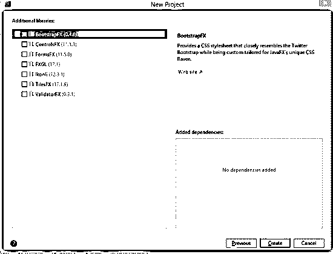
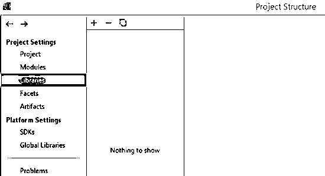
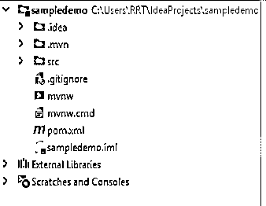
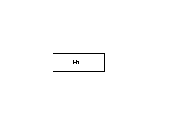

# IntelliJ JavaFX

> 原文：<https://www.educba.com/intellij-javafx/>




## IntelliJ JavaFX 简介

基本上，IntelliJ 向用户提供了不同类型的特性，JavaFX 是 IntelliJ 提供的特性之一。通常 JavaFX 只不过是一组媒体和一个图形包，帮助开发人员创建、设计、测试、部署和调试应用程序。主要是它提供了跨我们用于部署的不同平台的一致性，并且它完全取决于用户需求。

### 什么是 IntelliJ JavaFX？

JavaFX 是一组插图和一个媒体包，使工程师能够配置、制作、测试、研究和发送跨不同平台可靠工作的富客户端应用程序。JavaFX 应用程序的外观可以调整。流动样式表(CSS)将外观和风格从执行中分离出来，因此工程师可以专注于编码。视觉创作者可以毫不费力地通过 CSS 调整应用程序的外观和风格。如果你有一个网站组成的基础，或者另一方面，你可能希望隔离 UI (UI)和后端基本原理，那么你可以在 FXML 预排列语言中开发 UI 的显示部分，并使用 Java 代码实现应用程序基本原理。如果您喜欢在不编写代码的情况下设计 ui，请使用 JavaFX 场景生成器

<small>网页开发、编程语言、软件测试&其他</small>

### 如何创建 IntelliJ JavaFX？

现在让我们看看如何在 Intellij 中创建 JavaFX，如下所示。

1.首先，我们需要打开 IntelliJ。

2.在第二步中，我们需要点击新的项目，在我们得到一个新的窗口后，如下图所示。




3.在第三步中，我们可以在左侧看到生成器列表，因此单击它并选择 JavaFX，如下图所示。




4.在这里，我们可以根据我们的要求更改项目名称，如果需要，我们还可以在选择语言和构建系统后更改位置。

5.在 Group 字段中，我们需要指定包名，这意味着我们可以在项目创建时创建一个包。之后，我们需要选择我们想要的 JDK，然后点击下一步按钮，如下图所示。




6.点击下一步按钮后，我们得到一个新的窗口，在这里我们需要选择所有需要的库，我们可以在创建应用程序时使用，如下所示。




从上面的列表中，我们可以列出上面截图中显示的所有需要的库。

### 如何添加 IntelliJ JavaFX？

现在让我们看看如何添加 IntelliJ JavaFX，如下所示:

1.  首先，我们需要下载 JavaFX，它是一个压缩的文件夹，以 JavaFX-SDK 的形式下载，所以首先，我们需要解压缩这个文件夹，并将其移动到我们系统上的永久位置。
2.  在第二步中，我们需要将该库添加到 Intellij 项目中，这意味着当我们想要创建 JavaFX 项目时，我们只需将其添加到 Intellij 项目中，因此首先单击文件菜单，然后单击项目结构。点击后，我们得到一个新的窗口，在这里我们需要选择库，然后点击+号来添加新的库，如下图所示。




之后，我们需要右键单击一个包并选择 new。您将看到创建另一个 JavaFX 应用程序的选择。选择此选项。代码格式将显示在管理器中。用你可能想要执行的指导方针来完成开始技巧。目前尝试运行应用程序。您将看到一个 ClassNotFound 豁免被抛出。设置过程的第四步，也是最后一步，将解决这个问题。

3.  在下一步中，我们需要编辑项目配置以便执行。在运行菜单中，我们有一个编辑配置选项，单击它。之后，我们可以看到不同的虚拟机选项，因此我们需要输入两个选项，如下图所示。


这里，我们可以使用保存在本地机器上的 JavaFX SDK 的实际路径，而不是模块路径。

### IntelliJ JavaFX 应用程序

JavaFX 是一个产品阶段，用于配置、制作、测试和发送不同阶段的图形用户界面应用程序、富互联网应用程序和桌面应用程序。

现在让我们来看看 JavaFX 的结构，基本上，它包含如下三个主要部分。

1.  **Stage:** 用于存储 JavaFX 的对象，显示为 Stage 类。JavaFX 中有五种类型的阶段:修饰的、统一的、统一的、透明的和未修饰的。
2.  **场景:**用于展示 JavaFX 应用的物理内容。
3.  **场景图和节点:**用于展示层次结构。

有三种类型的节点:根节点、分支节点和叶节点。

### 例子

在上面一点中，我们已经看到了如何创建一个项目，所以这里我们使用一个已经创建的项目，如下图所示。




现在创建包，在包内我们需要添加类，编写如下代码。

```
package com.example.sampledemo;
import javafx.application.Application;
import javafx.fxml.FXMLLoader;
import javafx.scene.Scene;
import javafx.stage.Stage;
import java.io.IOException;
public class demo extends Application {
@Override
public void begging(Stage stage) throws IOException {
FXMLLoader fxmlLoader = new
FXMLLoader(HelloApplication.class.getResource("hello.fxml"));
Scene s_obj = new Scene(fxmlLoader.load(), 220, 180);
stage.setTitle("Hi");
stage.setScene(scene);
stage.show();
}
public static void main(String[] args) {
launch();
}
}
```

**解释**

执行后，我们会得到下面的结果。




### 关键要点

*   JavaFX 提供不同类型的 GUI 特性，如视图、音频、视频回放、动画等。
*   它为属性系统提供了更好的绑定。
*   它提供了不同的 CSS 样式。
*   它提供了内置的动画系统，当我们使用 JavaFX 时，理解不同的 API 就容易多了。

### 常见问题解答

下面是提到的常见问题:

#### Q1。是什么让 JavaFX 比 Swing 好？

**答:**我们知道 Swing 提供了可插拔的 UI 组件，另一方面 JavaFX 提供了更高级的 UI 组件，在外观和感觉上比 Swing 更好。

#### Q2。JavaFX 如何帮助我们？

**答:**通常它在 Java 平台上提供最好的 UI 组件，我们知道 Java 是通用开发的最好的编码语言之一，并且它提供了桌面应用程序所需的所有库。

#### Q3。Java 和 JavaFX 的基本区别是什么？

**答:** Java 只不过是一个 Swing 工具包，另一方面，JavaFX 提供了不同类型的 UI 组件来创建现代用户界面。

### 结论

在本文中，我们试图探索 Intellij JavaFX。我们还学习了 Intellij JavaFX 的基本思想，以及它的用途和特性。本文的另一点是我们如何看到 Intellij JavaFX 的基本实现。

### 推荐文章

这是 IntelliJ JavaFX 的指南。在这里，我们讨论简介以及如何创建和添加 IntelliJ JavaFX 以及应用程序和示例。您也可以看看以下文章，了解更多信息–

1.  [智能胃](https://www.educba.com/intellij-maven/)
2.  [Intellij 插件](https://www.educba.com/intellij-plugins/)
3.  [IntelliJ 版本](https://www.educba.com/intellij-version/)
4.  [JavaFX 应用程序](https://www.educba.com/javafx-applications/)


