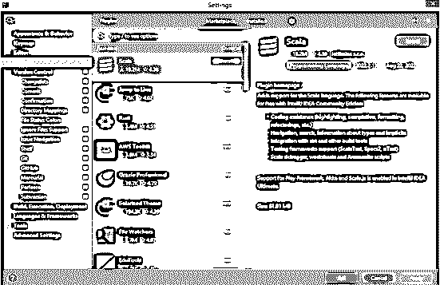
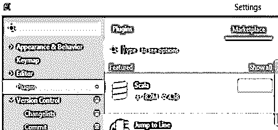
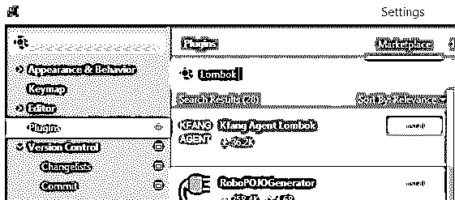
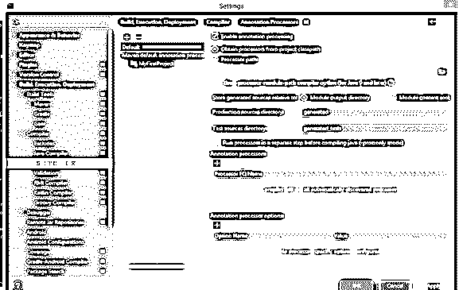
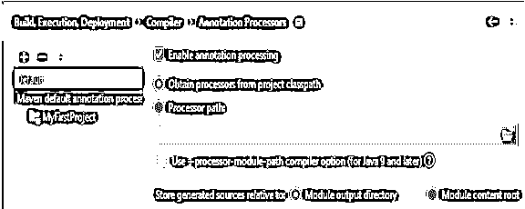
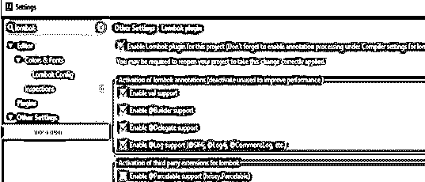

# IntelliJ Lombok 插件

> 原文：<https://www.educba.com/intellij-lombok-plugin/>


## IntelliJ Lombok 插件简介

这是一个关于 IntelliJ Lombok 插件的概要。一般来说，IntelliJ 支持不同类型的插件，Lombok 是 IntelliJ 支持的插件之一。Lombok 只不过是用于 reduction、的 java 基础库，或者我们可以说，它去除了重叠的代码，帮助开发人员在借助一些不同类型的注释进行开发时节省了时间。关于 Lombok 插件的另一个重要的事情是它增加了代码的可读性。

### **IntelliJ Lombok 插件概述**

Lombok 是一个处理大量单调工作的库，明显减少了 Java 源代码的冗长；我们通常需要在 IDE 中包含这个库，这需要额外的安排。

<small>网页开发、编程语言、软件测试&其他</small>

>我们不再需要设计 IDE 来利用 Lombok。IDE 与模块打包在一起。此外，评论处理将自然地被授权。在之前对 IntelliJ 的改编中，我们想展示使用 Lombok 的潜在趋势。此外，假设我们使用最新的再现，并且 IDE 不理解 Lombok 解释，我们希望确认底层设置没有物理障碍。

### 如何安装 IntelliJ Lombok 插件？

现在让我们看看如何在 IntelliJ 中安装 Lombok 插件，如下所示。

*   首先，我们需要打开插件选项，所以进入文件里面的文件菜单，选择设置命令，点击插件，如下截图所示。




*   第二步，我们需要浏览所需的存储库，如下图所示。




*   第三步，我们需要在搜索过滤器中搜索 Lombok 插件，如下图所示。




在这里我们可以看到不同的插件，所以点击安装按钮。安装完成后，我们可以看到安装的插件有不同的注释，如下图所示。


完成所有安装过程后，我们需要重启 IntelliJ，这样我们就可以获得 Lombok 的所有特性。

### IntelliJ Lombok 插件的设置

现在让我们看看如何设置 Lombok 插件，如下所示。

插件安装完成后，我们需要启用注释处理。Lombok 通过 APT 利用注释处理。因此，当编译器调用它时，库根据第一个。然而，评论处理并不是理所当然的。因此，要做的主要事情是在我们的任务中授权注释处理。

首先，我们需要在设置中打开设置，我们有 Preferences 选项，在这里我们可以看到不同的选项，但我们需要选择 Build、Execution 和 Deployment。之后，我们需要展开编译器选项卡并单击注释处理器，如下图所示。




在上面的截图中，我们可以看到不同的选项；这里我们需要确定以下两点。

1.  应单击“启用批注处理”复选框。
2.  应该单击“从项目类获取处理器”复选框

以上两个选项如下图截图所示。




### IntelliJ Lombok 插件的配置

现在让我们看看如何在 IntelliJ 中配置 Lombok 插件，如下所示。

安装完成后，我们需要通过以下步骤激活 Lombok。

*   首先，我们需要打开设置，点击其他设置选项，并选择 Lombok 插件，如下图所示。




*   这里我们需要确保我们启用了 Lombok 插件，如上面的截图所示。如果我们没有插件，那么我们需要安装它并重启 IntelliJ IDE，这样我们就可以获得 Lombok 的所有特性。

现在我们来看看龙目不同的注解如下。

*   **@Getter 或@Setter:** 当我们使用这些注释时，Lombok 会根据我们的要求自动创建默认的 Getter 或 Setter。默认注释负责返回注释的值或字段。在 Lombok 中，我们可以使用 getValue()或 isValue()方法，更重要的是，所使用的注释是公共的，除非指定了 AccessLeve。
*   **Builder:** 用于包含@Builder 呈现的成员。
*   **建造者。Default:** 它必须有初始化所需的表达式，并作为默认值。
*   **清理:**通过使用这个注释，我们确保变量声明将被清理。
*   **自定义日志:**用于根据我们的要求生成自定义日志。
*   **数据:**用于为所有字段创建 getter，可应用于 toString 方法。
*   **EqualsAndHashCode:** 用于根据我们的要求生成 equals 和 HashCode 方法，该方法将被对象继承。

此外，它还提供了许多其他注释，例如:

EqualsAndHashCode。排除，EqualsAndHashCode。包括、生成、非空、NoArgsConstructor、Singular、Synchronized、SneakyTHrows、ToString、ToString。排除，ToString。包括 Val、Values、var 和 With 等。

现在让我们来看看如下注释的例子。

```
private String studName;
public String get studName ()
{
return this. studName;
}
public void set studName e(String studName)
{
this. studName = studName;
}
```

**解释**

在上面，我们可以看到这是我们编写的简单 java 代码，这里我们需要使用 public 和 private 关键字来声明变量，如上面的代码所示。现在让我们看看如何用 Lombok 注释编写相同的代码，如下所示。

```
@Getter @Setter private String studName;
```

我们看到代码变得更加简洁，容易犯的错误也更少。注意@Getter 和@Setter 的解释额外承认了一个理想的边界，以在必要时指定入口级别。优点之一是它处理命名显示。

### 结论

在这篇文章中，我们试图探索 Intellij Lombok 插件。我们还学习了 Intellij Lombok 插件的基本思想，以及这些 Intellij Lombok 插件的用途和功能。文章的另一点是我们如何看到 Intellij Lombok 插件的基本实现。

### 推荐文章

这是一个 IntelliJ Lombok 插件指南。在这里，我们讨论介绍以及如何安装，设置和配置 IntelliJ Lombok 插件。您也可以看看以下文章，了解更多信息–

1.  [Intellij 插件](https://www.educba.com/intellij-plugins/)
2.  [IntelliJ JavaFX](https://www.educba.com/intellij-javafx/)
3.  [智能胃](https://www.educba.com/intellij-maven/)
4.  [IntelliJ 版本](https://www.educba.com/intellij-version/)


