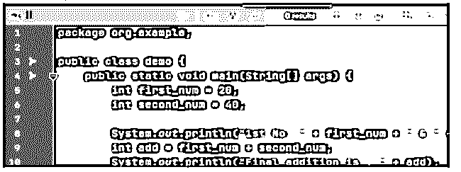
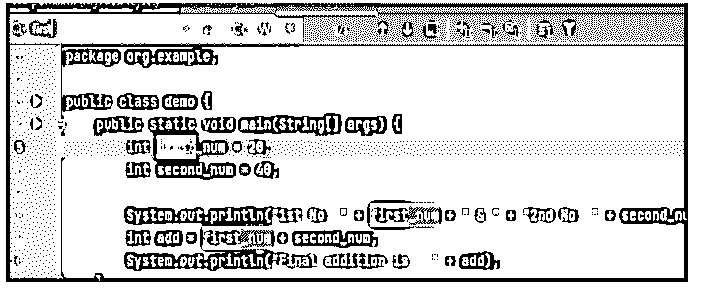
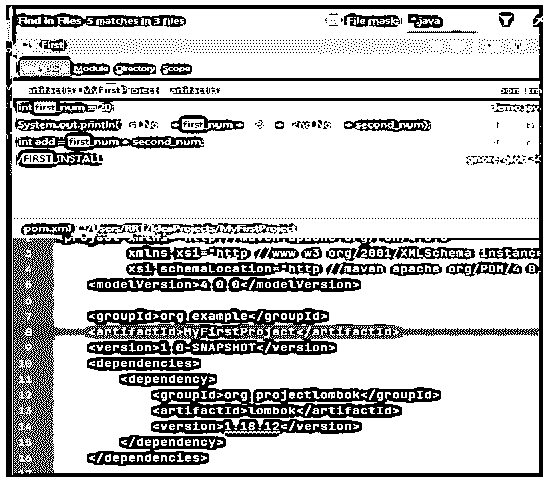
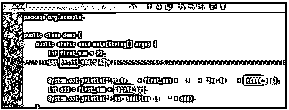
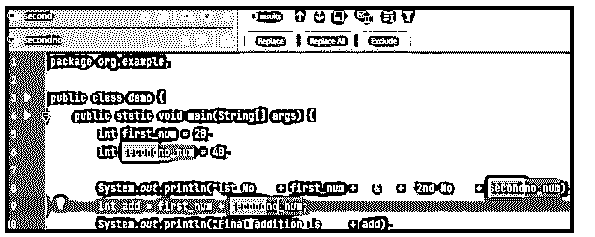

# IntelliJ 查找和替换

> 原文：<https://www.educba.com/intellij-find-and-replace/>

## IntelliJ 查找和替换简介

查找和替换是 IntelliJ 最好的特性之一；它帮助开发人员在整个项目中进行简单的搜索和替换操作。在开发过程中，有时开发人员需要从文件中查找或替换字符串或文本。我们可以偶尔使用查找或替换命令，为开发人员提供不同的选项来管理他们的查找或替换操作。

### 关键要点

*   查找和替换有助于开发人员轻松开发，并且可以轻松访问。
*   我们可以在指定的项目中执行搜索和替换，如果我们想在任何指定的文件中搜索，我们也可以这样做。
*   它还支持正则表达式来搜索字符串。

### IntelliJ 查找和替换概述

IntelliJ，所有 JetBrains 的想法都支持利用习惯发音来查找和替代文本的能力。在这种情况下，普通的发音可能很有力。当我们没有充分使用标准发音时，可能需要投资来考虑正确的正则表达式，经常浏览文档或指南来弄清楚它们是如何工作的。当需要进行大量替换时，查找/替换正则表达式(以及习惯上的查找/替换)的功能令人钦佩。IntelliJ IDEA 有几乎所有东西的可访问路径，包括快速选择和在仪器窗口之间交换。

<small>网页开发、编程语言、软件测试&其他</small>

### IntelliJ 在项目中查找和替换

让我们看看如何在项目中使用查找和替换，如下所示:

IntelliJ 提供了在当前工作项目和不同范围内搜索文本或字符串的功能，以方便搜索、查找重复的字符串等等。

首先，让我们看看如何在当前工作项目中找到字符串，如下所示:

有两种方法可以打开搜索框:首先，我们可以通过主菜单，然后点击编辑，在编辑里面，我们有查找选项，所以点击查找，选择在文件中查找；否则，我们可以使用快捷键 Ctrl + Shift +F。

第二步，我们需要输入文字或者键入文字进行搜索；我们可以使用快捷键来突出显示搜索字符串。

如果我们想查看以前搜索的历史，那么我们可以使用 Alt + Down。查找并替换，如下图所示。

IntelliJ 具有合并搜索字符串的功能，这意味着如果我们得到了多个搜索字符串，它会自动合并到同一行，或者我们可以说是一行。要执行多行搜索，我们需要单击箭头来输入一个新行，所以按 Ctrl + Alt +Down 来查看多次出现的行。

在对话的回顾区域检查结果，在那里你可以替换追踪字符串或选择另一个字符串，再次按 Ctrl+Shift+F，开始另一次搜寻。要在不同的设备窗口中查看事件摘要，请点按“在查找窗口中打开”。利用此窗口及其选项来汇集结果，查看它们，并进一步处理它们。

要在“查找设备”窗口的不同选项卡中查看每个新项目，请单击“查找要替换的文件”下方的应用程序常规内容，我们还可以根据需要在任何特定文件类型中进行搜索。

### IntelliJ 查找和替换文件中的文本

让我们看看如何查找和替换指定文件中的字符串，如下所示:

首先我们需要打 Ctrl + F .之后；我们得到了出现在搜索面板中的新窗口。

在下一步中，我们需要确定搜索选项并输入要搜索的字符串，如下面的屏幕截图所示。

作为类型，选择正在进行的光标位置之后的追踪字符串的主事件；不同的事件在校对功能。此外，协调事件在滚动条中用条纹隔开。

*   要查找多行部分，请在“字距”框中输入另一行或按 Ctrl + Shift + Enter。
*   让我们看看如何替换指定文件中的文本，如下所示:
*   第一，打 Ctrl+H；之后，搜索和替换面板将被打开，编辑器被激活。
*   在第二步中，我们需要指定替换选项。
*   现在，我们想要替换匹配出现的起始类型字符串将被突出显示，并且替换弹出窗口将在第一次匹配时打开。
*   在第三步中，我们需要输入替换的字符串，最后单击 Replace All 按钮。

### IntelliJ 查找和替换表达式

如果我们想要搜索一个特定的模式，我们可以使用 expression 选项，这有助于我们找到所需的模式匹配、过滤和解析。

首先打开搜索，借助 Ctrl + R 替换窗口。

在第二步中，我们需要输入字符串以及输入替换字符串并单击*来激活正则表达式。当您查找包含特殊正则表达式图像的文本字符串时，IntelliJ IDEA 在追踪字段中使用 backfire \避开了它们。

### IntelliJ 查找和替换示例

让我们看一个特定项目中搜索字符串的例子。

在这里，我们创建了一个示例项目，并尝试搜索字符串“first”，因此打开搜索面板并键入字符串，如下图所示。

现在让我们来看一个例子，看看如何在指定的文件中查找和替换文本，如下所示:

首先，我们需要打开面板来搜索字符串，如下图所示。

让我们看看如何替换字符串。在本例中，我们尝试用 secondno 替换 second，如下图所示。

现在点击替换或按照我们的要求替换所有按钮；在这里，我们替换所有如下所示的截图。

### 常见问题解答

下面提到了其他常见问题:

#### Q1。如何在 IntelliJ 中使用查找和替换？

**回答:**首先我们需要从一个菜单中打开查找和替换窗口，也可以使用快捷键 Ctrl + Shift + R，输入字符串进行搜索后，如果文件内部存在一个字符串，那么我们就得到结果。

#### Q2。如何在 IntelliJ 中用一个字符串替换另一个字符串？

**回答:**从菜单或快捷方式打开替换窗口；在这里，我们可以看到两个编辑框，一个用于查找，另一个用于替换，并根据我们的要求单击替换或替换所有按钮。

#### Q3。可以用正则表达式找字符串吗？

**回答:**是的，Intellij 支持正则表达式，帮助我们做更好的搜索。

### 结论

这里我们看到了 IntelliJ 中的查找和替换，以及一些用配置查找和替换的基本概念，不同的例子。我们还看到了查找和替换的用法和特性，以及如何在 Intellij 中使用它们。

### 推荐文章

这是 IntelliJ 查找和替换指南。在这里，我们讨论简介、IntelliJ 在项目中的查找和替换、示例和常见问题。您也可以看看以下文章，了解更多信息–

1.  [Intellij 插件](https://www.educba.com/intellij-plugins/)
2.  [IntelliJ 版本](https://www.educba.com/intellij-version/)
3.  [IntelliJ JavaFX](https://www.educba.com/intellij-javafx/)
4.  [Intellij 快捷键](https://www.educba.com/intellij-shortcuts/)

