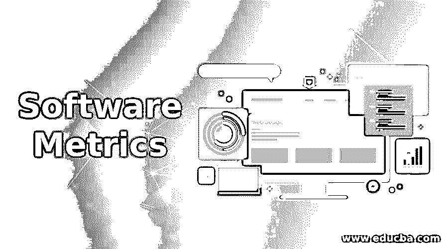

# 软件度量

> 原文：<https://www.educba.com/software-metrics/>

## 软件度量简介

用于评估软件测试工作的质量、进度和健康的度量标准被称为软件度量。它可以分为三组:产品度量、过程度量和项目度量。产品特性，如尺寸、设计特点、复杂性、性能、质量水平等。使用产品指标进行描述。相比之下，软件开发和维护使用过程度量来改进。项目的特征和执行由项目度量来描述，项目度量的例子包括软件开发人员的数量、成本等。

有必要根据一些指导方针开发软件度量标准。这些准则是:

<small>网页开发、编程语言、软件测试&其他</small>

*   它必须简单且可计算。推导必须简单易学，所花的时间和精力必须一般。
*   给出的结果必须客观一致。结果不应该模棱两可。
*   如果涉及到数学计算，就必须使用单位和量纲。
*   度量标准的开发应该基于分析模型、设计模型或模型的结构，并且应该独立于编程语言。
*   当且仅当它能够交付高质量的软件产品时，它才是有效的。
*   它必须能够适应项目不断变化的要求，这就是校准必须容易。
*   开发指标的成本必须合理。人们必须能够容易地获得它。
*   如果我们使用软件度量来制定任何决策，那么在应用软件度量来制定决策之前，必须对其进行验证。
*   开发的度量标准必须对变化具有鲁棒性，它不应该对项目、过程或小产品的变化敏感。
*   当其所代表的软件特性的值改变时，该值也必须改变，并且为了发生这种情况，该范围必须在有意义的范围内。比方说，软件度量的范围是 0 到 5。

### 软件度量的类型

下图显示了各种分类。

#### 1.过程度量

过程度量用于度量软件开发过程的特征。该示例包括故障检测的效率等。用于软件开发的方法、工具和技术的特征可以使用过程度量来度量。

#### 2.产品指标

软件产品的特征是使用产品度量来度量的。该软件的一些重要特征是:

*   软件规模和复杂性
*   软件可靠性和质量

这些度量的计算是在软件开发生命周期的不同阶段完成的。

#### 3.内部指标

对软件开发人员来说非常重要的属性可以使用称为内部度量的度量来度量。一个例子是代码行数的度量。

#### 4.外部指标

对用户非常重要的属性可以使用称为外部度量的度量来度量。一个例子是可移植性、可靠性、可用性等。

#### 5.项目度量

项目经理使用称为项目度量的度量来检查项目的进度。各种指标，如时间、成本等。，是通过使用过去项目中的数据收集的，它们被用作新软件的评估。项目经理时不时的检查项目的进度，努力、时间、成本与原来的努力、时间、成本进行对比。通过使用这些度量标准，可以减少开发、工作、风险和时间的成本。项目的质量也可以提高。随着质量的提高，错误数量、时间、成本等都有所减少。

### 优势

*   可以比较研究软件系统的设计方法。
*   可以研究各种编程语言的特征，以便使用软件度量进行分析和比较。
*   软件质量规格可以使用软件度量来准备。
*   可以验证软件系统的需求和规范的符合性。
*   可以推断出需要投入到软件系统的开发和设计中的努力。
*   可以确定代码的复杂度。
*   是否划分复杂模块的决策是可以做的。
*   可以指导资源管理器最大限度地利用资源。
*   可以进行设计权衡，比较维护成本和软件开发成本。
*   可以测量软件开发生命周期不同阶段的进度和质量，并且可以使用软件度量向项目经理提供反馈。
*   测试代码的资源分配可以基于软件度量来完成。

### 不足之处

*   在所有情况下应用度量标准并不容易。在某些情况下，这既困难又昂贵。
*   很难核实核实和证明所依据的历史或经验数据的有效性。
*   软件产品可以被管理，但是技术人员的表现不能用软件度量来评估。
*   可用的工具和工作环境用于定义和导出软件度量，在定义和导出它们时没有标准。
*   某些变量是基于预测模型估计的，它们并不经常为人所知。

### 结论

正在进行的过程的质量被识别，任何改进的实现和实现阶段结束后软件质量的预测都是通过使用软件度量来完成的。项目经理和领导可以通过使用软件度量来回顾在项目开发阶段做出的决策，然后制定计划来进行变更。但是，它并不仅仅是为了更高层次的管理，如领导和项目经理，任何个人都可以为了团队而使用它，并且可以获得有效的结果。

### 推荐文章

这是软件度量的指南。这里我们讨论软件度量的介绍和类型以及优缺点。您也可以看看以下文章，了解更多信息–

1.  [软件质量保证](https://www.educba.com/software-quality-assurance/)
2.  [软件可靠性](https://www.educba.com/software-reliability/)
3.  [软件平台](https://www.educba.com/software-platforms/)
4.  [硒软件](https://www.educba.com/selenium-software/)

