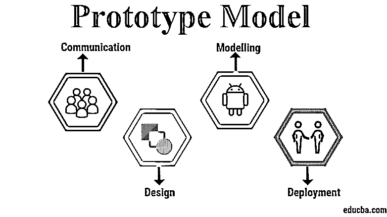

# 原型模型

> 原文：<https://www.educba.com/prototype-model/>

## 原型模型介绍

原型模型是一种系统开发的方法，在这种方法中，原型被创建、测试，然后根据需要被重构，直到获得合适的结果，通过该结果来开发完整的系统或产品。然后，基于需求，设计被创建，特定设计的原型被建模并交付给用户；然后，根据用户的反馈，进行适当的修改。

### 原型模型的阶段

不同的阶段如下:

<small>网页开发、编程语言、软件测试&其他</small>

1.  **沟通**:这是开发人员和客户安排会议并讨论需要实现的软件目标的阶段。
2.  **设计**:由于在提供端和接收端都明确了需求，设计很快完成。它用于构建原型。它包括软件的重要方面，即输入和输出，但主要集中在可见的方面，而不是计划的活动。
3.  建模:它提供了对软件需求的更好的想法和对软件产品的更好的理解。
4.  **部署**:部署前，客户端对软件进行评估，如果客户端不满意，那么就按照客户端的要求进行细化。这个过程一直持续到点客户端需求没有完成。在客户对产品满意之后，产品最终部署到生产环境中。它经过全面评估和测试，并定期进行维护。

### 原型模型的优缺点

以下是优点和缺点:

#### 优势

有几个优点:

*   这种模型增加了用户和开发人员在创建产品时的参与度，使产品处于同一页面上。
*   用户能够在实现时根据需求理解什么被完成了，什么被留下了。如果需要，这有助于在早期阶段改变需求。
*   可以在早期阶段检测到缺陷或错误。
*   它有助于减少成本和时间。
*   它有助于提供来自用户的反馈，并相应地改变事情。
*   在这个模型中，很容易识别缺失、混乱和困难的功能。

#### 不足之处

缺点如下:

*   有时，用户很难发现实际产品或系统与原型之间的差异。
*   原型模型在提到需求不足时不起作用。
*   它增加了系统的复杂性及其截止日期。
*   使用现有的原型来开发新系统是不可行的。
*   有时需要花费大量精力来构建系统的原型。
*   这也是一个缓慢的过程，因为开发原型需要很多时间。
*   有时大量的变化会让客户感到困惑，并对其不感兴趣。它也阻碍了开发团队的生产力。
*   如果用户不满意，它可以被扔掉。

### 何时使用原型模型？

当最终用户需要与最终系统(如在线系统、web 应用程序或界面)进行大量交互时，应该使用它。从用户到持续检查和使用的流量最高。开发这个系统确实需要训练有素的人。它还要求客户随时可以输入、反馈和签署不同的原型。

### 原型模型是如何工作的？

原型模型主要在高端工作，格式如下:

*   目标确定。
*   开发代码。
*   沟通提炼。
*   演示一下。
*   测试。
*   实施。

**开发人员主要采取以下方式进行原型模型工作:**

*   定义他们实现软件的目标，并从客户那里获取需求。
*   他们通常从 2 到 3 个特性开始，后来，他们也改进了版本。
*   设计的创造。
*   与小组和团队成员、利益相关者、用户、研究人员的讨论。
*   在完成与所有成员讨论的变更后，完成文档并最终确定设计。
*   设计原型。
*   咨询相关人员并接触适当的实体。
*   添加另一个功能，如果一切和输出按照开发商和客户之间的协议。
*   与客户沟通后，已做了改进。
*   为客户端实现和部署该功能。

### 我们为什么要用原型模型？

使用原型模型是因为它的优点。它给正在开发的软件一个清晰的画面，而不是在早期和实现阶段之前给客户。这有助于避免以后可能出现的问题。它有助于客户和开发人员的沟通，使产品符合需求，并且从客户的角度来看，开发人员也更容易理解它们。原型模型也提供了不同类型的模型。

请找到以下可用的原型:

*   快速原型制作。
*   进化原型。
*   增量原型法。
*   极端原型。

### 例子

有许多系统都是用原型模型开发的，对于开发人员和客户来说都取得了成功。正在开发动态系统开发方法、进化系统方法和快速方法。有一些工具；屏幕生成器是用原型模型开发的。

### 结论

原型模型是工作原型的方法论，或者是开发人员首先要做的工作，并创建它的样本。需要大规模数据处理和较少接口功能的系统无法从原型设计中获益。这可能是开发人员要做的额外工作。

原型模型正在成为一种非常流行的软件开发方法，用于在早期阶段了解客户的需求。该模型适用于需要通过各种屏幕来处理数据并给出最终系统精确外观的系统。

### 推荐文章

这是原型模型的指南。这里我们讨论了原型模型的各个阶段及其优缺点。您也可以浏览我们推荐的其他文章，了解更多信息——

1.  [什么是软件开发？](https://www.educba.com/what-is-software-development/)
2.  [软件测试面试问题](https://www.educba.com/software-testing-interview-questions/)
3.  什么是商业分析？
4.  [软件工程师职业](https://www.educba.com/careers-as-a-software-engineer/)

