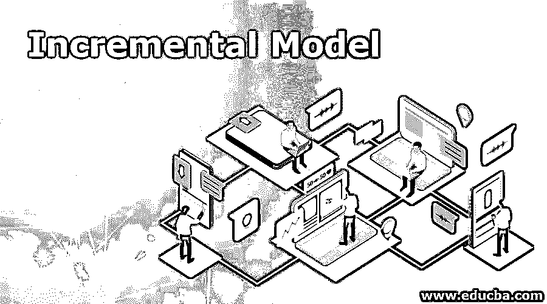
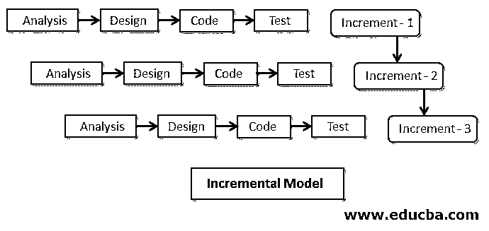

# 增量模型

> 原文：<https://www.educba.com/incremental-model/>

## 增量模型简介

增量模型是最常被采用的软件开发过程。在软件开发中有许多模型，它们被开发来实现不同的目标。这些模型指定了软件在迭代的每个阶段的开发方式，以及实现这些阶段的过程。模型的选择完全取决于组织及其软件目标，并且模型的选择对测试方法也有很大的影响。一些著名的模型包括敏捷、瀑布、增量、RAD、迭代、螺旋等。在本文中，我们将研究一种称为增量模型的模型。

### 什么是增量模型？

增量模型是软件开发过程中最常用的模型之一，它将软件需求分解成软件开发生命周期中许多独立的模块。一旦模块被拆分，增量开发将逐步进行，包括所有的分析、设计、实施、执行所有需要的测试或验证和维护。在增量模型中，开发每个迭代阶段，因此每个阶段都将经历需求、设计、编码，最后是软件开发生命周期的测试模块。在每个阶段开发的功能将被添加到先前开发的功能上，并且这将重复直到软件被完全开发。在每一个增量阶段，都将进行全面审查，并在此基础上做出下一阶段的决定。

<small>网页开发、编程语言、软件测试&其他</small>

下图说明了每个增量阶段的阶段和发展:

您可以看到，在增量开发的每个阶段，我们都经历了分析、设计代码和测试阶段，通过这样做，我们可以确保各个增量阶段是兼容的，并逐步帮助实现软件的所需目标。

#### 增量模型的重要性和特点

增量模型的主要重要性在于，它将软件开发分成子模块，每个子模块都是按照[软件开发生命周期过程 SDLC](https://www.educba.com/what-is-sdlc/) 开发的，如分析、设计、编码和测试。通过做这个模型，确保我们不会错过软件结束时期望的任何目标，即使它可能是多么小的目标。因此，我们用这个模型实现了 100%的软件目标，因为我们在每个阶段后都进行了积极的测试，以确保最终软件没有缺陷，并且每个阶段都与以前开发的和未来开发的阶段兼容。现在让我们来看看增量模型的一些特征，以及为什么它如此受欢迎。

*   要开发的软件将被分成许多阶段，因此将有许多软件的迷你子项目。
*   将要开发的部分系统将被组合起来，以获得软件的完整目标。
*   将为每个阶段或要求分配优先级，软件的最高要求将首先得到解决。
*   此外，在处理了一个增量需求之后，特定的增量将被冻结，并且集中于下一个增量或需求。
*   在任何给定的时间，该计划将只针对现有的增量，而没有任何长期计划。所以全部的焦点将会集中在正在处理的需求上。
*   每个增量版本都是在分析、设计、编码和测试阶段之后开发的，而且每个增量版本通常都是按照迭代瀑布模型开发的。这些版本也可以使用其他模型来开发。

### 增量模型的阶段

让我们看看每个增量阶段开发中的每个阶段。让我们想象一下，我们正在开发第二阶段，第一阶段已经开发和 100%的工作

| **每次增量中的相位** | **描述** |
| **需求分析** | 完成对需求的分析，以及如何确保该需求与之前开发的兼容 |
| **设计** | 一旦我理解并明确了这一特定增量的要求，将起草如何实现和归档这一要求的设计。 |
| **代码** | 现在编码是按照实现需求的目的来执行的。将遵循所有编码标准，没有任何默认值和不必要的硬代码 |
| **测试** | 这是增量阶段的最后一步，在这个阶段，对开发的代码进行积极的测试，并报告和解决缺陷 |

让我们看看什么时候使用需求模型方法，要点如下:

*   当存在对产品早期发布的需求时，当软件的目标中存在高风险特性和需求目标时，应该清楚地知道和理解需求。
*   这种方法主要由基于副产品的公司采用，因为开发的软件中的缺陷风险非常小，并且也用于开发 web 应用软件。
*   当项目有很长的开发时间表时，这种模型也是首选的。
*   此外，如果开发在软件开发中采用新技术，那么这种方法也是首选的，因为开发人员对该技术是陌生的

#### 增量模式的优势

让我们来看看这种特殊模型的一些优点。

*   由于该对象将被分为增量阶段，因此将确保 100%的需求和 100%的软件目标得以实现。
*   因为在每个增量阶段都有测试，所以软件会有多次测试，测试越多，结果越好，缺陷越少。
*   通过采用这种方法，我们可以降低初始交付成本。
*   这种模型是灵活的，当需求或范围发生变化时，成本最低。
*   用户或客户可以在每个阶段提供反馈，这样工作努力将得到重视，并且可以防止需求的突然变化。
*   与其他型号相比，这种型号对用户来说更便宜。
*   按照这个模型，可以很容易地识别错误

### 结论

因此，我们有许多模型可以用来开发软件并实现所需的目标。我们曾经看到过被称为增量模型的这种模型及其特点、应用和优点。无论我们是否使用这个模型，主要的应用是我们对需求有清晰的理解，并且期望软件有 100%的目标。

### 推荐文章

这是一个增量模型的指南。在这里，我们讨论增量模型的重要性和特征，以及它的阶段和优点。您也可以浏览我们推荐的文章，了解更多信息——

1.  [程序员 vs 软件工程](https://www.educba.com/programmers-vs-software-engineering/)
2.  [软件设计原理](https://www.educba.com/software-design-principles/)
3.  [逆向工程过程](https://www.educba.com/process-of-reverse-engineering/)
4.  [模型驱动架构](https://www.educba.com/model-driven-architecture/)

