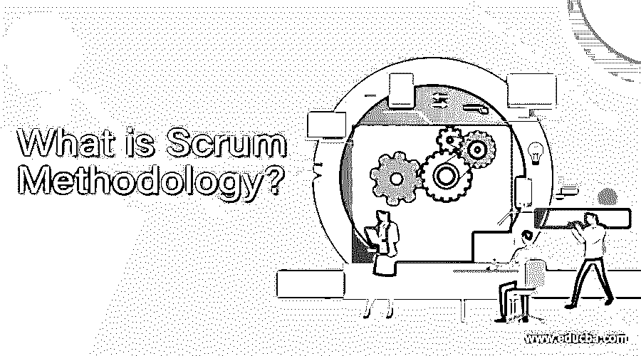

# 什么是 Scrum 方法论？

> 原文：<https://www.educba.com/what-is-scrum-methodology/>

## Scrum 方法论简介

当软件按照基于敏捷的方法开发时，Scrum 处理项目管理的部分。换句话说，我们可以说它是一个提供框架来管理流程或任务的平台。Scrum 将团队聚集在一起，每个人都在开发过程中扮演一个角色。Scrum 鼓励团队组织工作，从经验中学习，并持续评估工作。任何种类的障碍都会被记录下来，在与团队讨论后可以获得帮助。如果你观察一个团队或组织是否在使用基于敏捷的方法，他们很可能会使用 scrum 来处理他们的管理活动。在这个主题中，我们将学习什么是 Scrum 方法论。

Scrum 有很多东西可以让团队变得更强大，比如会议、工具和角色，它们可以开发具体的团队结构并处理他们的工作管理。Scrum like framework 对团队非常有帮助，因为它提供了持续的学习，也提供了非常容易处理项目开发中持续波动的方法。Scrum 承认团队在项目开始时并不知道所有的细节或需求，它坚信团队可以通过频繁的会议和项目交流来学习。Scrum 帮助团队轻松适应任何变化，如果在与决策者会面后有多个任务需要处理，并且他们中的大多数要么是客户要么是用户，scrum 也将帮助决定优先级。

<small>网页开发、编程语言、软件测试&其他</small>

### Scrum 方法论的重要性

当团队通过基于敏捷的方法进行开发时，Scrum 方法在团队中非常流行。scrum 的主要重要性在于，它们通过使信息透明来解决任务中存在的障碍和复杂性。这使得人们或团队成员检查和反思当前的状况，而不是停留在预测的状况上。这种 scrum 方法解决了最流行的遗留方法之一瀑布的常见缺陷。

在瀑布模型中，当有任何变更或者频繁的变更请求时，就会出现混乱。这个问题可以通过敏捷和 scrum 管理框架轻松解决。scrum 的透明性解决的其他一些缺陷包括低估时间、资源、预算，以及不准确的工作进度报告提交。所有这些陷阱最终将损害高度不可接受的软件质量。

scrum 方法中开发标准的透明性将确保交付的产品是不折不扣的预期产品。Scrum 有频繁的会议、频繁的评审和检查，以确保任何偏离标准的情况都可以在早期阶段被识别出来并得到纠正。Scrum 有冲刺计划，冲刺回顾会议，每日站立会议，冲刺回顾等等。来处理所有的检查和阻碍。

### 如何使用 Scrum 方法论？

Scrum 可以分为四个主要类别，它们是

*   Scrum 团队
*   Scrum 事件或仪式
*   Scrum 工件
*   Scrum 规则

这四个类别是成功管理基于敏捷的开发的主要支柱；使用 scrum，让我们看看每个

#### Scrum 团队

Scrum 团队包括以下成员

*   **产品所有者:**他们是产品的关键利益相关者。他们通常是客户或与客户沟通的人。
*   Scrum Master: Scrum master 是主持人，充当团队和产品负责人的协调员，确保团队沟通和 sprint 会议得到有效处理
*   **团队:**参与完成 sprint 期间分配的任务的团队。团队成员包括开发人员和测试人员。

#### Scrum 事件

以下是 scrum 事件。

*   **冲刺:**冲刺是基于时间的；预计完成计划任务的时间通常为 2 至 4 周
*   **Sprint Planning:** 这是一次会议，会上从积压工作中确定优先任务，并根据资源的强度分配给 Sprint 来完成
*   **冲刺回顾:**在此会议期间回顾已完成的任务，并要求解决任何不足之处
*   **sprint 回顾:**这是 Sprint 最后一次团队会议，讨论 Sprint 中哪些进展顺利，哪些需要改进

#### Scrum 工件

以下是 scrum 工件

*   产品待办事项列表:这是概述系统所有需求细节的重要文档之一。在某种程度上，我们可以说这是所有工作项目的待办事项列表。
*   Sprint Backlog:Sprint Backlog 是产品 Backlog 中需要在当前 Sprint 中实现的项目或任务的具体列表

#### Scrum 规则

规则是由团队、scrum master、产品所有者和其他利益相关者决定的，对团队和过程都是最好的。

### Scrum 方法论的优点和缺点

以下是下面提到的优点和缺点

#### 优势

*   基于 Scrum 的方法可以提供高生产率
*   高质量的成果
*   提高客户满意度
*   更好的团队沟通和动态
*   缩短发布时间，更好地节约成本

#### 不足之处

*   资源和其他 scrum 团队成员事务的经验水平可能会影响结果。
*   团队必须以承诺为导向并给予支持，否则学习可能会影响产品。
*   频繁的会议可能会影响士气，因此需要更好的参与会议。

### 结论

因此，由于 scrum 方法的好处，大多数敏捷运营团队和组织都采用了这种方法。因此，scrum 有助于更好的管理，最终提供高质量和更可靠的产品，并向团队传授知识。

### 推荐文章

这是一个什么是 Scrum 方法论的指南。这里我们讨论如何使用 Scrum 方法，以及它的重要性、优点和缺点。您也可以看看以下文章，了解更多信息–

1.  [Scrum Master 角色](https://www.educba.com/scrum-master-role/)
2.  [Scrum 软件](https://www.educba.com/scrum-software/)
3.  [Scrum 流程](https://www.educba.com/scrum-process/)
4.  [Scrum 仪表盘](https://www.educba.com/scrum-dashboard/)

