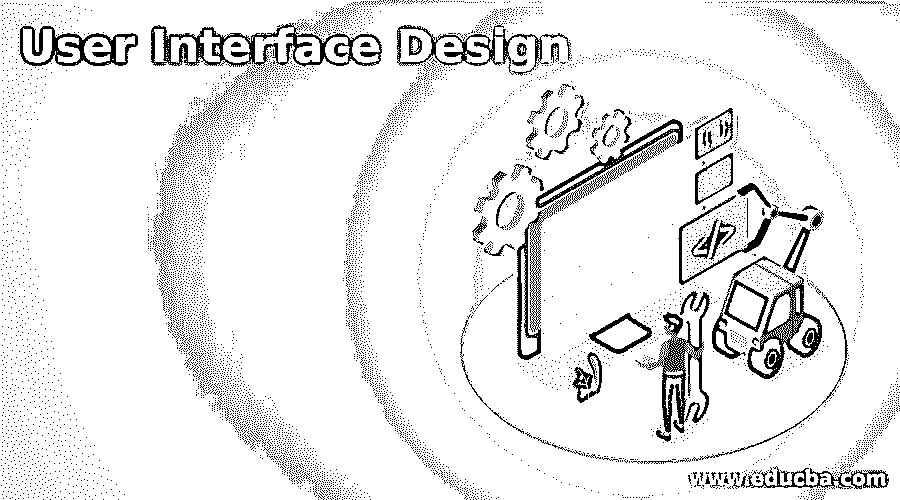

# 用户界面设计

> 原文：<https://www.educba.com/user-interface-design/>

## 用户界面设计介绍

用户界面设计指的是用户与产品的控制或显示进行交互的产品。仅仅好的编程技术不足以让用户接受软件产品。它还需要一个良好的用户界面；否则，它在市场上就会失败。编程技术关注软件功能，用户界面设计关注可用性专家。只有在进行了可用性测试之后，用户界面设计才变得有效。这样做是为了测试哪些工作正常，哪些工作不正常。只有在进行修复后，该产品才被称为具有优化的界面。当它应用于软件时，它被称为 HCI，即人机交互。

### 用户界面设计流程

用户界面设计过程分为以下 4 个活动:

<small>网页开发、编程语言、软件测试&其他</small>

*   **界面分析:**与最终用户一起评估 UI 设计，以了解将通过 UI 设计与系统[交互的用户，确认用户将执行的任务以完成他们的工作，了解这些任务将在其中进行的环境，了解界面的内容。一旦收集了所有的需求，最终用户就执行任务分析。](https://www.educba.com/what-is-ui-designer/)
*   **界面设计:**定义界面对象和动作，允许用户执行在用户需求分析阶段定义的所有任务。它试图确认设计的任务满足用户需求中定义的每个可用性目标。
*   **实现:**涉及到原型制作，然后是实际的实现。原型的输出用于实现。
*   **界面验证:**它验证用户界面正确执行每个用户任务的能力，用户对界面作为其工作中高效工具的接受程度。它关注的是用户界面设计易于使用和学习的程度。

### 用户界面设计原理

以下是提到的原则:

*   **用户熟悉度:**界面应该提供用户术语和概念，这些术语和概念是根据那些在应用领域中最能利用系统的人的经验来确定的，而不是使用新的术语。这有助于用户更好地理解软件的工作原理。
*   用户从来不喜欢看到系统以一种意想不到的方式工作。在这种情况下，他们会感到沮丧。用户绝不能对系统的行为感到惊讶，因为他们建立了系统如何工作的心理感知，如果这种感知被打破，那么用户看到系统意外的行为会感到惊讶，他们会感到紧张。
*   **一致性:**应该是一致的，即系统命令和菜单应该有相同的格式，相同的参数应该以相同的方式传递给所有的命令。
*   **可恢复性:**用户在使用系统时最容易犯错误。这些错误可以减少，但不能完全消除。但是可以有允许这些错误并允许系统回到其工作位置的规定。这被称为可恢复性。它应该包括一个允许用户从错误中恢复的机制。
*   **用户多样性:**界面应为不同类型的系统用户提供合适的交互设施。这是基于上述的第三个人类。
*   用户指导:当出现错误时，用户界面应该提供有意义的反馈，并提供不同级别的帮助和建议。该帮助级别从提供基本信息到提供系统设施的完整描述。

### 用户界面设计问题

设计一个好的用户界面需要考虑一些问题。应该注意这些问题，以便它们不会导致任何技术问题。

*   **响应时间:**这是请求和响应之间的平均时间，或者是软件产生期望输出的时间。它可以用长度和可变性来衡量。如果响应时间太长，用户会感到沮丧。
*   **错误处理:**错误信息可能会导致拒绝而不是接受产品。错误消息应该用用户容易理解的语言描述问题。
*   **帮助设施:**当终端用户需要一些信息，但他找不到或用户遇到麻烦时，他需要帮助。这两个要求都在帮助系统设计中考虑到了，并且必须随时可用。
*   **应用程序可访问性:**它表明应用程序是否易于交互。用户在与软件交互时会得到特殊的指导。

### 结论

一个好的用户界面设计可以让一个产品在市场上被接受或拒绝。如果最终用户感到难以学习和使用，那么即使一个优秀产品也可能失败。一个好的用户界面设计使得产品易于操作和使用，从而最终获得更多用户的认可。这就是为什么它对于设计过程是必要的。

### 推荐文章

这是用户界面设计指南。在这里，我们讨论的介绍，用户界面设计过程中，原则和设计问题。您也可以看看以下文章，了解更多信息–

1.  [用户界面设计原则](https://www.educba.com/user-interface-design-principles/)
2.  [UI 设计工具](https://www.educba.com/ui-design-tools/)
3.  [Indesign 的替代方案](https://www.educba.com/alternative-to-indesign/)
4.  [什么是系统设计？](https://www.educba.com/what-is-system-design/)

