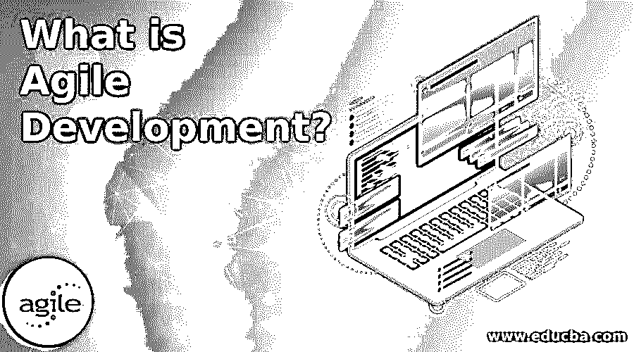
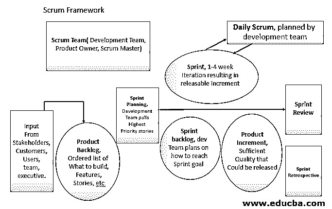

# 什么是敏捷开发？

> 原文：<https://www.educba.com/what-is-agile-development/>

## 敏捷开发简介

以下文章概述了什么是敏捷开发？正如敏捷这个名字所解释的，它是一个迭代的过程，通过开发需求和随着时间的推移临时制作产品，将产品/软件交付给客户。

敏捷软件开发是基于特性驱动部署的方法，我们遵循一些原则:

<small>网页开发、编程语言、软件测试&其他</small>

*   软件开发人员需要通过持续的交付来满足客户，并且即使在开发后期也欢迎变更。
*   需要以短时间间隔频繁交付工作软件。
*   关注技术专长和良好的功能设计将会提高灵活性。
*   为了更好的架构和需求设计，需要有自组织的团队。

与传统瀑布方法等其他软件开发模型相比，在传统瀑布方法中，开发人员获取需求，开发完整的代码并将其发送给软件测试，在敏捷方法中，我们根据优先级划分需求，并与其他团队合作开发给定的需求，同时并行测试目前已完成的需求，并一部分一部分地发布软件。

这种敏捷方法包括 Scrum 框架，它被用来管理采用各种过程和技术的复杂软件开发。

scrum 框架中有 3 个角色:

*   Scrum Master: 他/她确保流程被遵循，消除障碍并支持开发团队。
*   **产品负责人:**他/她与利益相关者和企业合作。
*   **开发团队:**进行需求分析、设计、实现和测试等工作的自组织团队。

### 敏捷方法中的 Scrum 事件

Scrum 很容易理解，但是实现这些方法需要额外的努力。敏捷方法中的 Scrum 事件是冲刺、冲刺计划、每日 Scrum、印刷回顾和冲刺回顾。

*   **sprint** :持续时间不超过 1 个月的时间段，在前一个 Sprint 结束后，新的 Sprint 立即开始。一旦 sprint 开始，就不做任何更改，项目的范围可以与产品所有者和开发团队重新协商。
*   sprint Planning :这是一个月 Sprint 最多 8 小时的时间框，它给出了 Sprint 中需要交付的需求的概述。
*   **每日争论**:这是一个 15 分钟的时间盒事件，让开发团队讨论并创建未来 24 小时的计划，以降低复杂性。
*   **冲刺评审**:在每个冲刺阶段结束时举行，检查增量，调整产品积压。
*   **sprint 回顾**:在 sprint 回顾之后，Sprint 计划之前进行，以了解在之前的 Sprint 中哪些做得很好，哪些可以改进。

### 敏捷中的工件

敏捷中的工件包括产品积压、增量和冲刺积压。

*   **产品积压**:这是一个有序的产品需求列表，永远不会完整。
*   **增量**:sprint 期间完成的所有产品待办事项的总和。
*   **Sprint backlog:** 它是为特定 Sprint 选择的产品 backlog 项目的集合。

### Scrum 框架

下面给出的是 Scrum 框架的示意图:

### 用户故事

*   这些是用户希望在他们的最终产品中使用的产品特性/功能，也称为需求。开发项目的成功在于理解客户需求并在最终产品/软件中实现它们。
*   在 Scrum 项目中，产品 backlog 由用户故事列表组成，并从用户的角度叙述他/她想要什么。这些用户故事被区分优先级，并在 sprint 计划会议中被纳入 sprint backlog。
*   例如，考虑顾客想要购买 PVR 电影票的需求，以便他能够以较低的价格购买电影票。
*   用户故事的格式是，作为一个客户，我想购买一张电影票，这样我就可以以较低的价格购买电影票。

该要求应满足客户/企业定义的验收标准。

*   一个顾客只能有一张通行证。
*   如果客户每年不一次性支付 500 英镑，将不会发放通行证。
*   客户必须注册，必须有在 PVR 观看至少 5 部电影的历史。
*   单程最多允许 3 人通过。并且这些标准可以根据客户的需求而继续下去。

**用户故事的好处包括:**

*   使用最终产品的是客户，用户故事连接最终用户和软件开发团队。
*   用户故事的格式确保实现客户想要的利益。
*   这对 Scrum 团队有额外的好处，因为接受标准是用户故事的一部分。
*   在项目的执行过程中，有机会对用户故事进行变更，即使故事的范围发生了变化，我们也可以将其分割，并将用户故事或部分需求转移到 backlog 中，以便在以后的 sprints 中执行。
*   当我们在 sprint 结束时交付工作软件/产品时，scrum 团队可以在评审会议中得到反馈。

### 敏捷开发的优势

*   它促进团队合作和跨职能培训。
*   可以在很短的时间内开发和演示功能。
*   这是一种现实的软件开发方法。
*   对资源的需求最小。
*   适合不断变化的要求。
*   至少部分地提前交付工作软件。
*   易于管理并为开发人员提供了灵活性。

### 结论

敏捷方法包括许多软件开发方法，这里我们讨论了 SCRUM，我们也有极限编程(XP)，敏捷建模等等。敏捷方法是一种不断发展的软件开发方法，它使软件开发人员、测试人员和组织的生活变得更加容易，因为它适应软件开发项目所需的变化、以人为本、快速和响应。

### 推荐文章

这是一个什么是敏捷开发的指南？在这里，我们讨论了简介、敏捷方法中的 scrum 事件、敏捷开发的工件和优势。您也可以看看以下文章，了解更多信息–

1.  [敏捷开发周期](https://www.educba.com/agile-development-cycle/)
2.  [敏捷特性](https://www.educba.com/agile-characteristics/)
3.  [敏捷开发模式](https://www.educba.com/agile-development-model/)
4.  什么是敏捷测试？

