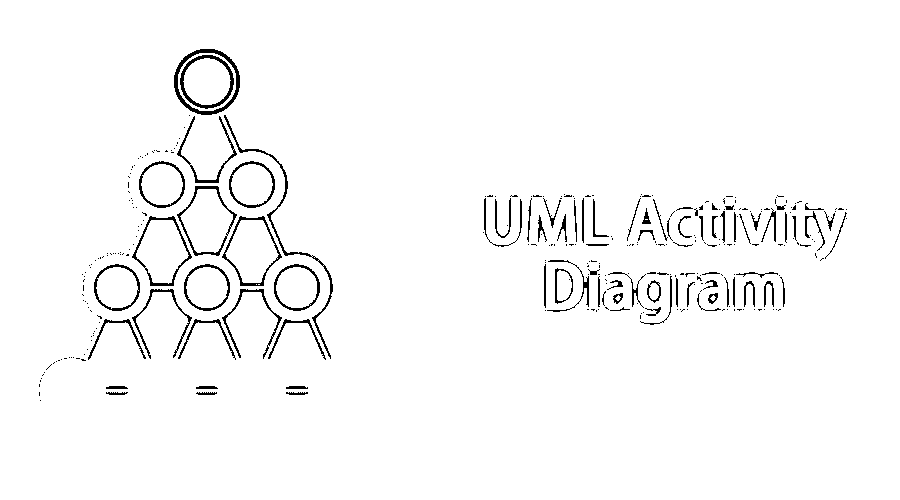
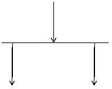
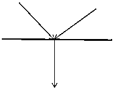
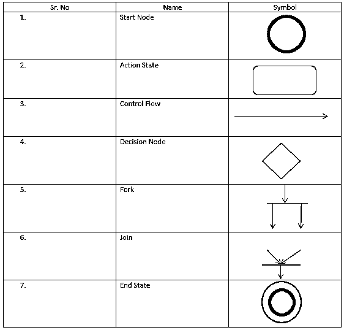
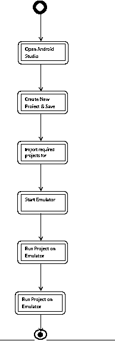

# UML 活动图

> 原文：<https://www.educba.com/uml-activity-diagram/>

## UML 活动图介绍

为了理解 UML 活动图，我们首先需要理解 UML 图的含义。UML 代表统一建模语言。它是一个标准化的图表集或集合，帮助软件开发人员和软件架构师理解软件的流程。换句话说，UML 图是描述软件系统如何运行的图。

UML 图分为三种类型:

<small>网页开发、编程语言、软件测试&其他</small>

*   结构图
*   交互图
*   行为图表

### 什么是 UML 活动图？

UML 活动图是上述三种类型的 UML 图中的行为图。现在，它们与 UML 图有什么不同？因此，活动描述了流程中将要发生的动作。它是软件系统如何运行的图形表示。在执行时，软件系统必须根据所需的流程运行，因此根据它，活动图将其描述为正向[和逆向工程过程](https://www.educba.com/reverse-engineering-tools/)/动作。

### UML 活动图的符号和组件

在此之前，人们必须知道如何绘制 UML 活动图，并且对于它，需要以下组件和符号。

#### 1.起始状态

初始状态尚未在活动中使用或修改。活动图从这一步开始。也称为进入状态。开始节点是任何活动的起点。

**描述为:**

#### 2.动作状态

用户或软件执行特定任务的一个步骤。它代表了在软件系统的这个阶段将要发生的动作。通常用圆边矩形来描绘。

**描述为:**

#### 3.控制流

描述流程的两个状态或两个动作之间的连接器。显示了执行的顺序。也称为路径。一个动作状态可以有多个控制流输入和输出到另一个动作状态。单向箭头用于描述控制流。

**描述为:**

#### 4.决策节点

条件节点或决策节点是指有多个选项可用的节点。或者在软件系统的角度上有两个或更多的条件可以考虑。

有一家冰淇淋店。一个人走进那家商店，想从众多可供选择的商品中买一件。现在，如果他选择香草口味，服务器 1 必须给他，否则他选择其他口味，然后其他人必须为他服务。所以这是活动图中的条件。它被绘制成具有多个输入和输出的菱形。

**描述为:**

#### 5.叉

两个并发或并行进程执行、运行或处理的起点。它通常包括单个输入，但可能得到也可能得不到一个输出。

有一家冰淇淋店。一个人倾向于为他自己和他的朋友买冰淇淋。现在，他们两个都买了同样的香草口味，但其中一个想要巧克力蘸酱，其他人想要水果放在上面。因此，这里的输入是相同的，即香草冰淇淋，但输出结果是不同的。这是一个完美的叉子的例子。

**描述为:**

#### 6.加入

连接是指并行活动的两个结果相加并形成一个结果。在联接中，有多个输入，但只获得一个输出。从两个活动中得到两个结果，得到一个结果。

**举例:**对三明治有要求。但是首先，我们需要西红柿和菠菜。

**描述为:**

#### 7.结束状态

这是 UML 活动图的最后一个阶段。这是软件系统中活动结束的地方。

**描述为:**

### UML 活动图的优缺点

以下是 UML 活动图的一些优点和缺点:

#### 优势:

*   软件系统中复杂阶段或步骤可以容易地用图解法解释。
*   软件系统的动态建模。
*   系统中的每一个活动流程都可以被如实地解释。
*   可以详细解释方法、功能和操作。
*   可以很容易地描述业务流程和流程。
*   简化的观点，虽然复杂的系统。
*   业务需求分析。
*   以简单明了的方式解释了对系统需求的理解。
*   详细解释了用户和系统以及用户和系统的工作流程。

#### 缺点:

*   唯一的缺点是 UML 活动图是两个组件之间的消息或通信，否则用户不能被显示。

### UML 活动图中使用的符号

下表给出了 UML 活动图中使用的符号:

### 如何用实例制作 UML 活动图

我们将考虑一个在 Android Studio 中开发软件的例子:

*   打开 Android Studio。
*   创建新项目&用唯一的名称保存项目。
*   导入项目所需的新包。
*   启动模拟器。
*   在模拟器上运行项目。
*   退出项目。

**UML 活动图:**

### 结论

因此，总的来说，我们可以说 UML 活动图在任何软件系统的开发过程中和开发之前都是必要的。这对于记录和描述开发过程中的具体过程和步骤非常有用。所有复杂的阶段都可以非常容易地显示出来。正确理解符号的人可以很容易地画出 UML 活动图。使用这些图最重要的部分是任何人都可以根据流程，在[软件系统开发生命周期](https://www.educba.com/what-is-sdlc/)的几乎每一步绘制它们。网上有很多软件可以用来绘制 UML 活动图，比如 SmartDraw 等。

### 推荐文章

这是一个 UML 活动图指南。这里我们讨论 UML 活动图的介绍、符号、组件、优点和缺点。您也可以浏览我们推荐的其他文章，了解更多信息——

1.  [类图](https://www.educba.com/class-diagram/)
2.  [什么是软件测试？](https://www.educba.com/what-is-software-testing/)
3.  [逆向工程](https://www.educba.com/reverse-engineering/)
4.  [UML 交互图](https://www.educba.com/uml-interaction-diagrams/)

