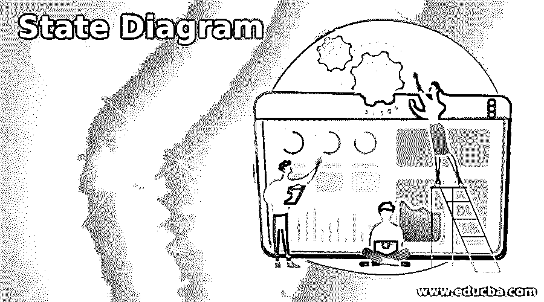
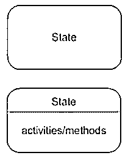
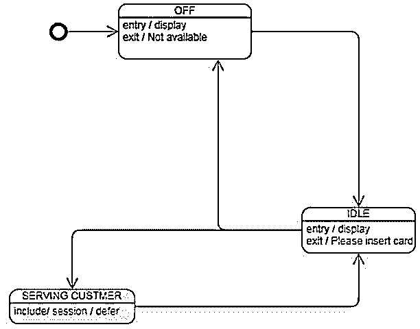

# 状态图

> 原文：<https://www.educba.com/state-diagram/>

## 状态图介绍

状态是存在的一种模式或状态。状态图是一种动态模型，它显示了对象在其生命周期中为响应事件而经历的状态变化。它用于帮助开发人员更好地理解系统特定领域的复杂功能。状态图也称为状态图，描述系统响应外部和内部事件的动态行为。

### 如何设计状态图？

下面给出了如何设计一个状态图:

<small>网页开发、编程语言、软件测试&其他</small>

#### 1.初态

实心圆表示它。它显示了图表的起点或第一个活动。这种状态也称为伪状态，其中状态没有变量，也没有活动。

**符号:**

#### 2.末态

带边框的实心圆表示它。它显示了状态图的结尾。这也是一个伪状态，因为它没有描述任何变量或动作。状态图可以有零个或多个最终状态。

**符号:**

#### 3.状态

它代表物体在某一瞬间的状态。状态是一种可识别的情况，存在于一段时间间隔内。一个标明的矩形和隔间标明了这一点，以描述状态名、变量和活动。

**符号:**

#### 4.过渡

过渡是从一种状态到另一种状态的变化。箭头表示它。引起转变的事件和动作写在箭头旁边，用斜线隔开。当活动状态为“已完成”时发生的转换称为无触发转换。如果在某个事件或动作完成后没有发生事件，则该事件或动作被称为警戒条件，即以布尔表达式的形式在事件或动作的描述 id 周围用方括号表示。然后，在保护条件发生后，转换发生。

**符号:**

#### 5.事件和动作

导致转换发生并改变状态的触发器称为事件或动作。在特定时间发生的事件没有持续时间。一个事件或动作被写在它引起的转变之上。

#### 6.历史状态

流可能要求对象进入等待状态，并返回到某个事件发生时的状态。这借助于圆圈内的字母 H 来表示。

#### 7.信号

当一个事件导致一个消息或触发器被发送到一个导致转换的状态时，则该事件发送的消息被称为信号。这由动作或事件上方的<< Signal>>图标表示。

#### 8.自我转变

一个状态可以有一个返回到自身的跃迁，称为 s 自跃迁。当效果与过渡相关联时，这是最有用的。

#### 9.状态内部的操作

动作执行一个功能，给一个数据变量赋值或启动另一个事务。每行指定一个内部操作。这些内部动作在不引起状态改变的情况下被处理。它采取的形式是:动作标签或动作表达式。

操作-标签可以是以下任何一种:

*   **条目:**在状态条目时执行相关的动作表达式。例如，条目/计数:= 0；总和:= 0。
*   **退出:**在状态退出时执行相关的动作表达式。例如，退出/响铃。
*   **Do:** 在状态进入时执行相关的动作表达式，并持续到状态退出。例如，do/显示闪光灯。
*   **包含:**这个动作表达式必须命名有限自动化。命名自动化是嵌套状态图的占位符。例如，包含/订单处理。

动作-表达-描述 bod 计算。

### 状态图的使用

*   状态图用于设计系统的动态方面。
*   它定义了组件的状态和由事件触发的状态变化。事件是影响系统的内部和外部因素。
*   在系统实现过程中，明确对象在其生命周期中的不同状态非常重要。状态图用于此目的。当该状态和事件被触发时，它们被用于对其建模，并且这些模型在系统实现期间被使用。
*   主要用于对系统的对象状态进行建模。
*   状态图也用于识别引起状态变化的事件。
*   用于模拟反应系统。
*   状态图也用于正向和反向工程。

### 例子

下面给出的是状态图的例子:

这里我们以 ATM 为例，画一个状态图。

### 推荐文章

这是状态图指南。这里我们讨论一下入门，如何设计一个状态图？用途和示例。您也可以看看以下文章，了解更多信息–

1.  [UML 交互图](https://www.educba.com/uml-interaction-diagrams/)
2.  [UML 组件图](https://www.educba.com/uml-component-diagram/)
3.  [UML 图软件](https://www.educba.com/uml-diagram-softwares/)
4.  [UML 图的类型](https://www.educba.com/types-of-uml-diagrams/)

