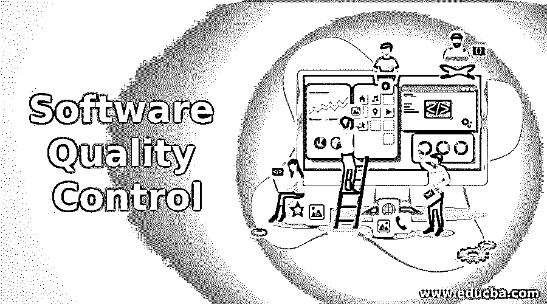
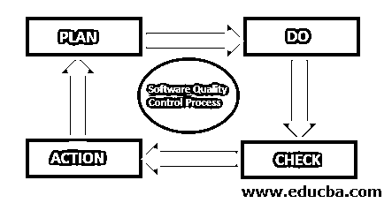

# 软件质量控制

> 原文：<https://www.educba.com/software-quality-control/>

## 软件质量控制导论

软件质量控制是一种验证活动，其中开发的软件产品的质量满足客户的需求和例外情况，或者适合目的，即检查我们是否构建了正确的软件。这个过程是面向产品的，目的是发现缺陷，提高开发的软件产品质量。通过执行应用程序代码进行软件产品测试是软件质量控制的一部分。

### 软件质量控制活动

软件质量控制过程主要涉及软件产品、开发过程和资源。它的工作原理是 PDCA(计划检查行动)。

<small>网页开发、编程语言、软件测试&其他</small>

软件质量控制过程主要处理两个活动和一些子活动。

#### 1.评审活动(质量保证(QA))

软件质量控制过程的评审活动如下:

| **评审活动** |
| 需求审查 |
| 设计评论 |
| 编码审查/td > |
| 测试计划评审 |
| 测试用例评审 |
| 部署审查 |

评审活动是一种防止缺陷的软件文档静态测试或验证过程。它是面向过程的，以改进没有程序执行的开发过程。需求文档、设计评审是其中的一部分。在软件开发生命周期过程中，它有多个评审活动，如需求、设计、编码、测试计划、测试用例以及部署。这是一个过程级的验证，以防止软件应用文档的缺陷。

#### 2.测试活动(质量控制(QC))

软件质量控制过程的测试活动如下:

| **测试活动** |
| 单元测试 |
| 集成测试 |
| 系统试验 |
| 验收测试 |
| 出厂试验 |
| 维护测试 |

测试活动本质上是一种动态类型，或者是软件应用程序发现缺陷的验证过程。它以产品为导向，通过程序执行来提高软件产品质量。产品测试是其主要部分，在软件开发生命周期过程中有多个测试活动，如单元、集成、系统、验收、发布和维护测试阶段。

在此活动中，我们还使用了一些额外的功能测试级别，如冒烟测试、健全性测试、重新测试、回归测试和一些非功能测试，如性能测试、压力测试、负载测试、容量测试、耐久性测试，以提高所开发软件产品质量的优先级(修复缺陷的紧迫性)和严重性(缺陷的影响)。因此 QA(验证)和 QC(确认)过程都与软件质量控制改进过程有内在联系。

下图显示了测试活动的工作情况，并附有详细说明:

##### 单元测试

软件应用程序的最小独立可执行部分/单元/组件的测试。它也被称为组件测试。它是由开发团队在开发阶段的早期完成的。

##### 集成测试

在此测试中，找出组件/单元之间的接口或交互中的缺陷或错误，即测试组合单元是否正常工作。它是由技术/开发领导完成的，而不是由测试人员完成的。集成测试有自顶向下和自底向上两种方法。

这里，测试驱动程序和测试存根被用来帮助集成测试工作流。当应用程序中有临时程序来替代开发中的程序时，称为存根和驱动程序。主程序如果被替换，就叫做驱动程序，如果底层程序被替换，就叫做存根。当我们有存根和驱动程序时，我们称环境为测试工具。

##### 系统试验

一旦部署团队发送了一封邮件，说明软件已经安装到测试环境中。我们从构建验证测试(冒烟测试)开始。在这里，我们检查最低功能是否正常工作，并向开发团队发送一封邮件，告知我们是接受还是拒绝构建。它也被称为端到端测试，由测试团队在测试环境中执行。当两个或多个应用程序需要一起运行时，在系统测试和用户验收测试之间还有一层测试叫做系统集成测试。

##### 验收测试/用户验收测试

该测试的目标是:

*   以获得释放的信心。
*   检查软件是否适合该目的。
*   从商业角度检查软件。

它由客户端执行。它有两种类型，如阿尔法测试和贝塔测试。阿尔法测试被称为业务验收测试(BAT)或工厂级测试，由客户在开发组织现场执行。Beta 测试被称为产品验证测试(PVT)或现场级测试，由客户在软件使用地进行。

##### 出厂试验

发布测试是软件产品或应用程序的最终测试阶段，用于验证已开发的软件是否可以发布。这里，应该测试该应用程序的全部功能，以确保软件应用程序的就绪性。

##### 维护测试

当软件或环境发生变化时，对生产中的软件进行测试。在此阶段，我们计划进行影响分析，即变更控制委员会(CCB)将由一组架构师、设计师、开发人员和测试人员组成，他们可以判断客户要求的变更(即变更请求(CR))的影响。它也有助于测试，因为它指导在哪里进行大部分测试，即重新测试和回归测试。这种类型的测试由测试人员完成。

### 软件质量控制标准

有一些 ISO 标准来审查/描述软件开发产品的质量。ISO/IEC/IEEE 提出了编号为 29119 的软件质量控制国际标准，随之而来的是开发过程的软件开发生命周期(SDLC)模型。它主要有五个国际级别的软件质量控制(QC)标准和一些子标准，用于审查应用程序的过程级别和产品级别。

它们如下:

#### 1.国际软件质量控制标准

*   **ISO/IEC 29119-1:** 表示软件的概念和定义。
*   **ISO/IEC 29119-2:** 表示一个软件产品中不同的测试过程。
*   **ISO/IEC 29119-3:** 处理软件应用的测试相关文档。
*   ISO/IEC 29119-4: 它描述了软件产品的不同测试技术和计划。
*   ISO/IEC 29119-5: 它处理不同类型的关键字驱动的软件测试。

#### 2.辅助软件质量控制标准

*   IEEE 730: 它处理软件产品验证，即质量保证(QA)。
*   IEEE 830: 它描述了具有适当需求的软件应用程序的精确开发。
*   EEE 1008: 这个标准处理开发应用的单元测试。
*   IEEE 1012: 它处理应用的验证和确认。
*   IEEE 1028: 本标准涉及正确的软件应用检查目的。
*   **IEEE 1044:** 用于检查应用软件中的一些不一致性。
*   IEEE 1059: 它处理应用指导验证和确认。
*   IEEE 1061: 该标准用于提高软件产品开发的质量，即处理应用质量度量。
*   IEEE 12207: 用于应用程序的开发生命周期过程。

### 软件质量控制技术

质量控制是 IT 组织开发高质量软件产品和提高组织生产力以及软件产品目标的过程。软件应用的软件质量控制有多种技术/方法，但 PDCA (Plan Do Check Action)技术是软件质量控制的最佳方法之一。

*   目标问题中心模型
*   全面风险管理模式
*   PDCA 模式
*   整体软件质量控制模型
*   螺旋模型质量控制
*   控制管理模型

#### PDCA 模型

它代表计划-执行-检查-行动模式。它是软件开发过程中最简单的模型之一，通过它，从开发的初始阶段就可以对应用程序进行质量控制。产品/应用程序、流程和资源等参数会影响软件应用程序的质量控制。

它包含四个阶段:

*   计划
*   做
*   支票
*   行为

**1。计划:**在这个初始阶段，软件质量控制过程被启动或计划。这里设定标准的软件质量目标，并相应地计划去实现它。

**2。Do:** 在此阶段，根据项目计划参数开始开发软件应用程序并执行，即工作进展状态**。**

**3。Check:** 在这个阶段致力于对已开发的软件应用程序进行静态和动态测试，以发现缺陷，提高产品质量。这里我们用实际的参数值来验证预期的输出值。

**4。动作:**在此阶段，采取纠正措施，从已开发的软件产品中移除错误或问题，即修复错误，并在需要时进行返工。

### 软件质量控制的利与弊

下面给出了优点和缺点:

#### 优势

以下是优点

*   它用于根据客户需求和例外情况验证软件应用程序。
*   软件 QC 用于识别软件应用中的缺陷。
*   它提高了软件开发团队的生产率和软件产品质量。
*   它增强了生产高质量软件产品的组织能力。
*   它使得最终的软件产品可以交付。
*   增加了对项目管理和未来水平发展的信任。
*   它用于减少重新开发或重新工作的成本，因为软件质量控制将从开发阶段的零开始实施。
*   它提高了软件产品的客户满意度和效率。
*   这是一种被动的方法，独立的测试团队将会发现缺陷。

#### 不足之处

以下是缺点

*   它需要更多耗时的过程测试。
*   软件产品部署应该延迟。
*   软件产品验证需要更多的资源。
*   团队中的每个人都不对自己的工作质量负责。
*   如果软件应用程序被拒绝，那么组织的预算就会出现大问题。

### 结论

在本文中，我们讨论了软件质量控制过程，以开发建立信任，识别缺陷，防止缺陷，并确保软件产品的质量。它还描述了不同的国际软件质量控制标准及其相关的活动和方法。因为它是确保所开发的软件产品是否满足客户例外和标准质量的反应性方法。在软件开发生命周期过程中，开发标准产品质量和改进开发过程涉及多个测试阶段。因此，在交付之前检查软件产品是最后一步。

### 推荐文章

这是软件质量控制指南。在这里，我们讨论软件质量控制的介绍以及活动、优点和缺点。您也可以看看以下文章，了解更多信息–

1.  [统计分析软件](https://www.educba.com/statistical-analysis-softwares/)
2.  [开源软件](https://www.educba.com/open-source-software/)
3.  [软件质量保证](https://www.educba.com/software-quality-assurance/)
4.  [软件系统架构](https://www.educba.com/software-system-architecture/)

