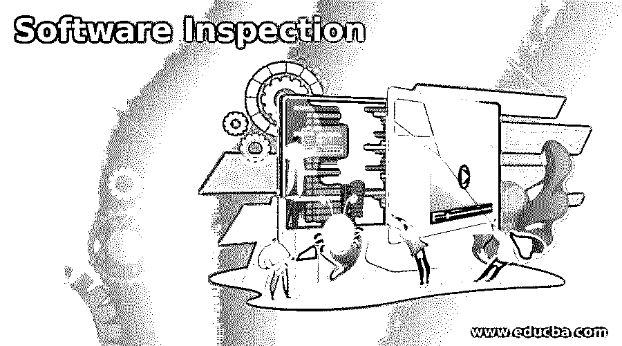

# 软件检查

> 原文：<https://www.educba.com/software-inspection/>

## 软件检查简介

软件检查包括人们检查源代码表示，目的是发现异常和缺陷。检验不需要执行。可以在实施过程之前使用系统 s0。可以应用于系统需求、设计、测试数据、配置数据等的任何表示。它们被证明是发现程序错误的有效技术。只有当作者，即开发人员，已经确保代码准备好接受检查时，才进行软件初始阶段。他通过对代码执行一些初步的案头检查和演练来做出决定。在通过这些评审方法之后，代码将被发送到团队开始阶段。

### 软件检查过程

软件检查包括 6 个步骤——计划、概述、个人准备、检查会议、返工和跟踪。

<small>网页开发、编程语言、软件测试&其他</small>

**第一步:**规划

*   选择小组评审团队，最好是 3 到 5 人的小组。
*   确定主持人——主要负责检查。
*   准备用于分发的包——用于评审的工作产品以及支持文档。
*   包应该是完整的，以供审查。

**第二步:**概述

*   简短会议–交付产品包，解释评审的目的，介绍等。
*   然后，所有团队成员单独评审工作产品。列出他们在自我准备日志中发现的问题，使用清单和指南。
*   理想情况下，应该一次完成，并将问题记录在日志中。

**第三步:**个人准备

*   每个评审者单独研究项目。
*   记下研究项目时遇到的问题。
*   决定如何提出这些问题并记录下来。

**第四步:**检查会议

*   审查者逐行检查产品。在任何一行，所有的问题都会被提出。
*   接下来的讨论将确定是否存在缺陷。
*   检查会议结束时记录决定。
*   书记员提出缺陷清单。如果缺陷很少，工作产品被接受；否则，它可能会被要求再次审查。
*   小组没有通过一些可能被记录的建议提出解决方案。
*   准备一份检查总结，这有助于评估有效性。

**第 5 步和第 6 步:**返工和跟进

*   缺陷列表中的缺陷稍后由作者修复。这些修改是为了修复发现的错误。一旦修改完毕，作者就会被版主处理或者进行另一次审查。
*   可能需要也可能不需要复验。
*   一旦所有的缺陷都得到满意的解决，评审就完成了，收集的数据也提交了。

### 检验角色

检查中涉及的各种角色如下:

*   **作者或所有者:**作者是负责制作程序或文档的程序员或设计师。负责修复检验过程中发现的缺陷。
*   **审查员:**审查员提供代码的审查意见。找出程序中的错误、遗漏和不一致。还可以确定检查小组范围之外的更广泛的问题。
*   **主持人或主席:**主持人根据流程正式运行检查。管理流程并促进检查。还向首席主持人报告流程结果。
*   **记录员:**记录员记录检查会议的结果，并在会后将其分发给检查小组。
*   **阅读者:**阅读者在检查会议上出示代码或文件。
*   **主审核人:**主审核人负责检验流程改进、检查表更新、标准制定等。

### 软件检查的优点和缺点

下面给出了提到的优点和缺点:

#### 优势:

*   该方法的目标是检测所有故障、违规和其他副作用。
*   作者和其他审稿人在进行检查之前做好了充分的准备。
*   一组人参与检查程序；收集了多种不同的观点。
*   检查组中的每个人都被分配了特定的角色。
*   检查中的阅读者以结构化的方式顺序地读出文档，以便彻底检查所有点和所有代码。

#### 缺点:

*   由于涉及多人，物流和调度可能会成为一个问题。
*   耗时，因为它需要准备和正式会议。
*   不可能总是用几个参数及其组合来检查每一行代码，以确保逻辑的正确性、副作用和适当的错误处理。

### 错误表

在软件检查期间可以检查的一些编程错误如下:

*   使用未初始化的变量。
*   非终止循环。
*   跳到循环中。
*   不兼容的分配。
*   数组索引超出界限。
*   过程调用中的实际参数和形式参数不匹配。
*   使用不正确的逻辑运算符或运算符之间不正确的优先级。
*   不正确的存储分配和释放。
*   循环修改不当。
*   浮点值相等的比较等。

### 推荐文章

这是一个软件检查指南。这里我们讨论软件检查的介绍、过程、角色、优点、缺点、错误列表。您也可以看看以下文章，了解更多信息–

1.  [软件审查](https://www.educba.com/software-review/)
2.  [软件质量控制](https://www.educba.com/software-quality-control/)
3.  [质量软件](https://www.educba.com/quality-software/)
4.  [软件开发模型](https://www.educba.com/software-development-models/)

